<!-- GENERATED BY scripts/gen_examples_readme.py — DO NOT EDIT.
     Edit the individual example's README.md instead, then re-run the script. -->

# Examples

125 example ROMs. Each directory is a self-contained npm workspace: `npm run build` makes the `.gba`, `npm start` opens it in mGBA, `npm run shot` takes a headless screenshot.

Every description below is taken from that example's own README, so this page cannot drift away from what it lists.

## Games and demos

| | example |
|---|---|
| 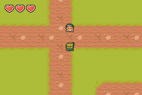 | **[akari — puzzle game demo (Akari / Light Up)](akari/README.md)** `akari` |
|  | **[anim demo — demonstrates sprite animation loops, frames, and state machines](anim-demo/README.md)** `anim-demo` |
| 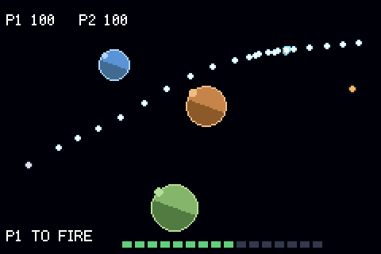 | **[artillery — two turrets, three planets, and one shot at a time](artillery/README.md)** `artillery` |
| 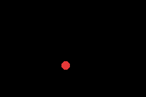 | **[asset sprite — demonstrates how to import and render 2D sprite assets using the asset pipeline](asset-sprite/README.md)** `asset-sprite` |
| 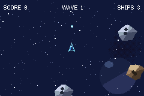 | **[asteroids](asteroids/README.md)** `asteroids` |
| 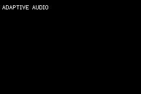 | **[audio adaptive — adaptive music made testable](audio-adaptive/README.md)** `audio-adaptive` |
| 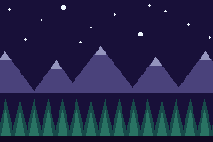 | **[bands demo — demonstrates background parallax scrolling or affine transformations](bands-demo/README.md)** `bands-demo` |
| 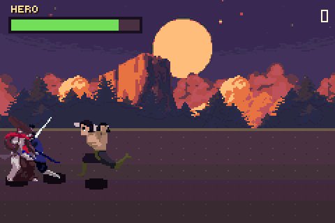 | **[beatemup — a Final Fight-shaped brawler](beatemup/README.md)** `beatemup` |
| 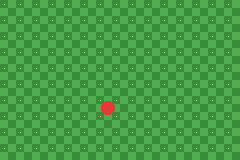 | **[bg demo — demonstrates background layers, tilemaps, and scrolling](bg-demo/README.md)** `bg-demo` |
| 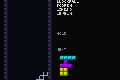 | **[blockfall — a falling-block puzzle game on the guideline ruleset](blockfall/README.md)** `blockfall` |
| 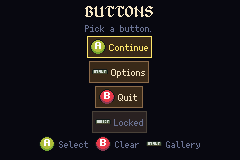 | **[button demo — demonstrates reading hardware input from the GBA buttons](button-demo/README.md)** `button-demo` |
| 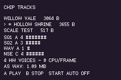 | **[chiptune — demonstrates audio playback for chiptunes/music tracks](chiptune/README.md)** `chiptune` |
|  | **[collect demo — demonstrates collision detection and entity collection logic](collect-demo/README.md)** `collect-demo` |
| 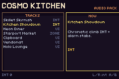 | **[cosmo kitchen — a complete mini-game demo (Cosmo Kitchen) showing game loop and UI](cosmo-kitchen/README.md)** `cosmo-kitchen` |
| 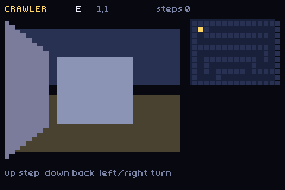 | **[crawler — a first-person grid maze drawn from rectangles](crawler/README.md)** `crawler` |
| 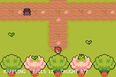 | **[creature rpg — a creature-collection RPG](creature-rpg/README.md)** `creature-rpg` |
|  | **[cutscene raw — a staged scene in a game that cannot link the game-engine crate](cutscene-raw/README.md)** `cutscene-raw` |
| 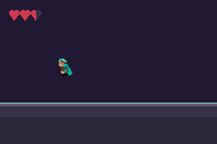 | **[dark hero — a genre template or demo for a dark-themed action game](dark-hero/README.md)** `dark-hero` |
| 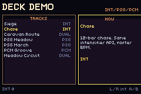 | **[deck demo — demonstrates the Deck audio synthesizer format](deck-demo/README.md)** `deck-demo` |
| 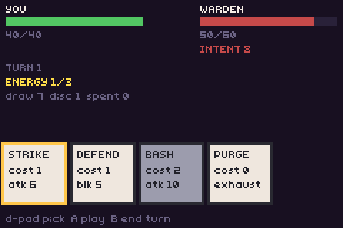 | **[deckbuild — a deckbuilding combat, on `packages/cards.tish`](deckbuild/README.md)** `deckbuild` |
|  | **[dialog demo — demonstrates text rendering and typewriter-style dialog boxes](dialog-demo/README.md)** `dialog-demo` |
| 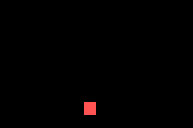 | **[dpad sprite — demonstrates moving a sprite across the screen using the D-Pad](dpad-sprite/README.md)** `dpad-sprite` |
|  | **[earshot — a sound source orbits you, and you can hear where it is](earshot/README.md)** `earshot` |
|  | **[engine demo — a comprehensive showcase of multiple engine features working together](engine-demo/README.md)** `engine-demo` |
|  | **[feel demo — every feedback in packages/feel.tish](feel-demo/README.md)** `feel-demo` |
|  | **[fonts demo — demonstrates custom font loading and text rendering](fonts-demo/README.md)** `fonts-demo` |
| 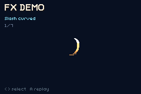 | **[fx demo — demonstrates visual effects, blending modes, and palettes](fx-demo/README.md)** `fx-demo` |
| 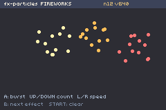 | **[fx particles — a particle system, screen flash and screen shake](fx-particles/README.md)** `fx-particles` |
| 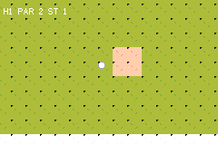 | **[golf — nine holes of top-down mini-golf](golf/README.md)** `golf` |
|  | **[gradient demo — demonstrates hardware color gradients and raster effects](gradient-demo/README.md)** `gradient-demo` |
| 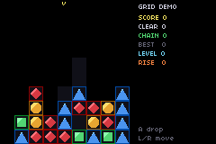 | **[grid-demo — a floor-stacked match-3 on packages/grid.tish](grid-demo/README.md)** `grid-demo` |
| 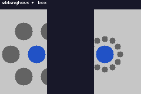 | **[illusions — optical illusions on GBA hardware](illusions/README.md)** `illusions` |
|  | **[input demo — demonstrates advanced input handling and key state debouncing](input-demo/README.md)** `input-demo` |
| 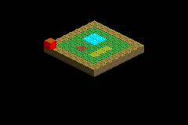 | **[iso sprite — an isometric SRPG subsystem demo showcasing sprite](iso-sprite/README.md)** `iso-sprite` |
| 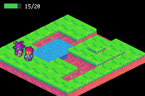 | **[iso-tactics — isometric tactics prototype](iso-tactics/README.md)** `iso-tactics` |
| 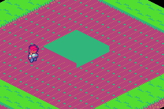 | **[iso-town — isometric plaza with talk + shop](iso-town/README.md)** `iso-town` |
| 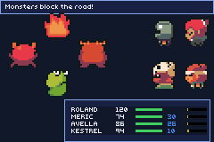 | **[jrpg-party — four heroes, four monsters and a clock](jrpg-party/README.md)** `jrpg-party` |
| 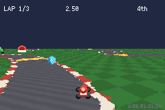 | **[kart-circuit — a Mode 7 kart racer on a real Mode 7 ground plane](kart-circuit/README.md)** `kart-circuit` |
|  | **[keep — dungeon lock-and-key, as a package](keep/README.md)** `keep` |
| 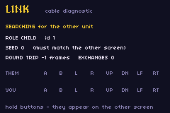 | **[link demo — demonstrates GBA multiplayer link cable communication](link-demo/README.md)** `link-demo` |
| 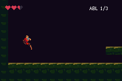 | **[metroidvania — one castle, three ability gates, and walls that were always passable](metroidvania/README.md)** `metroidvania` |
| 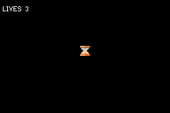 | **[microgame — a WarioWare-shaped bag of four-second games](microgame/README.md)** `microgame` |
|  | **[minimal — a bare-bones minimal project template with just a game loop](minimal/README.md)** `minimal` |
| 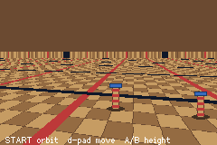 | **[mode7-demo — a Mode 7 ground plane](mode7-demo/README.md)** `mode7-demo` |
| 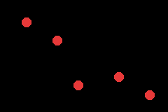 | **[mono demo — demonstrates monophonic audio or monochrome rendering](mono-demo/README.md)** `mono-demo` |
| 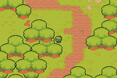 | **[ninja adventure — a top-down ninja action RPG template](ninja-adventure/README.md)** `ninja-adventure` |
| 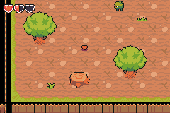 | **[ninja village — a top-down village exploration template](ninja-village/README.md)** `ninja-village` |
|  | **[oakhollow — a farming/life-sim template (Stardew Valley style)](oakhollow/README.md)** `oakhollow` |
| 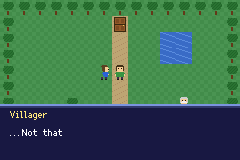 | **[overworld demo — a grid-walking top-down overworld](overworld-demo/README.md)** `overworld-demo` |
| 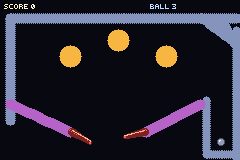 | **[pinball — a table with no tiles](pinball/README.md)** `pinball` |
| 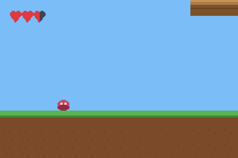 | **[platformer combat — demonstrates a platformer with health, a hearts HUD and stompable patrol enemies](platformer-combat/README.md)** `platformer-combat` |
| 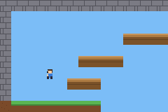 | **[platformer rooms — demonstrates a platformer with room-based camera transitions](platformer-rooms/README.md)** `platformer-rooms` |
| 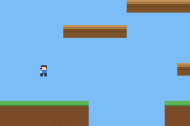 | **[platformer scroll — demonstrates a platformer with a smoothly scrolling camera](platformer-scroll/README.md)** `platformer-scroll` |
| 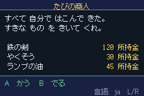 | **[polyglot — one merchant screen, four languages, and a layout that survives all of them](polyglot/README.md)** `polyglot` |
| 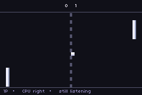 | **[pong-link — two-player Pong over the link cable](pong-link/README.md)** `pong-link` |
|  | **[prismfall — a metroidvania-shaped game whose abilities are colours](prismfall/README.md)** `prismfall` |
| 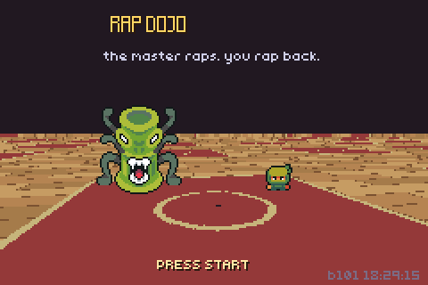 | **[rap-dojo — a call-and-response rhythm game](rap-dojo/README.md)** `rap-dojo` |
| 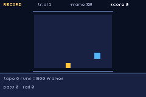 | **[rerun — record a run, play it back, and check that the game did the same thing twice](rerun/README.md)** `rerun` |
|  | **[ringside — a Punch-Out-style boxing bout seen over the player's shoulder](ringside/README.md)** `ringside` |
|  | **[roguelike — a dungeon generated on the cartridge from a seed](roguelike/README.md)** `roguelike` |
| 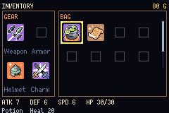 | **[rpg menu — demonstrates nested UI menus for RPGs](rpg-menu/README.md)** `rpg-menu` |
| 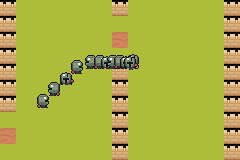 | **[rts flow — rTS de-risk A1](rts-flow/README.md)** `rts-flow` |
| 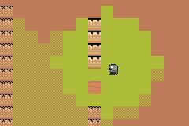 | **[rts fog — rTS de-risk A2](rts-fog/README.md)** `rts-fog` |
| 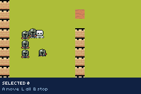 | **[rts select — rTS de-risk A3](rts-select/README.md)** `rts-select` |
| 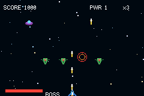 | **[shmup — a shoot-em-up (shmup) genre template with bullet patterns and enemies](shmup/README.md)** `shmup` |
| 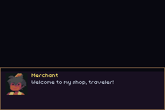 | **[shop demo — demonstrates a shop UI and inventory management](shop-demo/README.md)** `shop-demo` |
|  | **[soccer — six players and a ball](soccer/README.md)** `soccer` |
|  | **[solitaire — klondike solitaire drawn entirely from ui_rect and ui_text](solitaire/README.md)** `solitaire` |
|  | **[spectra — four colours at a time](spectra/README.md)** `spectra` |
|  | **[sunny land — a platformer template using the Sunny Land asset pack](sunny-land/README.md)** `sunny-land` |
|  | **[Sunnyside — a farming life-sim on a generated island](sunnyside/README.md)** `sunnyside` |
|  | **[Sunnyside day — the clock, the night, and the bed](sunnyside-day/README.md)** `sunnyside-day` |
|  | **[Sunnyside farm — the farming core](sunnyside-farm/README.md)** `sunnyside-farm` |
|  | **[Sunnyside save — the farm state through the cartridge](sunnyside-save/README.md)** `sunnyside-save` |
|  | **[Sunnyside sheet — character animation smoke test](sunnyside-sheet/README.md)** `sunnyside-sheet` |
|  | **[Sunnyside terrain — runtime autotiling of a generated island](sunnyside-terrain/README.md)** `sunnyside-terrain` |
|  | **[Sunnyside worldgen — the island generator against its Python twin](sunnyside-worldgen/README.md)** `sunnyside-worldgen` |
|  | **[title demo — demonstrates a main menu and title screen flow](title-demo/README.md)** `title-demo` |
|  | **[tower-def — a fixed-track tower defence](tower-def/README.md)** `tower-def` |
|  | **[transitions — every scene transition the GBA can do](transitions/README.md)** `transitions` |
|  | **[ui builder vs literal — the same screen authored two ways, measured](ui-builder-vs-literal/README.md)** `ui-builder-vs-literal` |
|  | **[ui demo — demonstrates UI components, layouts, and rendering](ui-demo/README.md)** `ui-demo` |
|  | **[ui shell — demonstrates a complex UI shell or operating-system style interface](ui-shell/README.md)** `ui-shell` |
|  | **[vault — six chests, two triggers, and a cartridge that still knows what you did after the power goes off](vault/README.md)** `vault` |
|  | **[versus — a Street Fighter–style 1v1 fighter](versus/README.md)** `versus` |
|  | **[visual-novel — a branching story on `packages/cutscene-core`](visual-novel/README.md)** `visual-novel` |
|  | **[warforge — a Warcraft-shaped RTS campaign](warforge/README.md)** `warforge` |
|  | **[warheads — pick a hull, choose a rock, and take turns dismantling the solar system it is standing on](warheads/README.md)** `warheads` |
|  | **[warsong — Warsong Gulch battlegrounds](warsong/README.md)** `warsong` |
|  | **[win-demo — the GBA's window registers, reachable from tish for the first time](win-demo/README.md)** `win-demo` |

## Benchmarks, probes and regression repros

Not things to play — these measure something or reproduce a specific bug.

| | example |
|---|---|
|  | **[bench access — what a data access and a function call actually cost on GBA](bench-access/README.md)** `bench-access` |
|  | **[bench ai — a benchmark testing the performance of the ai subsystem](bench-ai/README.md)** `bench-ai` |
| — | **[bench behav — a benchmark testing the performance of the behav subsystem](bench-behav/README.md)** `bench-behav` |
| — | **[bench boot — a benchmark testing the performance of the boot subsystem](bench-boot/README.md)** `bench-boot` |
| — | **[bench build — a benchmark testing the performance of the build subsystem](bench-build/README.md)** `bench-build` |
|  | **[bench entities — a benchmark testing the performance of the entities subsystem](bench-entities/README.md)** `bench-entities` |
|  | **[bench memory — a benchmark testing the performance of the memory subsystem](bench-memory/README.md)** `bench-memory` |
|  | **[bench room — a benchmark testing the performance of the room subsystem](bench-room/README.md)** `bench-room` |
|  | **[bench systems — where the native pass goes, system by system](bench-systems/README.md)** `bench-systems` |
|  | **[bench tables — what a generated table costs to read, and whether caching one is worth anything](bench-tables/README.md)** `bench-tables` |
| — | **[p0 spike — a prototype or technical spike for engine core mechanics](p0-spike/README.md)** `p0-spike` |
|  | **[probe arrayarg — does passing a typed module array to a native de-optimise every OTHER read of it? Yes](probe-arrayarg/README.md)** `probe-arrayarg` |
|  | **[probe arrayret — a technical test for array returns over FFI or WASM](probe-arrayret/README.md)** `probe-arrayret` |
|  | **[probe module let — does a bare module-level `let` read back correctly after reassignment on the GBA target?](probe-module-let/README.md)** `probe-module-let` |
|  | **[repro 654 agg push — aggregate repro for #654](repro-654-agg-push/README.md)** `repro-654-agg-push` |
|  | **[repro 654 capt shadow — a body-local must shadow its never-assigned `_capt` alias](repro-654-capt-shadow/README.md)** `repro-654-capt-shadow` |
|  | **[repro 654 capt stack — ~40 never-assigned Value captures + a nested arrow should not clone at entry](repro-654-capt-stack/README.md)** `repro-654-capt-stack` |
|  | **[repro 654 heap natives — many FunDecls naming `log` must not multiply VmRef allocations](repro-654-heap-natives/README.md)** `repro-654-heap-natives` |
|  | **[repro 654 sibling stack — one hot FunDecl naming ~40 sibling fns keeps VmRefs, not Value extracts](repro-654-sibling-stack/README.md)** `repro-654-sibling-stack` |
|  | **[repro 654 vec cell arrow — a nested arrow over a cell-captured native array must not double-wrap the VmRef](repro-654-vec-cell-arrow/README.md)** `repro-654-vec-cell-arrow` |
|  | **[repro eco natives — proof ROM for the ecosystem/platformer engine natives](repro-eco-natives/README.md)** `repro-eco-natives` |
|  | **[REPRO: struct-global store shadows a user variable — `G.cur = BASE + c` did not compile, because the emitted `with(|c| …)` closure shadowed the author's own `c`](repro-globalset-shadow/README.md)** `repro-globalset-shadow` |
|  | **[repro hub cave heap — a bug reproduction or regression test case](repro-hub-cave-heap/README.md)** `repro-hub-cave-heap` |
|  | **[repro intro heap — *Where the large SRPG example's memory actually goes](repro-intro-heap/README.md)** `repro-intro-heap` |
|  | **[repro mixed struct — a struct param qualifies on ONE numeric field, not all of them](repro-mixed-struct/README.md)** `repro-mixed-struct` |
|  | **[repro platformer cost — where does packages/platformer.tish spend its ticks?](repro-platformer-cost/README.md)** `repro-platformer-cost` |
|  | **[REPRO: PSG SFX vs MUSIC — does firing a PSG sound effect on a channel the music is using damage the music?](repro-psg-sfx/README.md)** `repro-psg-sfx` |
|  | **[repro sprite y — a bug reproduction or regression test case for sprite Y coordinates](repro-sprite-y/README.md)** `repro-sprite-y` |
|  | **[repro stackframe — struct params and locals across calls read back correctly](repro-stackframe/README.md)** `repro-stackframe` |
|  | **[repro structwrite — a bug reproduction or regression test case for struct writes](repro-structwrite/README.md)** `repro-structwrite` |
|  | **[repro ui layout — native flex solver vs the boxed arithmetic it replaces](repro-ui-layout/README.md)** `repro-ui-layout` |
|  | **[repro ui paint — native paint vs the boxed paint it replaces, on the same screen](repro-ui-paint/README.md)** `repro-ui-paint` |
|  | **[repro-uibar](repro-uibar/README.md)** `repro-uibar` |
|  | **[repro validate 653 — cross-module const/identifier validation must accept this program](repro-validate-653/README.md)** `repro-validate-653` |
|  | **[repro validate 655 — simple recursion must validate and run](repro-validate-655/README.md)** `repro-validate-655` |
