<!-- GENERATED BY scripts/gen_examples_readme.py — DO NOT EDIT.
     Edit the individual example's README.md instead, then re-run the script. -->

# Examples

123 example ROMs. Each directory is a self-contained npm workspace: `npm run build` makes the `.gba`, `npm start` opens it in mGBA, `npm run shot` takes a headless screenshot.

Every description below is taken from that example's own README, so this page cannot drift away from what it lists.

## Games and demos

| | example | what it is |
|---|---|---|
| 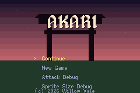 | **[AKARI](akari/README.md)** `akari` | Puzzle game demo (Akari / Light Up). |
|  | **[ANIM DEMO](anim-demo/README.md)** `anim-demo` | Demonstrates sprite animation loops, frames, and state machines. |
|  | **[ARTILLERY](artillery/README.md)** `artillery` | Two turrets, three planets, and one shot at a time. |
|  | **[ASSET SPRITE](asset-sprite/README.md)** `asset-sprite` | Demonstrates how to import and render 2D sprite assets using the asset pipeline. |
|  | **[ASTEROIDS](asteroids/README.md)** `asteroids` | Asteroids: a rotate-and-thrust wrap-around arena on the shmup toolkit's bullets. |
|  | **[AUDIO ADAPTIVE](audio-adaptive/README.md)** `audio-adaptive` | Adaptive music made testable: what a pause keeps, and what the hush it replaces throws away. |
|  | **[BANDS DEMO](bands-demo/README.md)** `bands-demo` | Demonstrates background parallax scrolling or affine transformations. |
|  | **[beatemup — a Final Fight-shaped brawler](beatemup/README.md)** `beatemup` | A Final Fight-shaped brawler: four actors on a road with real depth, a chaining light attack, knockdowns and wave-locked arenas. |
| 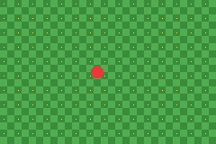 | **[BG DEMO](bg-demo/README.md)** `bg-demo` | Demonstrates background layers, tilemaps, and scrolling. |
|  | **[blockfall](blockfall/README.md)** `blockfall` | A falling-block puzzle game on the guideline ruleset: SRS kicks, 7-bag, hold, ghost, T-spins, and a budgeted search that plays it. The example tilemap_set8 was added for. |
|  | **[BUTTON DEMO](button-demo/README.md)** `button-demo` | Demonstrates reading hardware input from the GBA buttons. |
| 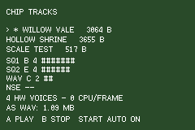 | **[CHIPTUNE](chiptune/README.md)** `chiptune` | Demonstrates audio playback for chiptunes/music tracks. |
|  | **[COLLECT DEMO](collect-demo/README.md)** `collect-demo` | Demonstrates collision detection and entity collection logic. |
|  | **[COSMO KITCHEN](cosmo-kitchen/README.md)** `cosmo-kitchen` | A complete mini-game demo (Cosmo Kitchen) showing game loop and UI. |
|  | **[crawler](crawler/README.md)** `crawler` | A first-person grid maze drawn from rectangles — the one thing 137 examples could not do. |
|  | **[CREATURE RPG](creature-rpg/README.md)** `creature-rpg` | A creature-collection RPG: a tile-locked overworld, tall grass that ambushes you, and a turn-based fight you can win, lose, flee — or end by catching the thing. |
| 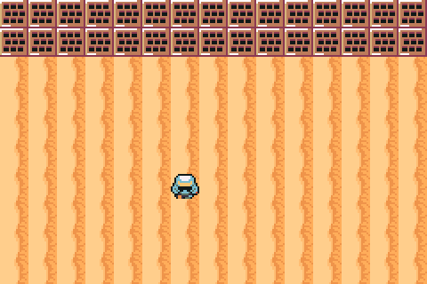 | **[CUTSCENE RAW](cutscene-raw/README.md)** `cutscene-raw` | A staged scene in a game that cannot link the game-engine crate. |
|  | **[DARK HERO](dark-hero/README.md)** `dark-hero` | A genre template or demo for a dark-themed action game. |
| 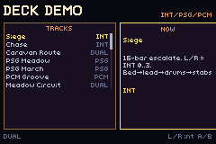 | **[DECK DEMO](deck-demo/README.md)** `deck-demo` | Demonstrates the Deck audio synthesizer format. |
|  | **[deckbuild — a deckbuilding combat, on `packages/cards.tish`](deckbuild/README.md)** `deckbuild` | A deckbuilding combat — draw, play, discard, reshuffle — on packages/cards.tish, with solitaire untouched. |
|  | **[DIALOG DEMO](dialog-demo/README.md)** `dialog-demo` | Demonstrates text rendering and typewriter-style dialog boxes. |
|  | **[DPAD SPRITE](dpad-sprite/README.md)** `dpad-sprite` | Demonstrates moving a sprite across the screen using the D-Pad. |
|  | **[earshot](earshot/README.md)** `earshot` | A sound source orbits you, and you can hear where it is. |
|  | **[ENGINE DEMO](engine-demo/README.md)** `engine-demo` | A comprehensive showcase of multiple engine features working together. |
|  | **[FEEL DEMO](feel-demo/README.md)** `feel-demo` | Every feedback in packages/feel.tish: presets, springs, hit-stop and the event channel. |
| 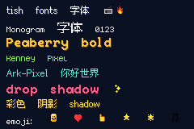 | **[FONTS DEMO](fonts-demo/README.md)** `fonts-demo` | Demonstrates custom font loading and text rendering. |
|  | **[FX DEMO](fx-demo/README.md)** `fx-demo` | Demonstrates visual effects, blending modes, and palettes. |
| 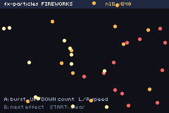 | **[FX PARTICLES](fx-particles/README.md)** `fx-particles` | A particle system, screen flash and screen shake — owned, stepped and **budgeted** by the engine. |
|  | **[GOLF](golf/README.md)** `golf` | Nine holes of top-down mini-golf — and the acceptance test for the engine's rigid discs. |
|  | **[GRADIENT DEMO](gradient-demo/README.md)** `gradient-demo` | Demonstrates hardware color gradients and raster effects. |
|  | **[grid-demo](grid-demo/README.md)** `grid-demo` | A floor-stacked match-3 on packages/grid.tish — the generic cell-grid kit, proven on the opposite gravity anchor from Magical Drop. |
| 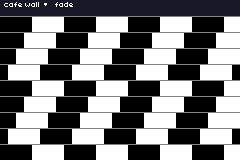 | **[illusions](illusions/README.md)** `illusions` | Optical illusions on GBA hardware — cafe wall, Hermann grid, Ouchi, Kanizsa, Ebbinghaus, Muller-Lyer, lilac chaser and a negative afterimage. |
|  | **[INPUT DEMO](input-demo/README.md)** `input-demo` | Demonstrates advanced input handling and key state debouncing. |
| 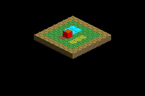 | **[ISO SPRITE](iso-sprite/README.md)** `iso-sprite` | An isometric SRPG subsystem demo showcasing sprite. |
|  | **[jrpg-party](jrpg-party/README.md)** `jrpg-party` | Four heroes, four monsters and a clock: the front-view party battle the catalogue did not have. |
|  | **[kart-circuit](kart-circuit/README.md)** `kart-circuit` | A Mode 7 kart racer on a real Mode 7 ground plane: drift, boost pads, off-road penalties and three rubber-banded AI opponents around a generated circuit. |
|  | **[keep — dungeon lock-and-key, as a package](keep/README.md)** `keep` | A dungeon room of locks, keys, bombs, shutters and pushable blocks — the acceptance test for packages/keylock.tish. |
|  | **[LINK DEMO](link-demo/README.md)** `link-demo` | Demonstrates GBA multiplayer link cable communication. |
|  | **[METROIDVANIA](metroidvania/README.md)** `metroidvania` | One castle, three ability gates, and walls that were always passable. |
|  | **[MICROGAME](microgame/README.md)** `microgame` | A WarioWare-shaped bag of four-second games — and the acceptance test for the engine's entity pool. |
|  | **[MINIMAL](minimal/README.md)** `minimal` | A bare-bones minimal project template with just a game loop. |
|  | **[mode7-demo](mode7-demo/README.md)** `mode7-demo` | A Mode 7 ground plane: per-scanline affine transforms driven by a 3D camera. |
|  | **[MONO DEMO](mono-demo/README.md)** `mono-demo` | Demonstrates monophonic audio or monochrome rendering. |
| 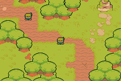 | **[NINJA ADVENTURE](ninja-adventure/README.md)** `ninja-adventure` | A top-down ninja action RPG template. |
| 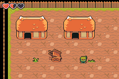 | **[NINJA VILLAGE](ninja-village/README.md)** `ninja-village` | A top-down village exploration template. |
|  | **[OAKHOLLOW](oakhollow/README.md)** `oakhollow` | A farming/life-sim template (Stardew Valley style). |
| 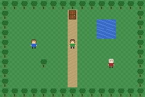 | **[OVERWORLD DEMO](overworld-demo/README.md)** `overworld-demo` | A grid-walking top-down overworld: tile-locked movement, door warps between scenes, and NPCs you face and talk to. |
|  | **[pinball](pinball/README.md)** `pinball` | A table with no tiles: per-pixel walls, a ball integrated in fixed point, and two flippers that actually swing. |
|  | **[PLATFORMER COMBAT](platformer-combat/README.md)** `platformer-combat` | Demonstrates a platformer with health, a hearts HUD and stompable patrol enemies. |
| 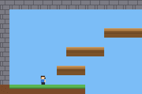 | **[PLATFORMER ROOMS](platformer-rooms/README.md)** `platformer-rooms` | Demonstrates a platformer with room-based camera transitions. |
|  | **[PLATFORMER SCROLL](platformer-scroll/README.md)** `platformer-scroll` | Demonstrates a platformer with a smoothly scrolling camera. |
|  | **[polyglot](polyglot/README.md)** `polyglot` | One merchant screen, four languages, and a layout that survives all of them. |
|  | **[pong-link](pong-link/README.md)** `pong-link` | Two-player Pong over the link cable: lockstep, where the only thing crossing the wire is a button mask. |
|  | **[PRISMFALL](prismfall/README.md)** `prismfall` | A metroidvania-shaped game whose abilities are colours. |
|  | **[rap-dojo](rap-dojo/README.md)** `rap-dojo` | A call-and-response rhythm game: fake 3D from per-scanline background bands, judged against the deck sequencer's own playhead. |
|  | **[rerun](rerun/README.md)** `rerun` | Record a run, play it back, and check that the game did the same thing twice — on the cartridge, every twelve seconds. |
|  | **[ringside](ringside/README.md)** `ringside` | A Punch-Out-style boxing bout seen over the player's shoulder: an opponent that is a data table of readable tells, and a fight that is pure reaction timing. |
|  | **[ROGUELIKE](roguelike/README.md)** `roguelike` | A dungeon generated on the cartridge from a seed — and checkable against a Python oracle, seed for seed. |
|  | **[RPG MENU](rpg-menu/README.md)** `rpg-menu` | Demonstrates nested UI menus for RPGs. |
|  | **[RTS FLOW](rts-flow/README.md)** `rts-flow` | RTS de-risk A1: 24 units following one shared flow field through an obstacle course, measured against the 60fps frame budget. |
|  | **[RTS FOG](rts-fog/README.md)** `rts-fog` | RTS de-risk A2: fog of war as a wrapping shroud layer over a scrolling scene map, and whether the BG budget holds. |
|  | **[RTS SELECT](rts-select/README.md)** `rts-select` | RTS de-risk A3: cursor selection, order issue and attack-move over a live world, with a panel that repaints only on change. |
|  | **[SHMUP](shmup/README.md)** `shmup` | A shoot-em-up (shmup) genre template with bullet patterns and enemies. |
|  | **[SHOP DEMO](shop-demo/README.md)** `shop-demo` | Demonstrates a shop UI and inventory management. |
|  | **[SOCCER](soccer/README.md)** `soccer` | Six players and a ball — the acceptance test for disc-vs-disc contact. |
|  | **[solitaire](solitaire/README.md)** `solitaire` | Klondike solitaire drawn entirely from ui_rect and ui_text — no art, no sprites, no OAM. A cold screen that repaints only when the table changes. |
|  | **[SPECTRA](spectra/README.md)** `spectra` | Four colours at a time. What is not in your lens is not there. |
|  | **[SUNNY LAND](sunny-land/README.md)** `sunny-land` | A platformer template using the Sunny Land asset pack. |
| 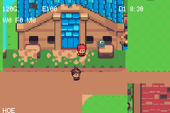 | **[Sunnyside — a farming life-sim on a generated island](sunnyside/README.md)** `sunnyside` | A Harvest-Moon-style farming life-sim on a procedurally generated Sunnyside island. |
|  | **[Sunnyside day — the clock, the night, and the bed](sunnyside-day/README.md)** `sunnyside-day` | Sunnyside de-risk 5: the day clock, night dim, sleep and pass-out. |
|  | **[Sunnyside farm — the farming core](sunnyside-farm/README.md)** `sunnyside-farm` | Sunnyside de-risk 4: till/plant/water/harvest through streamed-layer patches. |
|  | **[Sunnyside save — the farm state through the cartridge](sunnyside-save/README.md)** `sunnyside-save` | Sunnyside de-risk 6: the farm-state save schema through prefs.tish. |
|  | **[Sunnyside sheet — character animation smoke test](sunnyside-sheet/README.md)** `sunnyside-sheet` | Sunnyside de-risk 1: baked character sheets, action cycling, left/right by hflip. |
|  | **[Sunnyside terrain — runtime autotiling of a generated island](sunnyside-terrain/README.md)** `sunnyside-terrain` | Sunnyside de-risk 2: runtime mask-table autotiling of a generated island. |
|  | **[Sunnyside worldgen — the island generator against its Python twin](sunnyside-worldgen/README.md)** `sunnyside-worldgen` | Sunnyside de-risk 3: the full island generator against its Python twin. |
|  | **[TITLE DEMO](title-demo/README.md)** `title-demo` | Demonstrates a main menu and title screen flow. |
|  | **[tower-def](tower-def/README.md)** `tower-def` | A fixed-track tower defence: every creep shares one flow field, and a tower is a soldier that cannot move. |
|  | **[transitions](transitions/README.md)** `transitions` | Every scene transition the GBA can do — hardware fade, white, iris, box, wipe, curtain, bars, mosaic; software rain and checker dissolve. |
|  | **[UI BUILDER VS LITERAL](ui-builder-vs-literal/README.md)** `ui-builder-vs-literal` | The same screen authored two ways, measured — so the API choice is a number, not an opinion. |
|  | **[UI DEMO](ui-demo/README.md)** `ui-demo` | Demonstrates UI components, layouts, and rendering. |
| 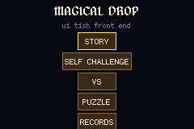 | **[UI SHELL](ui-shell/README.md)** `ui-shell` | Demonstrates a complex UI shell or operating-system style interface. |
|  | **[vault](vault/README.md)** `vault` | Six chests, two triggers, and a cartridge that still knows what you did after the power goes off. |
|  | **[versus — a Street Fighter–style 1v1 fighter](versus/README.md)** `versus` | A Street Fighter-style 1v1 fighter: frame data, hitboxes, motion commands and best-of-three rounds, with no entity system in the loop. |
|  | **[visual-novel](visual-novel/README.md)** `visual-novel` | A branching story on `packages/cutscene-core`: choices, portraits, and a flag set three scenes earlier being read back. |
|  | **[WARFORGE](warforge/README.md)** `warforge` | A Warcraft-shaped RTS campaign: harvest, build, train and a hero who levels across three missions. |
|  | **[WARHEADS](warheads/README.md)** `warheads` | Pick a hull, choose a rock, and take turns dismantling the solar system it is standing on. |
| — | **[warsong — Warsong Gulch battlegrounds](warsong/README.md)** `warsong` | Warsong Gulch–style CTF battleground: 3v3, classic WoW classes x specs, R soft-target, A/B skills, L skill wheel, double-tap dash, AI bots. |
|  | **[win-demo](win-demo/README.md)** `win-demo` | The GBA's window registers, reachable from tish for the first time: a rectangle, a per-scanline circular iris, and darkness everywhere else. |

1 of these show no image in their README yet

The thumbnail above is whatever image an example's own README embeds. Capturing a good one needs a built ROM, an emulator and a judgement call about the moment, so it is done by hand (`npm run shot` gets you a frame; choosing a *good* frame is the work). `asteroids/arena.png` and `solitaire/table.png` are the pattern to follow — note that `screenshot.png` is a CI validation artifact, not a chosen shot. Still missing one:

`warsong`

## Benchmarks, probes and regression repros

Not things to play — these measure something or reproduce a specific bug.

| | example | what it is |
|---|---|---|
| — | **[BENCH ACCESS](bench-access/README.md)** `bench-access` | What a data access and a function call actually cost on GBA. |
|  | **[BENCH AI](bench-ai/README.md)** `bench-ai` | A benchmark testing the performance of the ai subsystem. |
|  | **[BENCH BEHAV](bench-behav/README.md)** `bench-behav` | A benchmark testing the performance of the behav subsystem. |
| 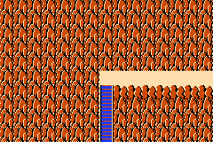 | **[BENCH BOOT](bench-boot/README.md)** `bench-boot` | A benchmark testing the performance of the boot subsystem. |
| — | **[BENCH BUILD](bench-build/README.md)** `bench-build` | A benchmark testing the performance of the build subsystem. |
| — | **[BENCH ENTITIES](bench-entities/README.md)** `bench-entities` | A benchmark testing the performance of the entities subsystem. |
|  | **[BENCH MEMORY](bench-memory/README.md)** `bench-memory` | A benchmark testing the performance of the memory subsystem. |
|  | **[BENCH ROOM](bench-room/README.md)** `bench-room` | A benchmark testing the performance of the room subsystem. |
| — | **[BENCH SYSTEMS](bench-systems/README.md)** `bench-systems` | Where the native pass goes, system by system. |
| — | **[BENCH TABLES](bench-tables/README.md)** `bench-tables` | What a generated table costs to read, and whether caching one is worth anything. |
| — | **[P0 SPIKE](p0-spike/README.md)** `p0-spike` | A prototype or technical spike for engine core mechanics. |
| — | **[PROBE ARRAYARG](probe-arrayarg/README.md)** `probe-arrayarg` | Does passing a typed module array to a native de-optimise every OTHER read of it? Yes — 3.8x. |
|  | **[PROBE ARRAYRET](probe-arrayret/README.md)** `probe-arrayret` | A technical test for array returns over FFI or WASM. |
| — | **[PROBE MODULE LET](probe-module-let/README.md)** `probe-module-let` | Does a bare module-level `let` read back correctly after reassignment on the GBA target? |
| — | **[REPRO 654 AGG PUSH](repro-654-agg-push/README.md)** `repro-654-agg-push` | Aggregate repro for #654: push + length via a shared cell. |
| — | **[REPRO 654 CAPT SHADOW](repro-654-capt-shadow/README.md)** `repro-654-capt-shadow` | A body-local must shadow its never-assigned `_capt` alias. |
| — | **[REPRO 654 CAPT STACK](repro-654-capt-stack/README.md)** `repro-654-capt-stack` | ~40 never-assigned Value captures + a nested arrow should not clone at entry. |
| — | **[REPRO 654 HEAP NATIVES](repro-654-heap-natives/README.md)** `repro-654-heap-natives` | Many FunDecls naming `log` must not multiply VmRef allocations. |
| — | **[REPRO 654 SIBLING STACK](repro-654-sibling-stack/README.md)** `repro-654-sibling-stack` | One hot FunDecl naming ~40 sibling fns keeps VmRefs, not Value extracts. |
| — | **[REPRO 654 VEC CELL ARROW](repro-654-vec-cell-arrow/README.md)** `repro-654-vec-cell-arrow` | A nested arrow over a cell-captured native array must not double-wrap the VmRef. |
| — | **[REPRO ECO NATIVES](repro-eco-natives/README.md)** `repro-eco-natives` | Proof ROM for the ecosystem/platformer engine natives. |
| — | **[REPRO: struct-global store shadows a user variable](repro-globalset-shadow/README.md)** `repro-globalset-shadow` | `G.cur = BASE + c` did not compile, because the emitted `with(|c| …)` closure shadowed the author's own `c`. |
|  | **[REPRO HUB CAVE HEAP](repro-hub-cave-heap/README.md)** `repro-hub-cave-heap` | A bug reproduction or regression test case. |
| — | **[REPRO INTRO HEAP](repro-intro-heap/README.md)** `repro-intro-heap` | *Where the large SRPG example's memory actually goes — measured in 30 seconds instead of guessed at over five-minute |
| — | **[REPRO MIXED STRUCT](repro-mixed-struct/README.md)** `repro-mixed-struct` | A struct param qualifies on ONE numeric field, not all of them. |
| — | **[REPRO PLATFORMER COST](repro-platformer-cost/README.md)** `repro-platformer-cost` | Where does packages/platformer.tish spend its ticks? |
| — | **[REPRO: PSG SFX vs MUSIC](repro-psg-sfx/README.md)** `repro-psg-sfx` | Does firing a PSG sound effect on a channel the music is using damage the music? |
|  | **[REPRO SPRITE Y](repro-sprite-y/README.md)** `repro-sprite-y` | A bug reproduction or regression test case for sprite Y coordinates. |
| — | **[REPRO STACKFRAME](repro-stackframe/README.md)** `repro-stackframe` | Struct params and locals across calls read back correctly. |
|  | **[REPRO STRUCTWRITE](repro-structwrite/README.md)** `repro-structwrite` | A bug reproduction or regression test case for struct writes. |
| — | **[REPRO UI LAYOUT](repro-ui-layout/README.md)** `repro-ui-layout` | Native flex solver vs the boxed arithmetic it replaces. |
| — | **[REPRO UI PAINT](repro-ui-paint/README.md)** `repro-ui-paint` | Native paint vs the boxed paint it replaces, on the same screen. |
| — | **[repro-uibar](repro-uibar/README.md)** `repro-uibar` | *(repro-uibar)* |
| — | **[REPRO VALIDATE 653](repro-validate-653/README.md)** `repro-validate-653` | Cross-module const/identifier validation must accept this program. |
| — | **[REPRO VALIDATE 655](repro-validate-655/README.md)** `repro-validate-655` | Simple recursion must validate and run. |
