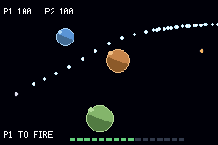

# ARTILLERY

> *Two turrets, three planets, and one shot at a time.*



Turn-based artillery in space. Aim, charge, fire — and watch the shot bend through the gravity wells
on its way. This is the spike for a full Warheads/Gunbound-style game, and the thing it exists to
pin down is the physics: **N-body inverse-square gravity, integrated in pure integer tish, on a chip
with no floating-point unit and no divide instruction.**

## Controls

| | |
|---|---|
| LEFT / RIGHT | aim |
| UP / DOWN | power |
| A | hold to charge, release to fire |
| START | rematch, once someone has won |

It plays itself until you touch the pad.

```bash
npm run assets && npm run build && npm start
```

```bash
npm run verify
```

## What this is the acceptance test for

`examples/golf` proved a rigid disc **comes to rest**. `examples/soccer` proved discs **collide
stably**. Neither says anything about a force that varies *continuously with position* — the case
where a lookup table, a fixed-point scale and an overflow bound all have to be right at once, and
where being slightly wrong gives you a trajectory that looks entirely plausible and is not
reproducible.

Three claims, each with a control that would catch the obvious fake:

1. **The arc is bent by every planet at once.** Faked by an integrator that ignores gravity — which
   would sail through the determinism check, because a straight line is extremely reproducible. So
   `verify.sh` measures the integrated turning of a real shot trace and requires a shot to bend more
   than 25°. In practice they bend 130–170°.
2. **It is computed in integers.** Faked by source that *looks* integral. `verify.sh` greps the
   **generated Rust** for four signatures: an f64 multiply, the f64 bounds-check fallback, an f64
   round-trip, and a soft-float module scalar. All four must be zero.
3. **It is bit-reproducible.** The same ROM and the same inputs must produce a byte-identical shell
   trace — with a control requiring the trace to be non-trivially long, since two empty traces are
   also identical.

## The numbers it produced

Measured on device, one frame being 4,389 Timer2 ticks:

| | |
|---|---|
| **N-body substep, 3 planets** | **~33 ticks** (including the two `ticks()` reads that measure it) |
| Sustained frame cost | ~560–650 ticks, 15% of a frame |
| `hud_text` repaint | **~6,000 ticks — 1.4 frames** on the frame its string changes |
| Arena rebuild | ~19,000 ticks, once per match |
| Heap drift across 5 matches | **0 bytes** |
| Sprite VRAM / OAM | 2 palette banks, ~97 OAM entries of 128 (64 of them the dot ring) |

## Design notes

**Everything is a table.** `1/d³` is `GACC[2048]`, `dx*dx` is `SQ[1024]`, `sqrt` is `ISQRT[2048]`,
sin and cos are 256-entry Q8 tables. `scripts/gen_artillery_tables.py` emits them and prints an audit
block — surface gravity, escape speed and acceleration at 60 px per planet class — so the gravity
constant is tuned by reading numbers rather than by rebuilding the ROM and squinting at an arc.

**Angles are 1/256ths of a turn, never degrees.** A turn divides by 256 with a mask; 360 does not.

**The near-field singularity is fixed in the table's contents, not in a runtime branch.** Every entry
below `d = 6` holds the clamped value, so the kernel is bounded everywhere including `d = 0`, at a
cost of zero instructions in the hottest loop in the game.

**One integrator serves three callers.** The live shell, the aim-preview probe and the boot self-test
all run the same inline substep loop with a different slot index. A checksum over a *second*
implementation would assert only that the second implementation had not changed.

**The aim preview is budgeted, not batch-computed.** A full lookahead every frame the d-pad is held
is thousands of ticks. A packed key invalidates the walk, which then advances a fixed slice per
frame and lights a dot as it reaches one — so the arc draws itself over about ten frames, which
reads as the computer thinking rather than as a hitch.

**The trail is spaced by distance, not by time.** A dot every third tick sounds equivalent and is
not: a shell accelerating through a gravity well covers three or four times as much ground per tick
near a planet as it does at apoapsis, so time-spaced dots bunch where the shot is slow and stretch
to nothing where it is fast — which is exactly where the interesting part of the curve is. The
spacing test is the octagonal approximation `max + (min >> 1)`: within ~5% of the true hypotenuse
for two compares and a shift, where Manhattan would overestimate a diagonal by 41% and visibly
tighten the spacing on the diagonal segments that make up most of an arc.

## ⚠️ Things that were actually wrong, and what they looked like

**A masked index is not enough — the array must be a power of two long.** `PL_X[p & 3]` over a
*three*-element array cannot be proven in bounds, so the compiler emitted its f64 bounds-check
fallback. That fallback is **contagious**: its type is f64, so `Math.imul(..., PL_MASS[p & 3])`
became `to_int32(<f64>)`, which made the product f64-typed, which dragged the whole `gx +=`
accumulation out of the integer domain and back through `to_int_unchecked`. One under-sized array
turned the entire force computation into soft float. Padding to four fixed all of it.

**And the mask has to be at the index site.** `T_X[w]`, where `w` was assigned `G.who & 1` on the
line above, still emitted the fallback — the compiler does not track the range through a local.
`T_X[w & 1]` is a direct load.

**`hud_text` costs ~6,000 ticks when its string changes.** The angle readout was in the HUD line, so
it repainted every few frames while the gun was moving: 142 frames over budget in a 3,600-frame run.
Taking the number off the text line took it to 23, all of them at turn boundaries. The aim is shown
by the dot arc instead, which is both cheaper and easier to read.

**The attract driver scored the wrong thing.** It hill-climbed on the shell's *closest approach
during flight*, which is the obvious metric and the wrong one — damage is dealt where the shell
**dies**. It converged happily on shots that passed within 14 px of the target and then sailed on to
explode somewhere else: 27 shots, a textbook convergence curve, zero damage.

**A deadband must be narrower than the smallest step it has to resolve.** With the search perturbing
by ±1 unit and the gun's deadband at 2, the driver could not act on its own finest step; it fired a
byte-identical shot for ever. Four hits, same tick, same pixel, same damage.

**The proximity fuse armed on its own launcher.** Widening the fuse from 6 px to the 14 px blast
radius made every shell detonate on the muzzle it left 9 px earlier. The damage numbers named it
exactly: every blast dealt 24, which is the falloff value at 9 px. Whoever fired first killed
themselves first, so one side "won" five matches in a row, 100-to-nothing.

**A hill climb does not survive a new arena.** Leaving the learned aim in place across a rematch let
whichever side solved the first board keep that solution on boards it had never seen.

**The catalog made the trail worse, and the honest answer was to draw it.** The obvious source for a
trail dot is `FX/Particle/Spark.png`, but a 14×8 spark scaled into an 8×8 cell and quantised into a
shared 15-colour bank lands as a one-pixel speck of an indeterminate colour — a hundred of them
along an arc read as screen dirt rather than a line. A trail dot is a UI primitive, not a particle:
uniform, legible against black, identical every time. Three pixels of deliberate shape beat a
downsampled illustration.

## What verify.sh asserts

| check | what it would catch |
|---|---|
| four greps over the generated Rust | any arithmetic that left the integer domain |
| tables are `const [i32; N]` | a table built on the heap at boot instead of loaded from ROM |
| canned trajectory checksums to a known value | any change to the physics, deliberate or not |
| a shot bends > 25° | gravity doing nothing — which passes every other check here |
| both sides fire | a turn counter that increments without changing hands |
| shells land damage | a blast that never reaches anybody |
| falloff is 39 at the centre and 0 at the rim | damage that ignores distance |
| a match reaches a verdict | a game that cannot end |
| arenas differ between matches | a generator that ignores its seed |
| heap span ≤ 8 KB | anything allocating per shot, per turn or per match |
| identical trace across two runs | a clock, an uninitialised read, or real randomness |
| the trace is ≥ 20 samples long | …the above passing because both traces were empty |
| `ran` equals `EXPECT` | a check that died without printing `ok` or `FAIL` |

## What it does not do yet

Deliberately out of scope, and all of it planned on the numbers above: a scrolling arena, three ship
classes, multiple weapons, thrust, ship placement, the link cable, and a real budgeted aim search.
The simulation is already driven by a pure `(in0, in1)` pair of input words with edges computed in
simulation time, so the two-console lockstep path is an addition rather than a rewrite.
