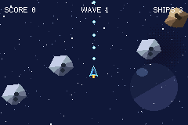
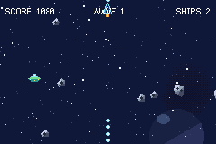

# ASTEROIDS

> *Asteroids: a rotate-and-thrust wrap-around arena on the shmup toolkit's bullets.*


The rock field, in a low-poly space-sim skin. Turn, thrust, coast on your own momentum, and break the
rocks down one size at a time. The screen is a torus — everything that leaves an edge comes back in
the other side, you included. Built on the same
[`packages/shmup`](../../packages/shmup.tish) toolkit as the [shmup](../shmup) example; the bullets,
the rock entities and the debris bursts are all its.





## Controls

| | |
|---|---|
| **Left / Right** | rotate (22.5° per step, a full turn in about a second) |
| **Up** | thrust — there is barely any friction, so momentum is the whole game |
| **A** | fire, along the nose |
| **B** | hyperspace — somewhere else at random, which is sometimes worse |
| **START** | play again, on the game-over screen |
| **SELECT** | perf overlay |

Large rock → two mediums → two smalls → nothing, at 20 / 50 / 100 points. Clear the field and the
next wave comes in one rock bigger. A saucer wanders through every so often and shoots back; it is
worth 200, and it leaves on its own if you let it.

## What comes from where

Almost all of it is the shmup kit, which turns out to cover Asteroids nearly whole:

| piece | from |
|---|---|
| `fireAngle` | the shot, fired along the ship's heading — a pure-component entity the engine flies, hits with and retires on its TTL |
| `spawnEnemy` | every rock: collider, contact damage, `ENEMY` tag, native tumble animation, and the `onDeath` hook that splits it |
| `fireAimed` | the saucer's shot at the ship |
| `explode` | the debris burst |
| `loadStars` / `scrollStars` | the slow backdrop drift |
| `tagPlayer` / `tagEnemy` | the tags a hand-built ship and its targets have to wear |

Three things are genre-specific and live in `src/main.tish`: a ship that rotates and accelerates,
rocks that split when they die, and the wrap.

### The wrap is native, and has to be

`set_arena_wrap(1)` is a world flag in `tish-gba-game-engine` that makes the 240×160 screen a torus
for every entity at once. An entity is teleported only once it is *fully* past an edge, and lands
exactly one span over — so it slides off and back on with no gap and no jump.

It is native because the tish version does not fit in a frame: twenty-odd rocks each reading two
coordinates and writing a transform back through the ABI is thousands of ticks of call overhead, for
arithmetic that is free in Rust. It is a world switch rather than a per-entity component because in a
game that wants it the rule is universal — and shots, which `fire_bullet` spawns natively, have no
tish-side handle to flag anyway.

One consequence worth knowing: while it is on, **nothing is ever off-screen**, so
`set_despawn_offscreen` stops retiring anything. Shots die on their `ttl` instead, which is the
classic behaviour regardless, and the saucer leaves by `set_lifetime`.

### The ship is invulnerable at birth, without a component for it

`set_health` starts an entity with a full bar and *no* i-frames, and `damage` is what opens the mercy
window. So the ship is born with two hit points and spends one immediately:

```
set_health(e, 2, SPAWN_INV)
damage(e, 1)
```

which leaves exactly one hit point behind a full-length window. Once it closes, a single rock ends
the life — as it should.

## What it costs

One tish tick for the ship, one for the saucer when there is one, and the main loop. **A rock costs
no callback at all**: it drifts on native velocity, tumbles on a native looping animation, wraps in
the native pass, and only wakes tish up at the moment it dies, to split.

That does not make a rock free, and the difference matters. Measured on device (SELECT):

| entities | `world_step` | frame period (4389 ticks = 60fps) |
|---|---|---|
| 9 | 1046 | 4514 |
| 22 | 2413 | 4904 |
| 35 | 3324 | 5754 |
| 46 | 4416 | 7110 |

Collision is nearly flat across that whole range (114 → 186 ticks). What grows is the engine's
**native system pass** — about 60 ticks per live entity, paid whether or not the entity runs a line
of game code, because a dozen systems each scan every slot.

So the field has a ceiling: waves cap at six large rocks, and at sixteen rocks a break yields one
piece instead of two. Six large rocks split all the way down would be twenty-four pieces, and with
the ship, its shots and a couple of bursts that is where the step starts eating the frame. In play
the count sits around 10–12, `world_step` runs 770–1400 ticks, and the frame holds 60fps.

## The art

All procedural — [`scripts/gen_asteroids.py`](../../scripts/gen_asteroids.py), no external pixels.
Every shape is a real polygon, rotated in float coordinates and rasterised hard-edged, so each frame
lands on exact palette colours.

The rocks are flat-shaded facet by facet against a **fixed** light direction, taken from the geometry
*after* rotation — so a tumbling rock relights as it turns, the way a faceted solid does, rather than
spinning a painted highlight around with it. That one detail is most of what sells the read at 32px.
Rotation frames are contiguous per silhouette, which is what lets the tumble run on `anim_play`.

The ship is faceted the same way but carries a bright rim, and that is not decoration: without it the
shadow facet is close enough to empty space that half the hull disappears at some headings, and the
silhouette appears to change shape as it turns. The rim is what keeps all sixteen frames reading as
one object — and it doubles as the vector-Asteroids outline.

```bash
npm run art
```

## Build and run

```bash
npm run build
```

```bash
npm start
```
