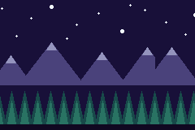

# BANDS DEMO

> *Demonstrates background parallax scrolling or affine transformations.*

Stars that barely move, mountains that drift, a treeline that rushes past. All three are **one
background layer**.



## Why

The GBA has four background layers and that is the whole budget. A game with menus has already spent
one on its UI canvas and one on the world, so two is the hard ceiling on separately-scrolling
backdrops — and two is not much depth.

But a background's horizontal scroll register can be rewritten *between scanlines*, by DMA, while the
screen is drawing. So one layer can scroll at a different rate across the stars, the mountains and
the trees. Three depths, one layer, no extra VRAM, and no per-frame cost beyond the 320-byte table
the engine hands the DMA.

## The whole thing

```
const bg = bg_new(bands, 3)
bg_bands(bg, [0, 12, 52, 72, 104, 240])
```

A flat `[firstRow, mulX, …]`: rows 0..159 top to bottom, `mulX` in 1/256ths of the camera, where 256
tracks the camera exactly and 0 pins the layer to the screen. Each band runs to the next one's first
row. `bg_bands(bg, [])` turns it off.

For a Tiled map's backdrop layer the call is `sceneBands(i, …)` from `packages/engine`, where `i`
counts the scene's parallax layers in `.tmj` order.

## Two limits, both hard

**One banded layer per game.** agb's frame holds a single DMA slot and its HBlank transfer is
hardcoded to DMA channel 0, so a second banded layer would silently replace the first. The engine
gives it to the first layer that asks and lets the rest scroll normally.

**Only a background that WRAPS.** A full-screen `background:` image (this example) or a `scene:`
backdrop layer, both of which repeat every 256px in hardware. The world layer of a large map is
streamed and only keeps a 256×256 window of tiles in VRAM, so scrolling it hundreds of pixels per
scanline would show tiles that were never loaded.

## Also a test

There is deliberately **no `bg_parallax` call** here. This layer has no whole-layer scroll at all, so
every pixel of movement is the per-scanline DMA. If banding broke, the picture would sit perfectly
still rather than merely look wrong.

Measured over 60 frames, drifting right — the numbers the three multipliers predict:

| band | mul | moved | predicted |
|---|---|---|---|
| stars | 12 | 2px | 2.8 |
| mountains | 72 | 17px | 16.9 |
| trees | 240 | 9px | 56.2, which aliases to 8 — the conifers repeat every 16px |

## Controls

**Left / Right** scrub the camera; it drifts right on its own otherwise, so a screenshot shows the
effect with no input.

Those two did nothing at all until 2026-08-11. `let LEFT = 5` / `let RIGHT = 4` are the SHOULDER
buttons in tish-agb's `button_of` — the code order is `0 A · 1 B · 2 Select · 3 Start · 4 L · 5 R ·
6 Up · 7 Down · 8 Left · 9 Right`, which is not the GBA's register bit order, and the d-pad's
horizontal axis comes *after* the vertical. A headless frame with RIGHT held was pixel-identical to
one with no input, and the sentence above was the only implementation of the feature.

That is why there is now a [`verify.sh`](verify.sh). A dead control emits no crash, no log line and
no changed pixel, so it is indistinguishable from one nobody pressed — and nothing pressed it. The
suite presses both and asserts the camera moved *and* which way:

```bash
npm run verify
```

## See also

[`docs/gba-backgrounds.md`](../../docs/gba-backgrounds.md) — the four-layer budget, the priority rule
that decides whether the player is visible at all, the one-palette-set constraint, and why a scene's
backdrop layers are wrapping backgrounds rather than streamed.

## Regenerating the art

```bash
python3 scripts/gen_bands_demo.py
```

One 256×256 image — exactly the GBA's background wrap, so it tiles seamlessly. The band boundaries in
`src/main.tish` (`MTN_TOP`, `TREE_TOP`) match the strata the script draws; change them together.
