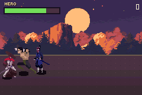

# beatemup — a Final Fight-shaped brawler

> *A Final Fight-shaped brawler: four actors on a road with real depth, a chaining light attack, knockdowns and wave-locked arenas.*



Four characters on a road with real depth. A light attack that chains, a heavy that knocks down, a
jump kick, a panic move that costs health, and three wave-locked arenas.

```bash
npm run build && npm start
```

## Controls

| | |
|---|---|
| **A** | attack — press it again as one lands and it **chains**; the third link knocks down |
| **B** | jump. Attack in the air for a jump kick, which nothing on the ground can reach |
| **L** | heavy — slow, and it puts them on the floor |
| **R** | grab — no reach at all, always knocks down, hits hardest |
| **A + L** | panic move — hits both sides at once and costs you health for the privilege |
| **↑ / ↓** | walk up and down the road — this is the depth axis, and it is how you leave a punch |
| **→ →** | run |
| **START** | advance a screen |

⚠️ There is **no grab animation** in these packs — 24 poses and none of them is a hold — so R
borrows the heavy swing and reads as a shoulder throw. It is the honest version of a grab on this
art rather than a missing feature pretending to exist.

## What is where

| file | what it is |
|---|---|
| `packages/beatemup.tish` | the brawler engine: N actors, the depth axis, frame data, knockdowns |
| `packages/motion.tish` | shared with `examples/versus` — the input ring, the double-tap run |
| `scripts/fighter_art.py` | shared with `examples/versus` — the 24-pose character bake |
| `src/chars.tish` | the roster, as a table of numbers |
| `src/main.tish` | boot, waves, arenas, the camera |
| `src/hud.tish` | health bar, score, combo counter |

`npm run assets` rebuilds the art from the CC0 source packs (see `../versus/assets/ATTRIBUTION.md`).

## The third axis is the whole genre

A character's `y` is not a screen row, it is where it stands **across** the road. That one number
decides three things, and they have to agree or the game feels broken:

1. **Where it draws, and in what order** — `sprite_set_depth(spr, y)`, so someone standing nearer the
   camera covers someone further up the street.
2. **Whether a punch connects** — `|attacker.y - victim.y| <= 12`. The previous version of this
   example had no depth test at all, so you hit people standing behind you and the road was
   decoration.
3. **Where the AI has to stand before it can attack** — which is why enemies line up on your lane
   instead of just charging your column.

`z` is height off the ground. It moves the sprite but never the shadow, and **the shadow is not
decoration**: with a virtual Z axis, "far away" and "in the air" are the same pixels at the same
height, and the shadow staying on the ground is the only thing that tells them apart.

## Three rules that make a crowd fair

A brawler with four independent attackers is not four times harder, it is unplayable — there is no
gap to move or hit back in. Three rules fix it, and all three are in `packages/beatemup.tish`:

1. **One attack token.** However many enemies are on screen, exactly one may be committed to an
   attack. It is taken when the swing starts, handed back when it ends or when its owner is hit, and
   it expires on a timer so a coward cannot hold the wave hostage.
2. **The wince.** Being hit cancels whatever the victim was doing *and* releases its token. Without
   it, enemies swing straight through their own hitstun and trade blow-for-blow while you are
   mid-combo — which is exactly what "I die constantly" feels like.
3. **Mercy frames.** The player is invulnerable for ~28 frames after being hit, so a crowd cannot
   loop them between two attackers.

## What it is rebuilt from

The old version of this example was the ECS one: `mount`/`create`/`behave`/`step`, per-entity
`data.` objects, `Math.random()` on the frame path, and 16×16 placeholder art. It ran, in the sense
that it produced a picture. This one applies what `examples/versus` measured:

- **No entity system.** Flat `i32[]` state and one `beatemupTick()`, because the engine's `behave()`
  hooks dispatch through a boxed `Value` trampoline.
- **Frame data, not timers.** Startup / active / recovery, hitbox vs hurtbox, hitstun, pushback,
  knockdown — a table, so a new enemy is one line.
- **Inline the small helpers.** A tish function that touches a module array is a boxed closure
  wherever it lives, at roughly 120 ticks a call. `clampX` was two comparisons called eight times a
  frame; inlining it and the pose lookup, and only running the wave check when something dies, took
  ~1,300 ticks off the frame.
- **Digits, not text, for anything that changes.** The score changes on the frames a hit lands.
- **`let X: i32`, not `const X`.** A tish `const` compiles to a thread-local `Cell<f64>`, so
  `A[b + A_X]` was a *soft-float* add on a chip with no FPU. Converting every constant in this
  package and the fighting one — a mechanical change touching no logic — took the tick from 7,800
  ticks to 5,700 and the whole frame from 12,400 to 10,000. It is the cheapest perf change in the
  repo and most of `packages/` has not had it yet.

## The stage is three parallax layers out of one atlas

Not `bg_bands` — per-scanline banding turns a *dropped* frame into a *corrupt* one, and this game
drops frames. Instead: one `background:` atlas of 178 unique 16×16 tiles, and three GID grids built
with `parallaxLayer`, drifting at 24/96/256 of the camera. Layers are created **near first**, because
backdrops sharing a priority break the tie by creation order and the first one drawn wins.

Two things that cost a build each:

- **The pack's layers are all bottom-aligned to each other**, so dropping them in as-is buries the
  treeline under the road and reads as "the trees layer is missing". Each layer names the source rows
  it wants and where they go (`LAYERS` in `scripts/gen_beatemup.py`), and the generator writes
  `assets/stage-preview.png` so the composition can be iterated without building a ROM.
- **agb's background palette packer is much worse than a greedy first-fit.** The generator now
  implements the greedy check — and it said this stage needed 8 palettes where agb's
  `overload_and_remove` demanded 25 and refused to build with `DoesNotFitError`. A local check is a
  useful guard, not a substitute; the budget list simply starts at a colour count that packs.

See [docs/perf-rules.md](../../docs/perf-rules.md) for the general list — this example is one of the
two it was written from.

## Known limits

Peak frame cost with four actors on screen is ~10,500 Timer2 ticks against a 4,389-tick 60fps frame,
falling to ~8,700 with fewer — so a busy brawl still drops frames, the same trade `examples/versus`
makes. The remaining cost is boxed dispatch: roughly twenty-five helper calls a frame inside the
tick.

⚠️ **Sprite VRAM is the other hard ceiling, and it panics rather than degrading.** Running out gives
`have space for sprites: SpriteFull` from inside agb, on an innocent frame, after minutes of play.
Two things caused it here and both are worth knowing: `sprite_set_visible(h, 0)` does **not** release
a sprite's Object, so four hidden 64x64 overlays still held 8 KB; and `text_draw` allocates sprite
VRAM per letter group, so a 16px banner competed with the fighters. The overlay is now one shared
sprite and every word on screen is `ui_text` on the background canvas.

Four actors is also a hard art ceiling, not a taste one: three sprites each (body, attack overlay,
shadow) with 64×64 bodies is 16 KB of the GBA's 32 KB of sprite VRAM.
