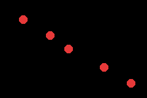

# COLLECT DEMO

> *Demonstrates collision detection and entity collection logic.*



Collision + events on tish_gba_game_engine: a player collects coins that vanish on
contact. Both behaviours — the player controller and the coin's collision reaction —
are tish components; the Rust engine detects overlaps and dispatches the callbacks.

```tish
define_component('Player', {
  update: (me, e, dt) => { set_body(e, input_x() * 1.5, input_y() * 1.5) }
})
define_component('Coin', {
  onCollide: (me, e, other) => { despawn(e) }   // collected → remove
})

let hero = spawn(); set_collider(hero, 16.0, 16.0); add_behaviour(hero, 'Player', {})
// ... spawn coins with colliders + the Coin behaviour ...
while (true) { world_step() }
```

Each `world_step()`, after movement, the engine's **collision** phase AABB-tests all
collider pairs and fires `onCollide(me, e, other)` on each side that defines it
(reentrancy-safe, like `update`). Walk the hero into a coin and it despawns (the
engine also hides its tish-agb sprite). An `overlaps(a, b)` query is available for
imperative trigger checks.

(Collision is O(n²) for now — a spatial hash is the later optimization.)

Engine: `crates/tish-gba-game-engine`. Build: `npm run build`.
