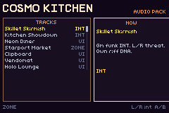
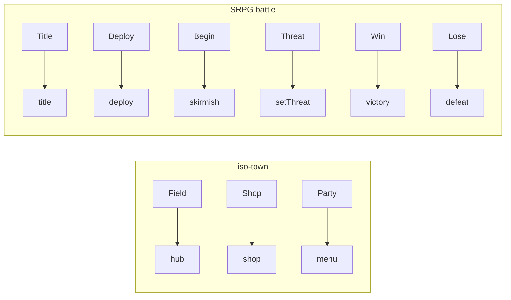

# COSMO KITCHEN

> *A complete mini-game demo (Cosmo Kitchen) showing game loop and UI.*



Campy retro-futurist **intergalactic chef** RPG music + SFX for the GBA.

Jetsons diner meets SRPG kitchen wars: bright pulse leads, rubbery wave bass,
bitcrushed “appliance” PCM, spoon / burn / order-bell motifs shared across the pack.

This example is a **jukebox + API**. It does not wire iso-town / the isoboard SRPG example yet —
import [`src/audio.tish`](src/audio.tish) from those demos (or a full game) when ready.

## Run

```bash
npm start          # build + mGBA
npm run verify     # dual-engine smoke (boots Starport Market)
npm run gen:music  # regenerate assets/music/*.deck from scripts/gen_music.py
```

**Controls:** Up/Down browse · A play · B stop · L/R intensity on **INT** tracks.

## Motifs

| Motif | Shape | Use |
|-------|-------|-----|
| Spoon | rising C–E–G | brand, accept, plating, victory |
| Burn | descending minor 2nd + noise | danger, defeat, law break |
| Order bell | high pulse ping | shop open, turn start |

## API

```tish
import { playZone, playBattle, playSting, setThreat, stopMusic, sfx } from './audio'

playZone("hub")           // starport market
playBattle("skirmish")    // skillet INT @ 0
setThreat(enemyHeat)      // 0..3 stems
playSting("victory")
sfx("chop")
stopMusic()
```

### `playZone` keys

`title` · `hub` · `menu` · `shop` · `holo` · `hyperspace` · `agri` · `night` ·
`liner` · `asteroid` · `icebox` · `spice` · `sugar` · `galley` · `compactor` ·
`deploy` · `techno` · `house` · `acid` · `trance` · `breaks` · `dub` · `electro`

### `playBattle` keys

`skirmish` (INT) · `card` · `rush` · `boss` (INT)

### `playSting` keys

`victory` · `defeat` · `level` · `sidequest` · `law`

### `sfx` keys

Kitchen: `sizzle` · `chop` · `ladle` · `microwave` · `bell` · `card` · `pop` ·
`fizz` · `whistle` · `fridge` · `steam` · `clink` · `spatula` · `timer` ·
`grease` · `bubble` · `spoon`

Also: `coin` · `accept` · `blip` · `slash` · `whoosh` · `hit` · `cancel` · `chime`

Each song uses a **different** progression / groove (ii–V funk, Lydian, Phrygian,
noir Cm, waltz A, Bbm dembow, Locrian grind, warehouse techno, house, acid, …) —
regenerate with `npm run gen:music` after editing `scripts/gen_music.py`.

## Cue map (iso baselines)

Neither iso-town nor the isoboard SRPG example (now in the chuggie-tactics repo) ships audio today. Wire like this:

| iso-town mode | Call |
|---------------|------|
| Field walk / dialog | `playZone("hub")` (or zone key) |
| Shop | `playZone("shop")` + `sfx("bell")` on open |
| Party menu | `playZone("menu")` |
| Buy success | `sfx("coin")` |
| Dialog advance | `sfx("accept")` / typewriter `sfx("blip")` |

| SRPG battle phase | Call |
|-------------------|------|
| Title | `playZone("title")` |
| Deploy | `playZone("deploy")` |
| Battle begin | `playBattle("skirmish")` or `"boss"` |
| Enemy pressure | `setThreat(0..3)` |
| Melee / magic | `sfx("chop")` / `sfx("microwave")` → `sfx("sizzle")` |
| Heal | `sfx("ladle")` |
| Law break | `sfx("whistle")` + optional `playSting("law")` |
| Victory / defeat | `playSting("victory")` / `"defeat"` |
| Level up | `playSting("level")` |



## Catalog

| File | Tag | Bars |
|------|-----|------|
| `title-neon-diner.deck` | UI | 16 |
| `hub-starport-market.deck` | ZONE | 16 |
| `menu-clipboard.deck` | UI | 12 |
| `shop-vendomat.deck` | UI | 12 |
| `zone-hyperspace-cruise.deck` | ZONE | 16 |
| `zone-agri-dome.deck` | ZONE | 16 |
| `zone-neon-night-market.deck` | ZONE | 16 |
| `zone-cruise-liner.deck` | ZONE | 16 |
| `dungeon-icebox.deck` | DUN | 16 |
| `dungeon-spice-mines.deck` | DUN | 16 |
| `dungeon-sugar-caverns.deck` | DUN | 16 |
| `dungeon-derelict-galley.deck` | DUN | 16 |
| `battle-skillet-skirmish.deck` | INT | 16 |
| `battle-card-recipe-duel.deck` | BTL | 12 |
| `boss-kitchen-showdown.deck` | INT | 16 |
| `deploy-mise-en-place.deck` | BTL | 12 |
| `sting-*.deck` (5) | STG | short |

Authoring: deck → `deckPlay` ([docs/deck.md](../../docs/deck.md)). Caps: 2 pulse / 1 wave / 1 noise / 2 PCM.
