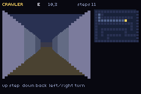
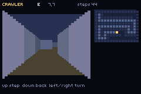

# crawler

> *A first-person grid maze drawn from rectangles — the one thing 137 examples could not do.*



The acceptance test for **`packages/fpview.tish`**, which is new.

| | |
|---|---|
|  | the auto-map fills in as you go; the wall-follower is 44 steps into this one |

## Controls

- **up** step · **down** back up · **left/right** turn ninety degrees
- Leave it alone and a right-hand-on-the-wall walker solves the maze, then generates another.

## Why it exists

Two independent engine reviews a day apart, from different starting questions, named the same hole:
the whole catalogue is side-view, top-down or isometric, and **nothing renders into the screen**.
The first-person grid crawler — Wizardry, Eye of the Beholder, Etrian Odyssey — is a very GBA shape
and there was nothing behind it.

## It is not a raycaster, and that is the design

The instinct is Wolfenstein: a ray per column, DDA through the grid, a wall slice per column. That
buys free movement and free rotation, and costs a sin/cos table, **a division per column** for the
perspective correction — on a chip with no divide instruction — and a full redraw every frame,
because a continuously-changing view is never not changing.

A grid crawler does not move continuously. It steps one cell and turns ninety degrees, so **the view
is a pure function of (cell, facing)** and there are exactly four facings. The geometry can therefore
be *exact* rather than sampled: at each depth the corridor opening is a known rectangle shrinking
toward a vanishing point, and a wall is either there or it is not. No trigonometry, no division per
column, and no per-frame work at all — the screen is redrawn when you move and at no other time.
Standing still issues zero draw calls.

That is also how the games it imitates did it, and for the same reason.

**The side walls are vertical strips**, because `ui_rect` is axis-aligned and a receding wall is a
trapezoid. Eight strips per wall reads as a straight edge at this resolution and keeps the whole view
under about seventy rectangles — fine once per step, ruinous sixty times a second.

## The bug worth keeping

The wall-follower spun on the spot and logged **not one exit in 9,000 frames**. Written the obvious
way — *"if the right side is open, turn right"* — it turns, and then its **new** right is the cell it
just came from, which is also open, so it turns again, for ever. The right-hand rule is
turn-*and*-advance as one indivisible move; a pending-step flag is what makes it one. With that
fixed:

```
CRAWLER exit reached in 60 steps
CRAWLER new maze seed 20261791
CRAWLER exit reached in 52 steps
```

## Notes

- The maze is a seeded recursive-backtracker carve, so it is the **same maze every boot** — which is
  what makes a headless capture at frame N mean anything.
- Odd dimensions on purpose: a backtracker carves the odd cells and leaves the even ones as walls, so
  a solid border comes out for free.
- `fpSolid` treats **out of bounds as wall**, which stops both the renderer and the player from
  walking off the edge of the world into an empty screen.
- Everything is `ui_rect`/`ui_text` — no background image, no sprites, no art at all.

## Build

```bash
npm run build && npm start
```
