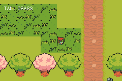
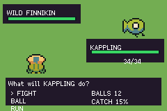
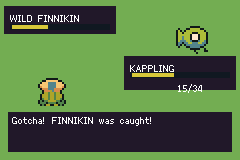

# CREATURE RPG

> *A creature-collection RPG: a tile-locked overworld, tall grass that ambushes you, and a turn-based fight you can win, lose, flee — or end by catching the thing.*

A grid-RPG-style world built on `packages/engine.tish`'s grid movement, with Pixel-Boy and AAA's CC0
**Ninja Adventure** art. One continuous 40×36 map — a town in the south, Route 1 in the north,
joined by a gap in a treeline — plus two house interiors you walk into through their doors. Step
into the tall grass and one of six wild creatures finds you.



| | |
|---|---|
|  |  |
| FIGHT / BALL / RUN, with the live catch odds | The throw sticks |

## Controls
- **d-pad** — walk, one tile per press
- **A** — talk to whoever you are facing, and turn a dialogue page
- **walk onto a door** — go inside. Walk onto the doorway again to come back out, onto the doorstep
  you left by.
- **in a battle** — **up/down** move the cursor, **A** confirms, **B** backs out of the move list.

## The loop

Walk into tall grass and every step rolls a 14% encounter. It flashes, the screen shakes, the
drums come in, and you are in a fight: your creature against one of six wild ones, 1v1,
speed-ordered, two moves each — **FIGHT / BALL / RUN**. Win, lose, escape or catch it and you are
put back on the exact tile you were standing on, with the music dropped back to the walking
arrangement.

**Catching is the point of fighting.** A throw sticks 15% of the time at full health and up to 80%
once the wild one is nearly down, and the live odds sit on the menu (`CATCH 54%`) so the gradient
teaches itself — no tutorial needed. A miss costs you the turn: it breaks free and gets a free
swing, so throwing on turn one is a real gamble. **What you catch becomes your partner**, which is
what makes the choice matter — a caught NIGHTWING outruns everything on the route, a caught
CAPSHROOM outlasts it. Balls and the caught list survive between battles (they are the run, not the
fight — the one deliberate exception to `battleStart`'s reset-everything rule), and MOM restocks you
six at a time, because without her the mechanic has a dead end in it.

**The roll only happens in the grass.** The road through Route 1 is deliberately clear of every
patch, so the gate keeper telling you to keep to the dirt is the truth and crossing untouched is a
real choice — the generator asserts it.

## What it demonstrates

**Grid movement is not a physics problem.** It is the ECS `GridPos` component, surfaced through
`makeEntity` — `onGrid(col, row)`, `gridStep(dx, dy)`, `gridMoving()`, `facing()`, `interact()`,
`gridCol()`/`gridRow()`. A tile-locked step, occupancy so NPCs block, and press-A-to-talk in the
faced tile all come from the engine. This example adds no movement code.

**Every asset is generated.** `scripts/gen_creature_rpg.py` bakes the five character sheets out of
the vendored pack and authors all three `.tmj` maps against the shared Tiled tileset library;
`scripts/gen_creature_music.py` writes the theme. Nothing here was placed by hand, so the pack and
the map stay the source of truth — see [assets/ATTRIBUTION.md](assets/ATTRIBUTION.md).

**The tall-grass mask is derived from the map, not written twice.** The engine gives no way to read
a tile's GID back out of a streamed map, so the generator emits `src/generated/world.tish` from the
same `GRASS_PATCHES` list it paints the tiles from. Change a patch and the lookup follows.

**One intensity, one playhead.** The theme is a `.deck` song in four stems — bass + pad at layer 0,
melody at 1, drums at 2 — sharing one playhead, so `deckSetIntensity` lifts the arrangement when an
encounter starts and drops it when the fight ends, both in time, neither restarting the music. That
is the whole hardware budget: 2 pulse, 1 wave, 1 noise, and deck layers are mute gates rather than
extra voices, so a fifth track would be a compile error.

**The battle takes input as an argument and never draws.** `src/battle.tish` is the turn engine and
nothing else — `battleTick(keys)` never reads the pad, so a whole fight can be driven from a table
with no controller and no screen; the caller owns every pixel. Both conventions are lifted from
`packages/battle.tish` (the SRPG grid-battle engine — the wrong shape to import here, the right
shape to copy), along with the third: `battleStart` resets everything up front, because a second
battle inheriting the first one's state is a bug this repo has already shipped once.

**⚠️⚠️ The pack has no monster back sprites, so they are authored.** Every row of every monster
sheet is a face-forward or side view — the four rows are animation and aspect variants, *not* four
directions, unlike the `Actor/Character/` cast. Dump all sixteen cells of `GoldRacoon` and every one
has eyes. A battle shows your own creature from behind, so the generator authors each back by
healing the face out of the front: a per-species face box, inpainted from the nearest true body
pixel with the outline colour excluded as a source. Silhouette, palette and shading survive, so the
pair reads as one creature from two angles rather than as two creatures.

That took a wrong turn worth recording. Measuring *how much row 0 differs from row 1* establishes
only that the frames differ — it is a different claim from "one of them is a rear view", and the
numbers looked convincing (Slime scored 280 of 765) while being no evidence at all. No universal
rule worked either: luminance thresholds miss mid-tone eyes, and colour-frequency detection ate the
kappa's shell while leaving the bat's face on. At 16×16 the face has to be stated per sprite. The
generator asserts each box heals at least 20 px, so a box that misses the face cannot quietly ship
two identical sprites.

All seven species are baked into one strip and quantised together, so the whole roster shares a
**single** palette bank instead of seven.

**Hitting and being hit do not feel the same.** They are different events and shaking the camera
for both made every exchange identical:

| event | what moves |
|---|---|
| the wild one takes a blow | **only it flinches** — a decaying side-to-side on that sprite alone, back to its exact home pixel. The camera holds still, so the hit reads as landing on something over there. |
| you take a blow | **the whole screen recoils**, because it happened to you. |

The screen shake is `packages/feel.tish`'s `feelBump`, not raw `fx_shake`: the same native spring
underneath, but scaled by feel's intensity and *summing*, so a jolt landing on top of another reads
as one bigger jolt instead of replacing it and losing the first one's decay. The encounter uses
`FP_ILLEGAL`, the one stock preset that is pure bump plus a PSG note with nothing to draw. Both
paths get `feelFreeze` hit-stop, and `feelFrozen()` gates the world step *and* `battleTick` — so the
stop really stops the game, while the flinch keeps animating outside the gate.

**The numbers were simulated, not guessed.** The damage arithmetic was run over 6,000 fights per
matchup before it went near the hardware. The first pass had one species winning 65% of the time —
a wall three steps into the first patch of grass — and three other species as unloseable walkovers.
Both are the same bug: the choice between two moves did not matter. It now sits at 89–100% if you
pick the right move and as low as 1% if you pick the wrong one against a fast glass cannon.

## Traps this example hit, every one silent

**⚠️⚠️ An entity wrapper is on loan.** `create()` and `entity()` hand out one of *two* rotating pool
slots (`packages/engine.tish:55`). Storing the wrapper in a module variable and using it next frame
does not crash — it silently starts naming whichever entity borrowed the slot since. The first build
of this example was unplayable because `hero` had been re-pointed at an NPC by the rest of the spawn
loop, so every `gridStep` was trying to walk the gate keeper. **Hold the id; call `entity(id)` when
you want the methods back.**

**⚠️⚠️ A `Collision` layer cannot make anything solid.** It is real and it is honoured, but it only
forces cells *walkable* — a painted cell does nothing and a blank one **erases** the tileset's own
collision. The first build of this map used one and the player walked out through the treeline, the
map border, and both houses. Force-solid is a separately-named `Solid` layer, added to
`crates/tish-gba-scenepack/src/tiled.rs` for this example precisely because `Collision` is
deliberately clear-only (forcing solid from it once over-blocked the overworld and broke bridges).

**⚠️ Tile collision is the tileset's, and it is sparse.** `TilesetNature` marks exactly **two** tiles
solid in total — the trunk cell of the pink and green canopies — so a treeline stamped every three
columns leaves two of every three cells walkable. `TilesetField`, `TilesetFloorDetail` and
`tileset_bed` mark **none**, so a grass patch or a bookcase is scenery you walk through. Every wall
here is painted on the `Solid` layer.

**⚠️ A failed escape cost nothing.** `afterMessage` hands the turn over via `second` and ignores
`actor`, so the RUN path — which set `actor = 1` — never gave the wild one its free hit. Found only
because the ball-miss path needed the identical hand-over and the two were written side by side.

**⚠️ Only two of TilesetHouse's five facades are solid** (bases 0 and 12). A lab built from the blue
awninged shopfront at base 16 looked far better and you could walk straight through it. The
generator asserts the base is one of the solid pair.

## Layout

The map is authored from named coordinates in `scripts/gen_creature_rpg.py`, and the bake asserts
the two things that would otherwise break quietly: **no grass patch may touch the road** (the gate
keeper says keeping to the dirt is safe, and a patch across it makes that a lie), and **a facade
must be one of the solid bases**.

## Build / run
```bash
npm run build      # build the ROM
npm start          # build + open in mGBA
npm run assets     # re-bake the art, the maps and the music from the vendored pack
```

## The roster

Seven species, ids in the order of `ROSTER` in the generator — which is also the order of the stat
tables in `src/battle.tish` and the frame order in `creatures.png`. Keep the three in step.

| id | name | source | HP | ATK | DEF | SPD | moves |
|---|---|---|---|---|---|---|---|
| 0 | KAPPLING *(starter)* | `KappaGreen` | 34 | 14 | 10 | 13 | TACKLE · BUBBLE |
| 1 | SLIMELET | `Slime` | 34 | 13 | 12 | 8 | TACKLE · SPLASH |
| 2 | CAPSHROOM | `Mushroom2` | 36 | 12 | 14 | 7 | TACKLE · SPORE |
| 3 | NIGHTWING | `YellowsBat` | 32 | 13 | 9 | 16 | TACKLE · GUST |
| 4 | GILDPAW | `GoldRacoon` | 30 | 15 | 8 | 15 | TACKLE · BITE |
| 5 | SCALETAIL | `Lizard` | 34 | 13 | 11 | 12 | TACKLE · BITE |
| 6 | FINNIKIN | `Fish` | 34 | 11 | 13 | 6 | TACKLE · SPLASH |

## Status

**Phases 1–3 done.** The overworld, the town and both interiors, NPC dialogue, the door round trip,
the theme, tall-grass encounters, and the full turn-based battle.

Verified on hardware-accurate emulation rather than asserted: one press is one tile; the map border
and both buildings hold; doors warp and return you to the doorstep; the ROM emits audio and the
melody stem is audibly on; an encounter fires in grass and **never on the road** (0% battle pixels
after walking its full length); every battle menu state renders; HP falls; the enemy sprite flinches
by a decaying oscillation and settles back on its exact home pixel; a throw catches, decrements the
balls, increments the dex and makes the catch your partner; the fight returns you to the tile you
left; and 9,000 frames of walking, fighting and throwing run with no crash and no halt.

Still to come: pooled `fx_burst` hit sparks on each blow, and a party you can switch between rather
than a single active creature.

## Naming

The example that used to sit here was a 168-line grid-walking demo with no creatures, no party and
no battle. It is now [`examples/overworld-demo`](../overworld-demo/README.md), which is what it
actually demonstrates.
