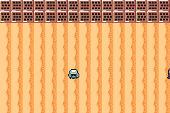

# CUTSCENE RAW

> *A staged scene in a game that cannot link the game-engine crate.*



This ROM depends on **`tish_agb` alone**. No entities, no `world_step`, no `packages/dialog`.
Everything on screen is a raw sprite moved with `sprite_set_pos` — exactly like the three card RPGs
in `card-gba`.

## What it resolves

[#63](https://github.com/schlopai/chuggie-engine/issues/63) and
[#66](https://github.com/schlopai/chuggie-engine/issues/66). `packages/cutscene.tish` documented three
hooks so that *"a game that draws with raw sprites and presents its own frames can use every verb
here"* — then imported five game-engine natives at module top for the defaults behind them. tish's
native merge links whole modules, so the escape hatch never reached.

The measured cost, from #66: `card-gba` ships three card RPGs with 33 Tiled towns, and grepping all
three for `cutSay` / `cutMove` / `camera_set` returns **zero**. Every story beat is a talking head
triggered by walking into a stationary sprite.

So this scene is deliberately the three beats #66 records as impossible:

```
ok   an actor walked into frame under its own power (260 -> 128)
ok   the camera panned off the player (0 -> 64)
ok   ...and came back (64 -> 0)
ok   cutChoose returned an index
ok   the scene moved the player itself (ended at 96,60)
```

⚠️ #66 is explicit that a core with `cutSay` and `cutChoose` but no movement *"gets a game talking
heads with a working prompt, which is what card-gba already hand-rolled, and is not a cutscene"*. So
`cutscene-core.tish` carries **every hook-driven verb** — `cutWalkFrom`, `cutFace`, `cutPan` — not
only the entity-free ones.

## What linking costs — the #64 number

Same ROM, same scene, one import line different:

| import | free heap at boot |
|---|---:|
| `packages/cutscene-core` (this ROM) | **179,200** |
| `packages/cutscene` (links the engine + dialog + chipsfx) | 146,432 |

**32 KB**, for a scene that uses neither entities nor the dialogue package. That is
[#64](https://github.com/schlopai/chuggie-engine/issues/64)'s shape with a hard number on it.

## The contract

Four callbacks, and that is all:

| hook | this game supplies |
|---|---|
| `cutSetMover` | `sprite_set_pos` into its own position arrays |
| `cutSetAnim` | `sprite_set_frame` — a 4-frame-per-actor sheet, not the 5-frame walk layout the entity package defaults to |
| `cutSetStep` | a bare `frame()` — there is no pipeline to step |
| `cutSetDialog` | a ~30-line `hud_text` box written in this file |

The dialogue box is written here rather than imported on purpose: `packages/dialog` links
`packages/chipsfx`, and every linked module's initialiser runs at boot whether a keeper speaks or
not. A game with its own talk layer must not pay for a second one to get a sequencer.

Every missing hook degrades to the least surprising thing rather than an error — an actor that
slides without animating, a `cutSay` that returns immediately — because a cutscene that half-works
is debuggable and one that panics on the first verb is not.

## Controls

A advances dialogue and confirms a choice; UP/DOWN move the choice cursor.

```bash
npm run verify
```
