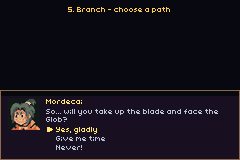

# DIALOG DEMO

> *Demonstrates text rendering and typewriter-style dialog boxes.*



A tour of **`packages/dialog.tish`** — the high-level chat / cutscene dialog component, built on the
`packages/ui.tish` flex layout engine. It self-plays through the dialog styles common to console RPGs:

| # | Style | What it shows |
|---|-------|----------------|
| 1 | **SRPG** | Portrait + speaker name, multi-page, blinking continue arrow. |
| 2 | **FF7** | A name-less boxed prompt with a **Yes / No** choice menu. |
| 3 | **Visual novel** | Portrait on the **right** (`side:"right"`), bouncing arrow. |
| 4 | **Narration** | No portrait/name, box pinned to the **top** (`pos:"top"`). |
| 5 | **Branch** | A three-way decision (portrait + name + `choices`). |

## The component

`dialogSay(text, opts)` opens a bottom- (or top-) pinned bordered box and you drive it with
`dialogUpdate()` once per frame — it is a non-blocking state machine, so it drops straight into a game
loop. Highlights:

- **Portrait** — an icon frame drawn through the UI icon pool (`side:"left"|"right"`).
- **Typewriter body** — word-wrapped and revealed one character at a time via `uiReveal`, so it is a
  cheap per-frame canvas draw, not a full re-layout.
- **Pages** — pass an array of strings; A turns the page (A also skips the typewriter to the full line).
- **Choices** — pass `choices:[…]`; after the last page finishes typing a cursor menu appears and A
  confirms, calling `onChoose(index)`.
- **Continue arrow** — the `▼` affordance is the reusable **`makeArrow`** widget from `ui.tish`
  (`arrowAnim:"blink"|"bounce"|"none"`, any glyph/size/colour).

```tish
import { dialogInit, dialogSay, dialogUpdate, dialogActive } from '../../../packages/dialog'

dialogInit({ font: body })
dialogSay(["Hello, traveler.", "Care to help us?"], {
  speaker: "Elder", portrait: 1, side: "left",
  choices: ["Yes", "No"], onChoose: (i) => { /* … */ }
})
while (dialogActive() > 0) { dialogUpdate(); frame() }
```

The low-level tish-agb `dialogue_*` box (used by `akari`) is untouched — this is the
opt-in, layout-driven, portrait-capable successor.

## Assets

Portraits are catalog **facesets** from the vendored Ninja Adventure pack
(`assets/ninja-adventure/Actor/Character/*/Faceset.png`), downscaled to 32×32 and packed into a
`sheet32:` strip by `scripts/gen_dialog_demo.py`.

```bash
python3 ../../scripts/gen_dialog_demo.py   # (re)build assets/faces32.png from the catalog
npm run build   # -> dialog-demo.gba
npm run shot    # headless screenshot
npm start       # run in mGBA (A: advance/confirm · Up/Down: choose)
```
