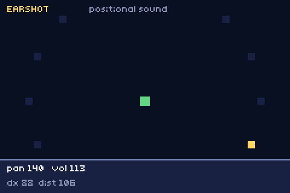

# earshot

> *A sound source orbits you, and you can hear where it is.*



The acceptance test for **`packages/sfx.tish`** and the new **`sound_play_ex`** native — the
positional half of the engine review's audio gap.

## What was missing

`sound_play(wav)` was the entire vocabulary. Every effect in every game played dead centre at full
volume: an explosion off the left edge of the screen sounded exactly like one under your feet. agb's
`SoundChannel` has had **volume, panning and playback speed** all along; nothing exposed them.

```
sound_play_ex(wav, volume, panning, pitch)   // all Q8: 256 = 1.0, panning -256 left .. +256 right
```

`packages/sfx.tish` turns a world position into those three numbers:

```
sfxInit({ near: 24, far: 160, minVol: 20 })
sfxListener(cameraX + 120, cameraY + 80)   // once a frame, wherever the ears are
sfxAt(boom, x, y)                          // and every effect is placed
```

Distance uses the **octagonal approximation** (`max + min/2`), within ~6% of the true hypotenuse for
a compare and a shift — a software `sqrt` per effect is not free, and 6% of a falloff curve is
inaudible. `minVol` is deliberately not zero: a sound that fades to silence is indistinguishable
from one that failed to play, and one of those is a bug you want to hear.

## It is measured, not listened to

Audio is the one subsystem a screenshot cannot check, and "it sounded fine to me" is not a test.
`tools/gba-shot` captures a **stereo** WAV, so panning is a number. `verify.sh` asserts the loud
channel matches the side the source was on, for every blip in the orbit:

```
blip   pan   Lrms   Rrms  expected   got
   0   153   1233   3961     right   right ok
   4     0   2626   2648    centre  centre ok
   8  -153   3779    637      left    left ok

ok   all 9 blips panned to the correct side
ok   distance attenuates (3961 near vs 2406 far)
```

## ⚠️ agb's panning is inverted from its own documentation

agb documents `panning` as `-1` fully left, `+1` fully right. On this fork it behaves the other way
round: with the source hard **right** (pan `+153`), the captured energy was in the **left** channel —
L rms 2379 against R 397. `tools/gba-shot` interleaves audio channel 0 into the even slots, so the
capture is not what is backwards.

The tish-facing API keeps the conventional sign, because that is what every caller will assume; the
flip is absorbed at the one boundary that knows about it, in `sound_play_ex`, rather than left for
each game to rediscover.

## ⚠️ And a shell trap that reports a passing check as failed

`echo "$log" | grep -q PATTERN` under `set -o pipefail` fails **when the pattern matches**: `grep -q`
exits at the first hit, `echo` dies of SIGPIPE, and `pipefail` propagates it. This verifier printed
`FAIL no blips` while the log plainly contained eleven. Use a bash string match instead.

## Build

```bash
npm run build && npm start
./verify.sh
python3 scripts/gen_earshot.py    # regenerate the blip
```
