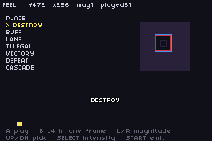

# FEEL DEMO

> *Every feedback in packages/feel.tish: presets, springs, hit-stop and the event channel.*



`packages/feel.tish` is 670 lines of game-feel helpers — screen shake, hit-stop, springs, sparks,
PSG hits — and **nothing in this repo compiled it**. It was not dead code: it had three consumers,
but every one of them lived in the sibling `card-gba` tree and reached across the repo boundary to
get here. So a change to `feel.tish` broke a different repo and passed CI in this one.

This ROM is the fix: one screen that exercises every export, so the package is built, run and seen
by this repo's own CI.

## Build / run
```bash
npm run build && npm start
```
