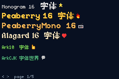

# FONTS DEMO

> *Demonstrates custom font loading and text rendering.*



Paginated specimens (sprite VRAM is finite). **D-pad Left / Right** flips pages.
Every face is baked at its **native** pixel size via `font:path@N` (1px stems).

1. **Faces** — monogram@16, peaberry@16, peaberry-mono@16, alagard@16, ark-pixel@10, ark-pixel CJK@10  
2. **Tiny pixel** — 3x3-mono@4, tinypixel@7, 04b03@8, Undead@8/@11, m3x6@16, m5x7@16  
3. **Kenney** — pixel@16, mini@8, future@8, blocks@8, high-square@16  
4. **Display** — Silver@19, Pixelify Sans (reg/bold)@11, Silkscreen (reg/bold)@8  
5. **Effects** — colour / align / wrap / tags in tinypixel@7  

## Import scheme

```tish
import { tiny } from "font:../../../assets/fonts/tinypixel.ttf@7"
import { body } from "font:../../../assets/fonts/monogram.ttf"  // → @16 default
```

Bare `font:path` (no `@N`) defaults to **16**.

## Native bake sizes

| face | `@N` | notes |
|------|------|-------|
| 3x3-mono | 4 | clean doubles at 8/16 |
| tinypixel | 7 | 5px caps + 2px descenders |
| 04b03 / undead-8 / silkscreen | 8 | |
| kenney-mini / future / blocks | 8 | 128u design grid |
| undead-pixel-11 | 11 | |
| pixelify-sans | 11 | Regular: ~92u stems → 1px at 11; needs FreeType mono |
| pixelify-sans-bold | 16 | Bold: ~127u stems; @11 collapses to Regular — use @16 for 2px |
| ark-pixel-10px | 10 | same as agb's bundled ark (`include_font!(…, 10)`); monospaced latin + zh_cn CJK |
| peaberry / peaberry-mono | 16 | author: pixel-perfect at 16×; bold 2px stems |
| monogram / alagard | 16 | alagard thick strokes are stylistic |
| kenney-pixel / high-square | 16 | 64u design grid |
| m3x6 / m5x7 | 16 | names are glyph grids; author: "use 16, 32, 48…" |
| silver | 19 | cleanest integer grid |

## Build

```bash
npm run build
npm start
```
