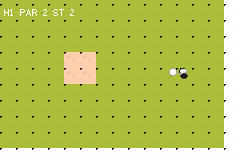

# GOLF

> *Nine holes of top-down mini-golf — and the acceptance test for the engine's rigid discs.*



## What it proves

`dynamic_system` with a **single** body, which pins down the part of a physics engine everything
else papers over: **coming to rest**.

Golf is the only thing in this repo whose correct answer is *a position the ball settles at*. A
game that merely integrates looks fine in motion and is unplayable, because a caller diffing
`entity_x` two frames apart cannot tell "resting" from "moving very slowly" — and every threshold it
might guess in tish re-implements, worse, a decision the engine already made with the real velocity.

So rest is an **engine state**. `body_asleep(e)` is 1 when the ball has stopped, and this game's
whole loop is *wait for that, then let the player aim again*. Sinking requires it: a ball crossing
the cup at speed lips out, which is real golf's rule and what makes the slope holes interesting.

```
ok   all nine holes finished (12) — the ball reaches REST, not just slow
ok   95 strokes for 12 holes — rest is not trivially true
ok   7 holes conceded of 12 — some are genuinely holed out, not just capped
ok   heap bounded across nine scene loads (span 2048 B)
ok   entity count constant (ENT 1 ) across the round
```

That second line is the negative control. If `body_asleep` returned 1 whenever velocity was merely
small, the ball would "sink" mid-roll and every hole would take one stroke.

## Surfaces are one mechanism, not three

Green, rough, sand and two slopes are the same thing: a per-tile class carrying a constant
acceleration and a Q8 friction. **A slope is wind is a conveyor.**

| class | ax, ay | friction | feel |
|---|---|---|---|
| green | 0, 0 | 246/256 | rolls |
| rough | 0, 0 | 232 | dies quickly |
| sand | 0, 0 | 200 | eats the ball — which is what a bunker is for |
| slope E / S | 0.06 | 246 | carries the ball, so power has to come *off* |

This is `kart.rs`'s surface table generalised. The plane is 4 bits per cell and is **empty until the
first write**, so a game with no surfaces pays nothing for it.

## Two hardware facts shaped the design

- **No divide instruction.** Contact uses a *rank*, not a mass: equal ranks split the correction
  with a `>> 1`, a lower rank takes all of it. The textbook `m₂/(m₁+m₂)` split is a software
  division per contact per iteration. Aim is in **1/256ths of a turn, not degrees** — agb's sin/cos
  table is 256 entries over one turn, so a 1/256th angle reaches it with no arithmetic at all, while
  `fire_angle` pays a division by `360*256` on every call.
- **`Num::sqrt` is division-free** (digit-at-a-time, shifts and subtracts). So the cheap operation
  here is the square root and the expensive one is the divide after it — which inverts the usual
  instinct and is why only *colliding pairs* pay one.

## Why top-down

Side-view golf needs a heightfield, real swept collision at drive speeds, and a second collision
path nothing else would use. Top-down makes golf and soccer **the same physics** with different
tuning — one `dynamic_system`, not two genre packages.

## The course is a Tiled map

Nine `.tmj` holes from `scripts/gen_golf.py`. Not a tish array: `bench-boot` measured a per-tile tish
marking loop at **~0.175 frames per tile**, which was one example's entire four-second boot.

⚠️ Walls come from a **`Solid`** layer. A `Collision` layer is the opposite — it forces cells
*walkable*, and an empty cell there erases whatever the tileset said. `verify.sh` asserts every hole
has the former and none has the latter.

## Two bugs this example found

Both were in code that compiled and looked fine:

1. **The ball bounced off the air.** `is_solid` reports out-of-bounds as solid, so a game with no
   collision grid has *every* cell reading solid — the ball travelled 2.4 px and slept.
   `life_system` guards its own solid check for exactly this reason.
2. **Nine holes leaked ~2 KB each.** `loadSceneRom` is `scene_stream` + `grid_from_map` and tears
   nothing down. The tell was that the heap kept falling on the *second* lap over the same nine
   scenes — first-touch retention would have plateaued. Fixed with `bg_clear()` and a `frame()`
   before the load, because agb does not return a background's tiles until a frame boundary.

## Controls

LEFT/RIGHT aim · hold A to charge, release to hit · the ball must stop before the next shot. It
plays itself until you touch the pad, and concedes at par+6 — golf's own cap, and what lets an
attract driver that cannot path around a wall still walk the whole course.

```bash
npm run verify
```
