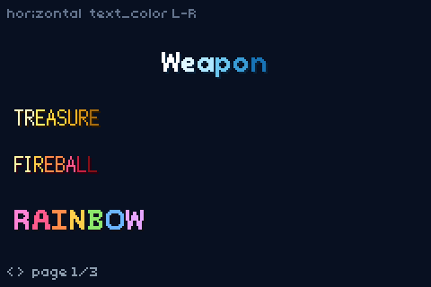

# GRADIENT DEMO

> *Demonstrates hardware color gradients and raster effects.*



GBA fonts are 1bpp masks. Colour comes from the OBJ palette:

- **Horizontal** — `text_color(n)` + `colors[]` assigns a solid stop per letter (L→R wash).
- **Vertical** — `text_draw({ vgrad: 1, colors })` remaps each glyph’s rows top→bottom
  across the same stops (no custom bitmap font).

```bash
npm start
```

**Left / Right** flips pages:

1. Horizontal showcase — ice / gold / fire + cycling rainbow  
2. Status washes — SRPG-style Move / Jump / Weapon / … (horizontal)  
3. Vertical showcase — same words as page 1 (Weapon / TREASURE / …), top→bottom
