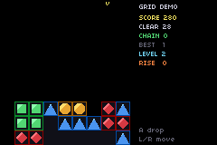

# grid-demo

> *A floor-stacked match-3 on packages/grid.tish — the generic cell-grid kit, proven on the opposite gravity anchor from Magical Drop.*



A floor-stacked match-3 on `packages/grid.tish`, with a rising garbage floor that eventually beats
you, and a real budgeted search that plays it until somebody presses a button.

**Controls** — Left/Right move the dropper · A or Down drops · Start deals a fresh board, or begins a
new run after a top-out.

```bash
npm run build
npm run start
npm run verify
```

## Why this game and not Magical Drop

`packages/grid.tish` was extracted from the Magical Drop rules, so a Magical Drop demo would prove
nothing — it would pass whether the kit were genuinely generic or merely the old code under a new
name. This is the **opposite board**: gravity toward the floor instead of the ceiling, gems dropped in
from the top instead of pulled from the bottom, runs cleared where they land. The same
`gridCollapse`, `gridSeedRuns`, `gridSpread` and `gridPaint` serve both, and `anchor: 1` is the only
line that differs in the setup.

For the other half of the puzzle genre — falling tetrominoes, where an overhang and the hole under it
are the entire point and packed columns are exactly the wrong model — see `examples/blockfall`, which
deliberately does *not* use this kit and says why.

## What it demonstrates about the kit

- **The packed word.** One `i32` per cell carrying the cell byte, the engine planes and a cached match
  mask, so matching in the hot loop is `(w >> 16) & class` — no call, no second array read.
- **A table, not a predicate.** The vocabulary is registered once with `gridDefineCell`; the game never
  supplies a per-cell function.
- **The causality plane.** A run only clears if a *seed* touches it. `gridSet` is inert and `gridPush`
  seeds, so a board dealt at boot does not detonate itself and only what the player drops starts a
  chain. Both halves are asserted at boot (`SELFTEST inert`, `SELFTEST seeded`).
- **Cascades.** `gridCollapse` re-seeds every survivor that *moved*, so the chain continues with no
  further input (`SELFTEST cascade`).
- **The anchor.** `anchor: 1` packs toward the last row and `gridPaint` flips the draw.

## The game layer

It began as a fixture for the kit and not a game: nothing to lose to, nothing that got harder, no way
to start again — a run simply continued until the ROM was killed. Three kit calls that no example was
exercising fix that.

| | call | why this one |
|---|---|---|
| the rising floor | `gridFeed` | a fed cell arrives at the **anchor**, which on this board is the floor, so garbage pushes the stack toward the ceiling instead of landing on top of it. `gridPush` does the opposite, and that exact mix-up once inverted the descent in the Magical Drop port. It also arrives **unseeded**, so an incoming row cannot detonate itself — a clear is something the player caused. |
| the loss | `gridAnyOver` | ⚠️ not `gridAnyFull`. The kit is explicit that these differ by a whole row of play: a column packed to exactly `ROWS` is full but still playable, and a game that ends there ends one row early. Asserted both ways in one value, because a test that only checks "one past the line is a loss" passes either way. |
| the level | cleared **cells** | so a chain advances it three times as fast as three singles, which is what the score already rewards. |

⚠️ **A difficulty curve has to catch up with the player.** The first version floored the feed interval
at 120 frames and the attract player survived a 9,000-frame run without ever topping out. That is a
rising floor that does not rise — and from the outside it is indistinguishable from having no game
layer at all, because the demo just kept running exactly as it had before. `verify.sh` now asserts
that the floor beats the AI and that a fresh run starts afterwards.

## The search

`packages/search.tish` over (piece in hand, target column) pairs, drained under a per-frame tick
budget, with a cheap tier that scores one resolve pass and a deep tier that resolves to a fixpoint so
a cascade is counted. The evaluator lives in this module and the search calls nothing — that inversion
is what keeps an AI affordable, since a boxed scoring callback would cost more per candidate than the
evaluation.

⚠️ `verify.sh` asserts the **peak** frame as well as the mean. An earlier version averaged 4,463 ticks
against a 4,389-tick frame while peaking at 5,672, and asserting only the mean let a search that
visibly missed frames report itself as fitting.

⚠️ It also asserts the **maximum** score and level across the run rather than the last. Now that a run
can end and a new one start, the final `TICK` line describes whatever the new run has managed so far —
it read 30 on a pass whose best run scored 2,450.
