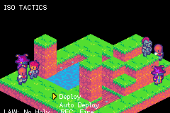

# ISO TACTICS

> *An isometric tactical RPG subsystem demo showcasing tactics.*



A Final Fantasy Tactics Advance-style battle: an isometric, height-mapped board authored in **Tiled**,
class-based units with **equippable weapons**, a full **animation state machine** (walk / attack /
charge / release / damage / weak / dead), and three distinct actions — **melee**, **ranged magic**,
and **healing**. The reusable tactics logic lives in the **engine**; this example is the game on top.
See the full feature roadmap in [`docs/ffta-tactics-plan.md`](../../docs/ffta-tactics-plan.md).

## The squad comes from the clan

**Team 0 is the town's roster.** `src/clanbridge.tish` reads `clanFormation()` from
[`packages/clan`](../../packages/clan/) — the same people the Party menu in
[`iso-town`](../iso-town) equips, re-jobs and levels — and deploys them onto the map's team-0 spawn
points in slot order. The Tiled map still decides placement and the whole enemy side. Levels and AP
earned here are written back when the battle resolves, so progress survives the trip.

Run standalone, this example seeds the same demo clan iso-town does, so it plays on its own.

What the bridge carries is **identity and progression**, not stat scale: a job decides which of the
four archetypes a unit *fights as*, and the archetype supplies the tuned numbers. The reason is in
`clanbridge.tish` — FFTA's stat growth formula is not known, so converting the clan's raw FFTA-scale
stats into this game's single-digit balance would be a guess applied to every formula at once.

## Split: packages vs example

Three layers sit under this game now:

- **[`packages/iso`](../../packages/iso.tish)** — the isometric projection, depth biases, the
  raised-block redraw and the camera clamp. Shared with [`iso-town`](../iso-town).
- **[`packages/tactics`](../../packages/tactics.tish)** — the tile-highlight pool, the board cursor,
  and the ability-footprint geometry (burst / line / cone) with the shape constants. The two hard
  capacities are config here (`poolSize`, `fpMax`) rather than bare constants.
- **this example** — the phase machine, turn flow, AI search, deployment, and all the data
  (`formula`, `laws`, `abilities`, `weapons`, `races`, `growth`, `status`, `terrain`).

The controller stayed here deliberately. It reads eighteen parallel per-unit arrays and encodes
FFTA's own turn flow — Move / Action / Item / Status / Wait, a deploy step, a chosen-facing step —
so packaging it against a single game would be inventing an abstraction with nothing to check it.

## Split: engine vs example

- **Engine** (`tish_gba_game_engine`, `tac_*` API) — the reusable tactics core: a height-mapped grid
  with occupancy, **move-range flood fill** (Move budget + Jump height-delta, blocked by terrain and
  units), **pathfinding**, a **unit registry** (HP/max-HP/team/speed), a **speed-based turn queue**,
  and resolution primitives **`tac_damage`** / **`tac_heal`** (capped at max HP). Any tactics game
  uses these.
- **Example** (this dir) — the game: isometric rendering (depth-sorted 32×32 sprites), the turn +
  animation state machine, cursor + range highlight, the weapon-swing overlay, the HUD, the AI search,
  and **all of the combat math**. Data is **components**: **unit classes**
  ([`components.tish`](src/components.tish)) bundle stats + sprite sheet + an equipped weapon + an
  ability list + AI weights; **weapons** ([`weapons.tish`](src/weapons.tish)) bundle `kind`
  (melee/magic/heal) + power + range + swing sheet; **abilities**
  ([`abilities.tish`](src/abilities.tish)) add power, MP, range and element; and
  [`formula.tish`](src/formula.tish) turns all of that into damage. A new class, spell or re-arm is
  just data. The sprite-sheet frame contract lives in [`anim.tish`](src/anim.tish) (mirrors
  `tools/pack_actors.py`).

## Maps in Tiled — read directly, no import step

`tiled/battle.tmj` **is** the battlefield — edit it in Tiled (set Orientation to **Isometric**, Tile
Size **32×16**) and just build. It has a `terrain` ground layer, **stacked height layers**, and a
`units` object layer (`cls`/`team` per spawn). **Walkability lives in the tileset**: a terrain tile
with a `walkable = false` custom property (e.g. water in `terrain.tsj`) makes its cells impassable —
no separate collision layer, no derived-in-code rule.

**Elevation = stacked tile layers (the standard Tiled isometric pattern), not an abstract number.**
Add a tile layer per level and give it a **Vertical Offset** (`Layer ▸ Offset`): a **full block = -16px**,
a **half block = -8px**. Place block tiles in those layers to build towers — Tiled draws each layer at
its offset, so you **see the height while editing**, and `include_tactics!` composites the same offsets
into the baked floor (pixel-identical to Tiled). A cell's elevation is just its top tile's offset, in
**8px units** (half = 1, full = 2); a unit's `jump` is the max unit-delta it can climb (2 = one full
block). No `height` layer, no lift constant to keep in sync — the blocks' own art is the height.

`import { board } from 'tactics:../tiled/battle.tmj'` runs the **`include_tactics!`** proc-macro
(`tish-gba-scenepack`) at build time, which bakes **everything** from that one file: the isometric
floor background *and* the per-cell frame/elevation/walkability *and* the unit spawns, straight into
the ROM. The game then:

```tish
tac_load(board)                 // build the grid (size + every cell) from the baked map
bg_new(tac_board_bg(board))     // show the baked floor
// units: tac_spawn_count(board) + tac_spawn_col/row/cls/team(board, i) → look up the class → tac_add_unit
```

There is **no Python import step and no generated `.tish` data module** — the Tiled files are the
single source, so an edit in Tiled reaches the game on the next `npm run build`.

Rendering is isometric — the iso projection draws the grid at `(±16,+8)` per step, lifting each tile by
its elevation, matching what Tiled shows.

The projection itself lives in **[`packages/iso`](../../packages/iso.tish)**, shared with
[`iso-town`](../iso-town) — `isoX`/`isoY`, the tile and unit Y, the depth biases, the raised-block
redraw and the camera clamp. The actor sheet frame map is
**[`packages/iso_actors`](../../packages/iso_actors.tish)**. Both were verbatim copies in each
example until they drifted: this one had `UNIT_LIFT = 12` where iso-town had 20 (20 is right — the
art is byte-identical and its feet sit 8px lower than 12 assumes), and it hardcoded the bake origin
to `(96,24)`, which silently limited it to boards of about 8×8.

Reading the origin back from the bake removes that limit from the *projection*, but a bigger board
is not yet playable here: this example has **no camera**, so anything past one screen would simply
render off the edge. `packages/iso` exports `isoFollowCam` (iso-town uses it) — a tactics camera
would drive it from the cursor rather than from a walking player, and that is the remaining piece.

### Terrain rendering — baked background + occluder sprites

One sprite per tile would burn ~64 OBJs and blow the GBA's **per-scanline OBJ budget** (text/units
start dropping pixels). Instead the whole board is **baked into a background at build time** by
`include_tactics!` (reusing the `include_isoboard!` compositor): it composes the iso board (real
elevations, painter's order) into one image and hands it to `include_background_gfx!` — zero OBJs for
the floor, and no committed PNG (it's a regenerated build artifact, like `scene:`). Because flat
ground can never occlude a unit standing on it, the bg always sits behind the sprites — but **raised
tiles (height > 0) are also redrawn as depth-sorted sprites**, so a unit standing *behind* a taller
block is correctly **occluded** by it. Depth is an honest `(col+row)·16 + elevation` key (no
force-units-in-front hack), so terrain and units interleave the way isometric expects.

## Current state — 3v3 skirmish under a law, with conditions, growth and a thinking AI

The sample battle is a **3v3 mirror** — a **Fighter** (Iron Sword, melee), a **Mage** (Staff, ranged
magic), and a **Cleric** (Scepter + `Cure`, support) on each side — fought under one of the Judge's
**laws**, with **status conditions** and **JP levels** in play.

- **Front menu.** Two ways in: **Deploy** places your squad yourself, **Auto Deploy** takes the map's
  own placement and starts immediately. The second is a debug door — the twentieth time you are
  checking whether a formula change broke anything you do not want to place three units first — and
  it is on the front of the game rather than behind a rebuild, because a flag you have to recompile
  to flip is a flag nobody uses. Attract mode skips the menu entirely; it has nobody to answer it.
- **Deployment.** Before the first turn you place each of your units inside a **deploy zone** and
  choose what it is looking at. The zone is flooded by the engine from your spawn tiles, so it can
  only contain real walkable ground, and it floods at the **smallest jump in your squad** rather than
  ignoring height — the board has pillars, and a placement screen that can strand a unit on top of
  one before the battle starts is a trap rather than a choice. It is bigger than the squad, so where
  each unit stands is a decision: high ground, who is in front, and which way the line faces.
  Landing on a cell an ally is still standing on **swaps** them, since that ally has not been placed
  yet and is only on whatever tile the map happened to give it — where a refusal would mean the one
  tile you most want for your Fighter is the one your Cleric is accidentally occupying. A cell held by
  an already-placed unit reads `Taken` and is refused.
- **Turns.** The engine **speed-based turn queue** (`tac_turn_next`) picks the next unit and floods
  its **move range**. **Team 0 = you** (its turn waits for input); **team 1 = AI**. Flip `SELF_PLAY`
  at the top of `main.tish` to **attract mode** — both teams play themselves, so every animation runs.
- **Action menu.** Move / **Action** / **Item** / **Status** / Wait (Left/Right + A) — FFTA's own five.
  The labels sit at **fixed positions** and a **pointer sprite** marks the selection, so the
  (non-monospace) text never reflows. **Action** opens the unit's list: its plain weapon action first,
  named after what it does (an attacker's reads **Attack**, a healer's **Heal**), then everything the
  weapon has taught it, each with **MP cost and range**. Move greys to `----` once it's spent, and Item
  once the stock is empty. Move shows the range; anything else opens a **target picker** (Left/Right
  cycles valid targets — enemies for damage, a wounded ally **or the caster itself** for heal — the
  unit rotates to face the pick; A commits, B cancels; "No target" if nothing is in reach).
- **Items come out of one shared stock.** Three Potions in this battle, not three each: `Potion x3` on
  the menu is the squad's whole supply, so spending one is a decision about the squad. Every unit can
  use them — FFTA's Item command is not learned and is not a job skill — and everything is **range 1**,
  which is what stops a stock of potions from being a healer that costs nothing. `Phoenix Down` is the
  only action in the game aimed at a body, and it is offered only while that body's cell is still free,
  since death releases the cell and somebody may have walked over it. The readout shows what the item
  will actually do *here* and nothing else: no hit percentage (an item cannot miss), no flanking, and
  the heal **capped at the gap**, so `+4` warns you that most of the bottle is about to be wasted.
- **The law pays as well as punishes.** Every law has two halves — `LAW: No Fire   REC: Bolt` — and
  doing the recommended thing earns a **Judge Point**, as does a **legal** kill. (A kill scored with
  the forbidden action earns nothing; that is the one FFTA red-cards.) A unit holds at most ten and
  can earn at most one per turn, so the currency measures whether the turn obeyed the Judge rather
  than how busy it was.
- **Combo** is what Judge Points are for. It spends *every* point the unit has and pulls in every ally
  already in reach of the target; only the initiator's blow is multiplied and the joiners pay nothing,
  which makes a Combo a question about **position** — the points decide how hard it hits, the board
  decides how many hit at all. Each participant rolls its own accuracy from its own angle, so it is
  not a free hit and flanking still matters inside one. It appears as a row on the **Action** list
  (`Combo  3JP  R2`) only while there are points to spend, and the count is on the Status screen.
- **What our currencies are called.** `EXP` buys levels, `AP` buys what your weapon teaches, and `JP`
  is Judge Points — FFTA's three, under FFTA's names. `EXP` was called `JP` here for a long time,
  which is FFT's meaning of the word and not this game's.
- **Winning lawfully pays.** The result screen carries the Judge's verdict under it: `Spoils: Potion`
  for a clean battle, or `Volunteer: no reward` — FFTA's own name for the penalty — if the Judge
  carded anybody in the clan, whatever the rest of the squad did. The prize goes into the shared item
  stock, which is what makes the forfeit mean something in a game with no gil: it is the one resource
  the squad actually shares. Breaking a law already fines the offender JP on the spot, but a fine on
  one unit is easy to shrug off in a battle you are winning.
- **Facing ends the turn.** Once a unit has moved and acted, or chosen Wait, the d-pad turns it and A
  ends the turn — FFTA's last decision of every turn, and the one that prices the *next* attack on
  that unit. It shows FFTA's compass: **a marker on each of the four edges of the unit's tile, the
  chosen one lit and the other three dim**, so the choice is on the board rather than only in a word
  at the bottom of the screen. The markers sit on the tile's edge MIDPOINTS, which is where a
  direction actually lives on an isometric grid — each edge is one grid direction and points at
  exactly one neighbouring cell — nudged a few pixels further out, because units are drawn a head
  taller than their tile and a marker on the true midpoint of a back edge lands on the character's
  chest. The directions are bound the way the cursor is (right is +col), the sprite turns as you
  press, and the AI faces its nearest living enemy.
  Being able to *choose* it is what makes flanking a plan rather than an accident: before this, a
  unit kept whatever direction its last step or swing left it in.
- **Weapons + attacks.** Each class equips a weapon whose `kind` drives the action + the on-screen
  swing (a 64×64 overlay re-pointed per attacker via `sprite_set_sheet`):
  - **Melee** (sword/axe) — path adjacent, **lunge + attack swing**, the blade arcs over the target.
  - **Magic** (staff) — from up to 2 tiles: **charge** (wind-up) → **release** (cast) with the staff
    swing, then damage.
  - **Heal** — same charge → release cast on a wounded ally *or the caster itself*, restoring HP
    (`tac_heal`, capped at max, "+N"). Healing is an **ability that costs MP** (`Cure`), not a weapon:
    a healing weapon is a free unlimited heal, and two clerics so equipped simply out-heal every
    attack in the game — the sample battle ran for minutes without a death until it was moved.
- **Full animation state machine.** Each character sheet carries walk / attack / charge / release /
  **damage** (a flinch when hit) / **weak** (a low-HP stagger the unit idles in once badly hurt) /
  **dead**. Facing is 4 iso directions (SE/NE art + h-flip): units face the way they walk and turn to
  face a target. **Deaths leave a corpse** on the ground (the tile frees for movement); wiping a team
  shows **Victory! / Defeat**.
- **HP HUD.** A **fill bar** (green→yellow→red) + **"Name cur/max MP n"** for the unit whose turn it
  is, live via the engine `hud_text`, which also draws the menu, the ±N popups, and the result.

## Abilities, damage and a thinking AI

- **Abilities + MP.** Every unit's turn offers an **action list**: slot 0 is its plain weapon attack,
  the rest are the class's abilities (`Power Strike`, `Fire`, `Bolt`, `Smite`, `Cure`, `Crush`). The
  menu's **Action** entry opens the list with each ability's **MP cost and range**; anything the unit
  cannot pay for is shown greyed and refuses to be selected. MP is an *example* stat — the engine's
  unit registry knows only HP.
- **The damage formula is the game's, not the engine's** ([`formula.tish`](src/formula.tish)). Damage
  is weapon power + the scaling stat (`atk` physical / `mag` magical) + the ability's power, mitigated
  by `def`/`res`, then modified by **facing**: a **back** attack is ×1.5 and a flank ×1.25. Accuracy
  is FFTA's own shape — `100 − Evade`, with flanking **dividing** the target's evade (`/2` from the
  side, `/4` from the rear) rather than adding to the attacker's aim. That division is worth having
  for what it *says*: halving evade is huge against a nimble Viera and nearly nothing against an
  armoured Bangaa, so who is worth flanking depends on who they are. Facing follows **FFTA's diagonal
  rule** — a square exactly diagonal from a target resolves in the *defender's* favour, so a rear
  diagonal counts only as a flank and every facing has exactly **one** true rear cell. You cannot get
  behind someone by standing on the corner behind them. **Elements** finish it — a Brute is weak to
  Fire and takes 150%. Misses show `Miss`, crits show `-N!`. The dice are a small deterministic LCG
  seeded at boot, so a battle **replays identically** for headless verification.
- **Height changes what you can reach, not how hard you hit** — which is FFTA's rule, and it was
  worth getting right because the alternative quietly decided every battle. Height used to add damage,
  accuracy and crit per elevation step; the map stacks **six** steps to its plateau, so a unit up
  there took +6 damage and +30 accuracy against evade stats of 4–8, which pinned its hit rate to the
  cap. It could not miss and could not be answered, and since team 1 spawns on the plateau it won
  essentially every attract-mode battle before either side chose anything. FFTA has no height term at
  all in either formula: what height governs there is **Vertical Range**, how far up or down an
  ability may be aimed. So that is what it does here — `vert` on every ability, in elevation steps
  (two to a visible tier), enforced by one `inReach` predicate that the player's picker, the AI's
  search and the post-move re-check all share. A sword reaches **2** (exactly as high as its owner can
  jump), a spell **4**, and Bolt is called down from **6**. High ground is still worth taking, for
  FFTA's reason rather than a damage bonus: standing on the peak means melee simply cannot answer you.
- **The target picker tells you the answer before you commit**: alongside the target's name and HP it
  shows **`~N`**, the expected damage *from where you are standing, against the way they are facing*,
  and the **hit %** — then names the reason it is what it is: `BACK` or `SIDE`. Showing the
  percentage next to the damage is showing the working rather than repeating it, since `~N` is that
  damage already discounted by those odds. Walk around a unit and watch both numbers move.
- **Threat-scored AI.** Instead of "walk at the nearest enemy and hit it", each AI turn searches
  **every reachable tile × every affordable ability × every legal target** and scores the combination:
  expected damage (capped at the target's HP, so overkill earns nothing), a flat bonus for a **kill**,
  healing that isn't wasted on a scratch, high ground (worth a **tier**, for the reach it buys rather
  than damage it no longer pays), and — for tiles it can fight from — the
  **threat** it would be standing in, precomputed per enemy as "how hard it hits and from how far it
  could start". The weights are per class ([`components.tish`](src/components.tish)), which is the
  whole personality: the Brute is reckless, the Mage is fragile and picks the safest tile it can still
  cast from, the Cleric values healing. The search is **amortized across frames** (a few tiles per
  frame while the "thinking" beat plays), so a turn never costs a hitch.

Verified via render (attract mode): walk + 4-way facing, melee swings with the weapon overlay, ranged
casts, cleric heals, the low-HP weak pose, corpses, and the win/lose result; and by driving the ROM
headlessly with a key schedule: the Action list, `No target` gating, the target readout (a Mage's Fire
reading `~12` on a fire-weak Brute — 11 base × 1.5 element × 76% hit), a committed player attack, and
a self-play battle running to **Defeat** with kills, misses, crits and heals along the way.

## The Judge, conditions and growth

- **One law per battle** ([`laws.tish`](src/laws.tish)), drawn from the same seeded generator as the
  combat dice and shown on the HUD for the whole fight — `No Fire`, `No Bolt`, `No Holy` or
  `No Healing`. It is the cheapest way to make a battle play differently: under `No Holy` the Cleric
  simply stops reaching for Smite and leans on Cure, and no AI code changed to make that happen.
- **The player may break it; the AI may not.** Both ask the same predicate, but the menu only marks
  an illegal ability `LAW!` while the AI filters it out entirely. Using one anyway costs JP and earns
  a **yellow card**, and the second offence is a **red card** that takes the unit out of the battle.
  A disabled button would have been simpler and much less interesting — the choice is the mechanic.
- **Conditions** ([`status.tish`](src/status.tish)) resolve at the top of the sufferer's own turn:
  **Poison** bleeds HP and can kill outright, **Regen** gives it back, **Sleep** costs the turn and
  is broken by any hit, and **Slow** costs every other turn. `Crush` poisons, `Bolt` slows, and any
  healing action **also cleanses** — without that the Cleric has no answer to Poison, and the poison
  out-ticks the healing over a long fight.
- **JP and levels** ([`growth.tish`](src/growth.tish)). Damage, healing and kills pay JP; enough of
  it levels the unit and raises the stats along its class's own axis, so a Mage grows `mag`/`res` and
  a Fighter `atk`/`def`. Each unit carries its **own stat block**, cloned from its class at spawn —
  the classes are single shared records, so levelling one in place would have buffed its opposite
  number on the other team. Levels do not raise HP: that pool is the engine's, and it has no setter.

Verified across two seeded self-play battles: every action the AI took came back legal, Bolt and
Crush applied Slow and Poison, a Slowed unit visibly lost a turn, Cure cleansed its Fighter twice,
and three units levelled along the right axis. The card path is code-parity — only a player can
offend.

## Area attacks and the Status screen

- **`Fire` is a burst** (radius 1). It hits the target's tile and its four neighbours, and each unit
  caught rolls its **own** hit, crit and facing — so one cast can crit a Brute standing
  downhill and miss the Mage beside it. It does not check tabards: **allies in the blast take it
  too**, which is the entire cost of casting one. The picker paints the footprint and counts the
  friends standing in it (`ALLIES 1`); the AI sums the value across everyone caught and subtracts its
  own side, so it will not trade its Fighter for a better angle on yours.
- **`Bolt` is a line.** It skewers every tile between the Mage and its mark, which turns its best
  spell into a question of where it is *standing* rather than what it can reach: line three units up
  and one cast hits all three; walk into your own shot and you are in it. Both shapes come out of one
  shared footprint, so the tiles the preview lights are by construction the tiles that take damage.
- **A turn banner** names the active unit for a beat at the top of each turn and then gets out of
  the way.
- **Status** opens the **free cursor**. Move it anywhere and it reads out what it is over — any
  unit's name, HP, MP, level, condition and full stat block (`ATK 1 MAG 5 DEF 3 RES 5 EVA 16` over
  `SPD 51 MOV 3 JMP 2 FACE SE`, plus `FLY` for a flier), **or an enemy's**, because a tactics game
  that hides the opposing numbers is asking you to guess at the one decision it is about. An empty
  tile reports its height. Looking never spends the turn.
  The second line is there because the first one cannot answer the questions that decide a turn:
  how often a unit acts (Speed, once Haste and Slow are in play), how far it reaches, and which way
  it is looking. Facing in particular belongs here and not only in the attack preview — you choose
  where to stand *before* you commit to a target, and facing you can only read by aiming at somebody
  is facing you cannot plan against.

Verified headlessly: the Status readout on an ally (`Ally Fighter 26/26 MP 12`) and on an enemy
(`Foe Brute 30/30 MP 8`, matching its class record exactly); a self-play `Fire` catching two foes at
once for **3 and 10** — the split being the fire-*resisting* Mage and the fire-*weak* Brute, which is
the element table showing up in a single cast; a `Bolt` fired down column 6 **piercing two enemies**
in one cast; and the two footprints measuring 5 tiles (radius-1 diamond) and 3–4 tiles (the stepped
path) exactly as their shapes predict.

## Cones, and abilities you have to earn

- **`Sweep` is a cone** — a wedge swept from the Fighter through whatever it is standing next to:
  one tile at the first step, three at the second. It is aimed at an adjacent unit but reaches *past*
  it, so unlike a burst its worth is decided by what is standing **behind** your target rather than
  by finding a good centre tile. The direction snaps to whichever axis the target lies furthest
  along, so the cone is aimed, not placed. It clips at the board edge, which means sweeping off the
  map wastes most of it.
- **Abilities now come from the weapon, and cost AP.** No class lists an ability any more. Each
  weapon carries an ordered `teaches` — the first free, the rest priced — so a Fighter opens the
  Action list to *only* `Attack` + `Power Strike` and unlocks `Sweep` partway through the battle, and re-arming a
  unit changes not just its damage but what it can eventually do.
- **The same work pays both curves.** JP makes a unit better at what it already does; AP gives it
  something new to do. They are awarded by the same act, so a unit that spends the fight waiting
  learns nothing. A kill is worth 30 AP against second abilities priced 20–25 — finishing something
  off is what opens up your options.

Verified headlessly: every unit boots owning exactly one ability (`LEARN u0 Power Strike known=1`);
both Clerics unlocked `Smite` mid-battle the moment a kill landed (`+30 total=32`); the Fighter's
Action list in normal play shows **only** `Attack` and `Power Strike 4MP R1`, with `Sweep` absent until paid for;
and the cone footprints measure what the shape predicts — `from 6,3 at 6,2` gives `6,2` then
`5,1 6,1 7,1`, and a cone fired at the board edge correctly collapses to the tiles that exist.

## Races

The other half of "race × job". A race is a set of **flat stat deltas** plus a list of the jobs it may
take — percentages are useless at this scale, where a −20% racial on a Mage's `mag: 5` either rounds
away to nothing or doubles depending which way it lands. The deltas are paired, so a race is a shape
rather than a tier: a Bangaa Fighter is not a better Fighter, it is one that hits and survives more
and dodges and casts less. Human is the all-zero baseline the classes were tuned against, and it is
on the field so there is something to read the rest against.

- **Bangaa** — heavy, slow, magically deaf, and barred from both casting jobs.
- **Nu Mou** — the best casters and the worst legs: a full point of move slower, which on this map is
  the difference between casting this turn and walking toward it.
- **Viera** — fast and evasive, fragile.
- **Moogle** — the only race that changes the **map** rather than the maths: +1 move and +1 jump
  reach terraces nothing else can.

The restriction is the part that matters. Without it a race is just a bonus you would always want;
with it, the races with the best magic are the ones barred from swinging an axe. An illegal pairing
in the roster falls back to Human rather than being applied, so the mistake reads as "this unit has
no racial" the moment you look at it, instead of as a badly tuned class.

Race is folded in **once**, when a unit's stat block is cloned at spawn — never consulted per stat
read. The damage formula, the AI's scoring and the Status screen carry on reading a plain stat block
and never learn that races exist, so nothing was added to the AI's innermost loop. The one ordering
that matters is that the raced block is built *before* the unit is registered: speed, move, jump and
max HP are the engine's copy and it has no setters for them, so a racial applied afterwards would
reach the formula and not the board.

Verified headlessly: every spawned block matches class + racial exactly, floors included — the Nu Mou
Mage's ATK and the Bangaa Brute's MAG both clamp at 0 rather than going negative. An intentionally
illegal Bangaa Mage spawned as a **Human** Mage with the class's untouched numbers. The Status screen
reads `Ally Viera Cleric 20/20 MP 20 / ATK 1 MAG 5 DEF 3 RES 5 EVA 10`, against a base Cleric's 22 HP,
MAG 4, DEF 4, EVA 6. And the racials reach the engine, not just the maths: the **Viera Cleric now
takes the first turn ahead of the Fighter** (Speed 51 against 50), and the Bangaa Brute finishes a
self-play battle at **18/36** — a max HP only its +6 can produce.

## The pond stops being a wall

Move-range was a uniform-cost flood fill, so every tile cost one step and terrain could only ever be
*passable* or *not*. It is now weighted — entering a tile costs whatever its terrain says — and the
pond, which was `walkable: false`, is a **cost-2 ford**.

That one change gives one piece of ground three different answers. The pond is two tiles across, so a
Move-4 Fighter spends its entire turn crossing and arrives with nothing left; a Move-2 Nu Mou Mage can
wade in and not out; and a flier ignores it completely. An impassable tile can never produce that —
it gives everyone the same answer, which is "go around".

**Flight** is the Moogle's, and it is a movement *type* rather than a bigger budget: a flier pays 1
per tile whatever the ground is and ignores height deltas, but over open ground it is no faster than
anyone else. It changes which tiles the same budget buys.

The engine owns the search and knows nothing about what the map's tiles mean — costs are pushed in
from `terrain.tish`, and default to 1, so this changed no existing behaviour that did not opt in.

Verified headlessly, from one tile on the pond's west shore with Move 4: a **walker reaches 17 tiles**
and a **flier 27**, on the same budget. The walker's range stops exactly where a cost-2 ford predicts —
it can enter the near water and cross to the far edge, but the tiles one step beyond fall outside the
budget — and it cannot reach the 3-high pillar at all, which the flier can. In self-play the Fighter
and the Brute both ended turns standing *in* the water, while the Moogle Cleric finished **every** turn
on height-6 ground, including that pillar; no walking unit ever got above height 4.

The Brute also stopped borrowing the Fighter's sprite and now wears `knight.png`. It arrived at 29
colours against the GBA's 15, so `tools/pack_actors.py` grew a path for pre-assembled sheets that
still need the palette conditioning the kit-built ones get.

## A defender you cannot walk past

Zone of control finishes what terrain cost started. Stepping into a tile adjacent to a living enemy
**ends the move**: the tile is reachable, nothing through it is. The tile a unit *starts* on is
exempt, or anyone who began their turn in contact could never move again — the rule exists to stop
people running past a defender, not to freeze the ones already engaged.

Testing this taught me something about the shape of the board. The first two attempts compared the
*set* of reachable tiles with the rule on and off, and found the two identical — from every legal
origin. That result is real and it is useless: on an open 4-connected grid there is nearly always a
parallel lane, so blocking one cell changes the route and not the destination. What ZoC changes is
what a tile **costs**, which is why the engine now answers `tac_move_cost(col, row)`.

Asked that way it is unambiguous. With the defenders in open ground rather than clustered in their
spawn corner — where they block their own control ring with their own bodies — one origin sees the
tile behind the line go from **3 move points to 5**, and the whole area past it drop out of range
entirely. The same number is now on screen while you pick a destination, so a detour you did not
expect is legible instead of mysterious — the destination readout reads `Move 3 / 3`, not "3 tiles".

## Knockback, and the fall

**Crush** now shoves its target one tile straight back. The edge of the board, a solid cell and
another body all stop it — but **height does not**, because being shoved off a ledge is the whole
point, and a jump check here would quietly switch knockback off next to exactly the terrain that
makes it interesting. The engine moves the body and reports that it did; what the fall *costs* is
the game's, so the example compares the heights either side and charges its own damage. Landing in
the pond costs nothing on impact and 2 move points to wade back out.

Every branch of the rule was driven directly rather than waited for: a 4-height fall off the terrace
and off the central pillar, a shove uphill (which moves the unit and deals nothing), a diagonal blow
resolving to the dominant axis, a victim against the board edge, and a victim with an ally standing
behind them — the last two refusing to move, as they should. The prediction the AI uses agreed with
the result in all seven. Then the same shove through the real `strike()` the menu and the AI both
call: a Fighter on 26 HP took 16 from Crush and 4 more from the drop, ending on 6 HP a terrace below
where it started.

The AI prices a shove at exactly the fall it causes, and nothing for the displacement — valuing that
would need a guess at what the target meant to do next. It keeps Crush honest: on flat ground it and
a free Attack score *identically* and the AI takes the free one, and beside a terrace the fall breaks
the tie.

One balance bug fell out of this that is worth remembering. The Brute is the only class with Crush,
and the Bangaa is the race that wants to be one — but the Bangaa's **−4 MP** put Crush's 6 MP past a
Brute's entire pool, so the single class that had the ability could never use it once. Racial
penalties need checking against a class's *cheapest* ability, not its stat line.

## Where to tweak AP and jobs

These numbers are starting values and will be re-tuned, so each kind of change has one home:

- **Payout rates** — `growth.tish`: `JP_PER_LEVEL`, `JP_PER_DAMAGE`, `JP_PER_HEAL`, `JP_KILL`, and
  `apFor(work)`. AP has its own function rather than reusing JP's number, because the two curves want
  to diverge as soon as a weapon teaches more than one thing: JP paces how fast a unit gets *better*,
  AP how fast it gets *wider*. Being a function and not a constant means the shape can change there
  too — "AP only for kills", or a flat award per battle, as FFTA itself does it.
- **What teaches what** — `weapons.tish`, as an ordered `teaches` list; prices are `ap` on the
  abilities themselves. The controller reads it through a single `teachesFor(id)`, so armour that
  also taught would be concatenated in that one function.
- **Who may take which job** — `races.tish`, as a list of class indices per race.

One limit worth knowing before you tune: `unitKnown[id]` is a *count*, so a unit knows a **prefix**
of its weapon's list and abilities unlock strictly in order. That is what lets a weapon author a
class's arc, and it keeps the state to one integer per unit — but it assumes AP costs never decrease
down a `teaches` list, and it can't express "spend AP on whichever you like". Player-chosen spending
would need a per-ability learned set, and the change is confined to `unitKnown`, `rebuildActions` and
`learnCheck`.

## Slow stopped pretending

Slow used to be "skip every other turn". It was written that way because the turn queue lives in the
engine and had no setter for how fast a unit's counter fills, and skipping every second turn removes
the same number of turns, so it looked equivalent. It isn't.

A skipped turn doesn't move a unit in the order — it acts, misses, acts, misses, and everyone else
sits in the same place relative to it. Scaled accrual reorders the whole queue: a slowed unit drifts
backwards past units it used to precede, and a hasted one cuts ahead. Over 60 turns on this roster,
one unit takes **11 turns normally, 18 hasted, and 6 slowed** — and the rigid `2 0 5 4 1 3` cycle
the battle normally settles into breaks up completely under Haste. Halving a turn *count* is not
halving a speed.

So `tac_unit_set_speed_scale(id, percent)` is the setter that was missing, and Slow and **Haste** now
use FFTA's own numbers: Haste adds double Speed per tick, Slow adds half, rounding down — which
integer division gives for free. The scale multiplies *accrual* rather than the Speed stat, so the AI
and the Status screen keep reading an unmodified stat block, and clearing a status is just setting
the scale back to 100: nothing to remember, nothing to double-apply.

It's floored at one tick per turn. A low-Speed unit halved can truncate to zero accrual, and a unit
accruing zero isn't slowed, it's deleted — the queue would hunt for a tick count that never arrives.

Haste is the first **buff** ability: a ranged cast at an ally that doesn't touch its HP. It's its own
action kind rather than a heal that restores zero, because everything downstream branches on kind and
the two disagree everywhere it matters — a heal is worth the HP it restores and is pointless on a
healthy unit. The AI prices a buff at what the *recipient* does with the turns it buys, so Haste on
the Brute and Haste on the Cleric aren't the same move; in self-play the Cleric learned it and put it
straight onto the Brute.

Which surfaced the same bug as last time from the other end. Priced at 30 AP, Haste was unreachable:
the Cleric earns AP most slowly of any class, and this battle is decided in about fourteen turns, so
nothing above roughly 10 AP ever unlocks for it. Last time a *race* put an ability out of reach; this
time it was the class's earning rate against the length of the fight. Second abilities want checking
against what the slowest earner can actually bank before the battle ends.

## What's next
Teleport movers came out of the plan — they were never FFTA's to begin with. FFTA dropped FFT's
Movement ability slot entirely, so there's no Teleport in it, and no Move+1, Ignore Height or
Levitate either; movement is your Move and Jump from race and job. It would also have been the wrong
feature here: every movement rule in the engine is a rule about *traversal*, and a teleporter answers
"not applicable" to all of them at once — the ford, the terraces and the front line all stop
existing. If a counter to a ZoC line is wanted, a short blink that bypasses control zones while still
paying terrain cost keeps it arguing with the board instead of stepping outside it.

Charge/cast times are out too, for the same reason: FFTA has none — "unlike FFT, there is no casting
time for spells and abilities, not even for Jump" — and Matsuno has said FFT only had them to give
the PlayStation time to load spell graphics. The charge/release frames in the art kit are an
animation, and they already play.

What's actually left is smaller than the plan implied: FFTA resets a unit's turn counter by how much
of its turn it spent → **done**. The costs are FFTA's — `Turn Taken 500`, `Move 300`, `Action 200`
against a threshold of 1000 — so a unit that moves and acts pays the full 1000 and starts its next
wait from zero, while one that stands still pays 500 and is already halfway to acting again. Wait is
now a real tempo play: measured over 400 scheduler calls, the same pair of units take turns in a
**1.26** ratio when both are charged the full amount (that is just their 50-vs-40 Speed) and **2.47**
when one of them waits — the same ratio, doubled.
See [`docs/ffta-tactics-plan.md`](../../docs/ffta-tactics-plan.md).

## Build

```bash
npm run build      # build the ROM
npm start          # build + open in mGBA
```

Art: vendored CC0 **Tiny Tactics – Battle Kit I** (`assets/tiny-tactics/`), packed by two tools:

- `tools/pack_tiles.py` copies the **whole** 16×13 tileset into `assets/tiles.png` (a `sheet32:` sheet
  indexed row-major, frame = row·16 + col) so the Tiled map can paint any tile; `terrain.tsj` mirrors it.
- `tools/pack_actors.py` packs each character (**fighter / mage / cleric**) into one `sheet32:`
  mega-sheet with every animation state for both facings (`assets/{class}.png`), and each of the six
  weapons into a 64×64 `sheet64:` swing overlay (`assets/weapons/*.png`). GBA sprites are 15 colours +
  transparent with no partial alpha, so it alpha-binarizes and quantizes each character to one palette.

`sheet64:` (64×64 sprite import) and `sprite_set_sheet` (re-point a live sprite at another sheet — the
shared weapon overlay) were added to **tish-agb** for this example.
