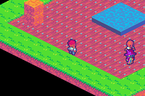

# ISO TOWN

> *An isometric tactical RPG subsystem demo showcasing town.*



A walkable outdoor town on the same **Tiled isometric bake** as
[`iso-tactics`](../iso-tactics): free d-pad movement, **camera follow** (akari-style), talk to NPCs
with A, a merchant shop (`packages/dialog` + `packages/shop`), and **Start → party menu**
(`packages/clan`).

## Controls

| Input | Action |
|-------|--------|
| D-pad | Walk (isometric diagonals); camera follows |
| A | Talk to adjacent NPC / confirm in dialog & shop / menu select |
| B | Back out of shop / party menus |
| Start | Open Party / Clan / System menu (blocked during dialog or shop) |

Party menu details: the party-menu docs.

## Build / run

```bash
cd examples/iso-town
unset CARGO_TARGET_DIR && npm run build   # -> iso-town.gba
npm start                                 # build + mgba
npm run shot                              # headless screenshot
```

## Layout

- [`tiled/town.tmj`](tiled/town.tmj) — 16×16 plaza (paths, pond, raised props, spawns)
- [`src/main.tish`](src/main.tish) — walk, camera, interact, Start → party
- [`src/npcs.tish`](src/npcs.tish) — dialogue lines + merchant / clinic flags
- Projection + depth + raised-block draw: [`packages/iso`](../../packages/iso.tish);
  actor sheet frame map: [`packages/iso_actors`](../../packages/iso_actors.tish) — both shared with
  [`iso-tactics`](../iso-tactics), which is why they are packages and not a copy in each example
- Clan state + UI: [`packages/clan/`](../../packages/clan/)
- Offline FFTA data: [`data/ffta/`](../../data/ffta/)
- Art reused from ffta-tactics (tiles + actors) and shop-demo (`shop32.png`)

Large boards bake to a **512×512** floor atlas and scroll via `camera_set` + `bg_scroll`; classic
≤8×8 tactics maps still use the fixed 256×256 canvas.
