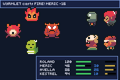
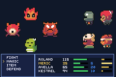

# jrpg-party

> *Four heroes, four monsters and a clock: the front-view party battle the catalogue did not have.*



A classic JRPG-shaped fight. The party stands on the right, the monsters on the left, and every
combatant fills an ATB gauge at its own speed; when one fills, that side acts. Heroes get a command
window — **FIGHT / MAGIC / ITEM / DEFEND** — and monsters get an AI that goes after whoever is
weakest. Spells cost MP, potions run out, DEFEND halves exactly one incoming blow, and the fight
ends when one side is gone.

Art is Pixel-Boy and AAA's CC0 **Ninja Adventure** pack (see `assets/ATTRIBUTION.md`).

| | |
|---|---|
|  | a heal landing, mid-fight |

## Controls

- **up/down** — move the cursor in the command window, the spell list, or over targets
- **A** — confirm · **B** — back out of the spell list or the target cursor
- **L+R together** — the perf overlay, in place of the message bar
- Touch nothing and it plays itself. The attract player presses the same buttons through the same
  menus a human does, one press every 14 frames, so anything it reaches you can reach by hand.

## What it proves

**A turn battle does not need a board.** `packages/battle.tish` is this repo's other turn engine and
it cannot be used here: it imports `isob_*`, `./iso` and the whole SRPG rules stack, so its turn loop
is inseparable from a grid with columns, rows, elevation and zones of control. `packages/party.tish`
is the front-view counterpart — N-vs-N, wait-mode ATB, no geometry at all — and it is new with this
example.

**The rules are testable without a screen.** `partyTick(keys)` takes its input as an argument and
never reads the pad; `party.tish` never draws. That is what lets the attract player drive a whole
battle by returning key bits, and it is the convention `examples/creature-rpg/src/battle.tish`
established for the same reason.

## The three things that were wrong

**The clock was four times too fast.** `ATB_FULL` started at 240, which is a turn every 16-30
frames — a quarter of a second, so the message telling you what happened expired before it could be
read. At 900 a turn is one to two seconds. Pacing, in this genre, is a constant.

**The party was a totem pole.** Four 32px sprites in a column need 128px; there are 96 between the
message bar and the window. The obvious single-column formation was a stack of clipped torsos. The
party is a 2x2 block.

**The status window cost five frames.** Measured with `ticks()` and `log()` — not `frame_stats`,
which allocates a string and costs more than what it measures — against a 4,389-tick frame:

| repaint unit | avg | max |
|---|---|---|
| the whole four-row window | 12,331 | 23,222 |
| one row, name and numbers | 4,377 | 4,773 |
| one row's numbers alone | **3,597** | 3,843 |

A blow moves one combatant's HP, so three quarters of that first number was drawing pixels that had
not changed, and a name only changes when the turn moves or its owner falls. The row pitch is 8px
starting at y=120 for one reason: `ui_clear_rect` snaps out to whole tiles, so an 11px row could not
be cleared without eating its neighbours — which is what forced the whole-window repaint in the
first place. The ATB gauges are gated separately again, because a gauge crosses a pixel on most
frames; they are cheap only because a bar repaints over itself and needs no clear at all.

## Build

```bash
npm run build && npm start
```

Art is baked from the vendored pack — re-run it if the roster changes:

```bash
python3 scripts/gen_jrpg_party.py
```
