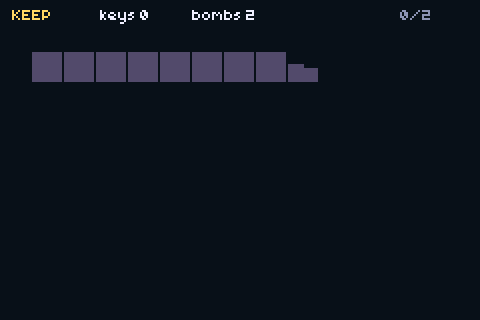

# keep — dungeon lock-and-key, as a package



A one-room keep that exercises every rule in **`packages/keylock.tish`**: keys, a Magic Key, a
bombable wall, a false door, a shutter that opens on its own, and two blocks that have to go on two
sockets. It plays itself — no input needed — and it saves.

```bash
npm run build && npm start
```

## Why this example exists

The engine had classic dungeon logic, but it lived **inside a dungeon-doors spike** (since moved to the topdown RPG port's repo) where
nothing else could reach it. `keylock.tish` is that logic lifted into a package, and this example is
the test of whether the lift worked: `keep` is a different game, written against the package, and
**that spike was not touched**. If the package needed editing to make this room work, it wasn't a
package — it was one game's code with a new filename.

## The four rules it proves

Run with `GBA_SHOT_LOG=1` and the whole thing is legible in six lines:

```
KEEP boot fresh=1 lockW=0 lockE=0 bomb=0 shutter=0
KEEP took key, keys=1
KEEP open id=2 kind=4 res=3 keysAfter=1 magic=0     bombable refuses a key (KL_NEED_BOMB)
KEEP bomb at 6,4 opened=1
KEEP took MAGIC KEY
KEEP solved, shutters opened=1                      the shutter opened with no key at all
KEEP open id=0 kind=5 res=0 keysAfter=1 magic=1     the Magic Key spends nothing
```

1. **A door is one object seen from two rooms.** `klPair(dLockW, dLockE)` — open either half and both
   report open. A door that opens on one side and stays shut on the other is the classic dungeon bug;
   the boot line logs both halves precisely so a regression is visible.
2. **Keys are one global counter, not per-door.** `klKeys()` is the only stock, and only a
   `KL_LOCKED` door spends from it. A bombable wall returns `KL_NEED_BOMB` no matter how many keys
   you are holding.
3. **The Magic Key spends nothing.** `res=0 keysAfter=1 magic=1` — it opened and the count did not
   move. This is a separate code path from "has a key", and conflating the two is easy.
4. **A shutter has no key.** `KL_SHUTTER` refuses `klTryOpen` outright; the only thing that opens it
   is `klClearRoom(room)`, which succeeds when the room's own condition does — here, both blocks
   standing on both sockets.

A fifth kind, `KL_FALSE`, exists to be *impossible*: it returns `KL_IMPOSSIBLE` forever, even with
the Magic Key. It is not a lock, it is scenery that looks like one.

## Persistence composes rather than duplicates

`keylock.tish` contains **no save code**. Each door's open bit is a `flags.tish` id at
`flagBase + doorId`, so the dungeon persists because the game's flag table persists. The attract run
calls `flagsSave()` when it finishes its route; run the ROM twice and the second boot reads

```
KEEP boot fresh=0 lockW=1 lockE=1 bomb=1 shutter=1
```

(`scripts/screenshot.sh` attaches the `.sav` by default — `GBA_SHOT_NOSAVE=1` for a guaranteed-fresh
cartridge.)

## Three things that cost real time here

**The attract route must go through the door it opened.** The first script sent the walker back west
along row 6 — which is the false door — and it stood there retrying it for thousands of frames,
logging `kind=2 res=4` over and over while looking like it was playing. The walker is greedy, not a
pathfinder: every waypoint has to be reachable in straight lines from the last one.

**Routing across a filled socket un-fills it.** Walking into a block pushes it, so a waypoint on the
far side of a socket shoves the block back off and un-solves the room a second after solving it. The
route detours along row 3.

**A hard-coded door count hides the one door that matters.** The paint loop was `while (d < 4)`
against five doors, and the one it dropped was the shutter — invisible on screen while the log
insisted it had opened. It reads exactly like the feature being broken. It is `klDoorCount()` now.

## Files

| | |
|---|---|
| `packages/keylock.tish` | the package (~310 lines, no save code, no rendering) |
| `src/main.tish` | this room: layout, paint, input, and the attract script |
| `packages/flags.tish` | where the door bits actually live |
