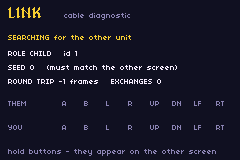

# LINK DEMO

> *Demonstrates GBA multiplayer link cable communication.*



A diagnostic ROM for the serial port. It has no gameplay; everything it does is on screen, so you
can tell at a glance whether two units are talking and how well.

```bash
npm start -w link-demo        # build + run one window
```

| Line | What it tells you |
|---|---|
| **PLAYING / SEARCHING / LOST / OFFLINE** | the state of the port, updated every frame |
| **ROLE MASTER / CHILD, id** | which unit is driving transfers. Exactly one must be MASTER |
| **SEED** | the value the two agreed on. **These must match.** A link that is up with two different seeds looks perfect and desyncs the moment a game deals a board from it |
| **ROUND TRIP** | frames between sending a word and seeing the answer. 1–2 is healthy; a number that climbs is a link too slow to play a lockstep game over |
| **EXCHANGES** | a counter that must keep rising. Frozen means the link died without noticing |
| **THEM / YOU** | the live button mirror — hold a button on one unit and watch it light up on the other |

The button mirror is the assertion that needs no interpretation. If `THEM` lights up when your
friend presses A, words are moving.

## In mGBA (the GUI path)

1. `mgba-qt link-demo.gba`
2. **File → New multiplayer window** — mGBA opens a second instance already wired to the first.
3. Load `link-demo.gba` in the new window.

Both should reach **PLAYING** within a second or two, one showing `ROLE MASTER` and the other
`ROLE CHILD`, with the same `SEED`. Press buttons in either window and watch the other's `THEM`
row. Order does not matter — a window with no peer yet sits in `SEARCHING` indefinitely.

## On real hardware

Flash the same ROM to two cartridges, connect a GBA link cable, power both on. Order and timing do
not matter for the same reason.

What to check, in order:

1. **Both reach PLAYING.** If one stays `SEARCHING`, the cable is not seated or one unit is not in
   multiplayer mode — the master end of a GBA cable is the one with the smaller connector.
2. **Exactly one says MASTER.** Two masters means neither is driving transfers.
3. **The seeds match.** If they do not, the transport works and the handshake did not; a game
   would deal different boards on each screen.
4. **ROUND TRIP is 1–2 and EXCHANGES keeps rising.**
5. **The mirror works both ways** — not just one.

## What it is testing

`packages/link.tish` over `sio_link_*` in `crates/tish-agb`: GBA multi-player SIO, a three-way seed
handshake, then one 16-bit word each per frame. That is the transport
[`packages/drop_modes.tish`](../../packages/drop_modes.tish) uses to drive side 1 of a VS match
from another console — see [`drop-vs`](../drop-vs).

It is also tested without hardware: `scripts/link.sh` runs two cores wired through mGBA's own SIO
lockstep, and `./verify.sh` asserts both reach PLAYING, agree one seed, mirror each other's
buttons, and keep the round trip inside a playable window. Emulation caught three protocol bugs
that reading the code did not — but it is still an emulator's model of a cable, which is what this
ROM is for.
