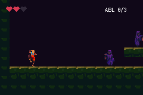

# METROIDVANIA

> *One castle, three ability gates, and walls that were always passable.*

A side-scrolling castle you re-cross as you get stronger, built on `packages/platformer.tish` with
Luis Zuno's (ansimuz) CC0 **GothicVania** art.



## Controls
- **d-pad** — move · **A** — jump (hold higher, tap for a hop) · **B** — **attack** · **R** — run
- **A in mid-air** — double jump *(once unlocked)*
- **into a wall while falling** — wall slide; **A** kicks off it *(once unlocked)*
- **R + Down while moving** — slide, which fits through one-tile gaps *(once unlocked)*

Run is on the shoulder button so the sword can have a face button. `B` throws a short-lived hurt box
in front of you via the engine's `swing` — which, until this example, aimed by *top-down* facing and
so stabbed the floor in any side-scroller. It now reads `Platformer.face`.

Land on an enemy to stomp it; touch its side and you take a hit. `ABL n/3` counts your abilities.

## The one idea worth stealing

**The ability gates are config flags, not new physics.** `platformerInit` already accepts
`doubleJump`, `wallSlide` and `slide`, and reads them from the entity's data every frame:

```tish
platformerInit(this, this.data, { doubleJump: 0, wallSlide: 0, slide: 0, … })
…
heroData.pfDouble = 1        // that is the entire "you got the double jump" event
```

So the genre is a *level-design* problem here, not an engine one. The moves work from frame one; the
castle is laid out so you meet each lock before its key:

| gate | where | opened by |
|---|---|---|
| a ledge four tiles up | cols 19-22 | double jump |
| a shaft with two facing walls and no holds | cols 26-30 | wall jump |
| a one-tile crawl at floor level | cols 33-37 | slide |

⚠️ **The room is built from named coordinates, not hand-drawn ASCII** (`build_level` in the
generator), and the bake asserts the shape: ceiling present, shaft walls present, crawl exactly one
tile, and — the one that matters — **the shaft keeps its floor**. A bottomless shaft you can fall
into before you own the wall jump is a soft-lock, not a gate; `examples/sunny-land` shipped exactly
that bug. You can always walk back out of this one. What you cannot do, until the pickup, is go up.

## What it demonstrates
- **`packages/platformer.tish`** driving a full move set: run/jump/fall/land, crouch, slide, wall
  slide + kick, coyote time, jump buffering, variable-height jumps.
- **Runtime ability gating** — the pattern above.
- **`packages/flags.tish` for progression.** The three abilities were private module scalars, which
  meant the castle forgot every unlock the moment the GBA was switched off — the one thing a
  metroidvania must not do. They are now flag ids on `flags.tish`'s versioned, checksummed SRAM, and
  the ability index *is* the flag id.
- **Native enemies** — the skeleton and hell-gato walk on `e.patrol(2)`, the engine's Rust patrol
  (turn at walls and ledges, mirror the sprite). **No `tick` hook anywhere in this example**: a
  per-entity tish tick is billed per *on-screen* entity and is the most expensive thing a room full
  of enemies can do. See [docs/perf-rules.md](../../docs/perf-rules.md) §7.
- **A one-quantisation sprite bake** — 19 hero poses share a single 15-colour palette (one of the
  GBA's 16 banks) because `clamp_colors` runs on the assembled sheet, and every pose is anchored to
  one union bounding box so the feet stay planted across clip changes.

## Build / run
```bash
npm run build      # build the ROM
npm start          # build + open in mGBA
npm run assets     # re-bake the art (needs the raw packs — see assets/ATTRIBUTION.md)
```

Level shape lives in `LEVEL` in `scripts/gen_metroidvania.py`, not in `src/maps.tish` — that file is
generated.

## Status

This is the **first playable**: one enclosed hall, the hero with attack and all three gated
abilities, the three pickups that grant them, and native-patrol enemies. Still to come, in order:

1. the three gates tuned so each is genuinely impassable before its pickup — the geometry is now
   coordinate-checked, but the *clearances* (jump arc vs ledge height, crouch height vs crawl) are
   still untested against the actual physics numbers,
2. the demon boss (art is in the same CC0 patreon pack, `demon-Files/`),
3. a save/heal point and a pause map screen on `packages/ui.tish`. (SRAM persistence itself is
   **done** — see below.)

## Progression persists, and restoring it is two halves

Unlocks are saved the moment they are picked up, not at a save point, because this game has no save
points and an unlock the player watched happen must not be undone by the power switch.

```
MV boot fresh=1 abilities=0        fresh cartridge
MV got ability 0, owned=1          collected, and saved on the spot
MV boot fresh=0 abilities=1        power cycle
MV restored ability 0
```

**Restoring needs both halves, in two different places.** Turning the ability back on happens in
`Player.start`, because that is where `heroData` first exists — doing it from `main.tish`'s boot ran
*before the hero had spawned*, hit `applyAbility`'s null guard, and silently restored nothing. A
castle that never unlocks and never logs an error is the worst version of this bug, which is why
the restore logs a line per ability instead of being assumed.

Removing the already-collected pickups is the other half. Turn the ability on without removing the
pickup and a collectable sits in the room granting what you already have; remove the pickup without
turning the ability on and the castle locks for good.

The negative control: on a fresh cartridge no `restored` line appears at all.

## Naming

The example that used to sit at `examples/metroidvania` was a linear one-screen platformer with no
exploration, no gates and no backtracking. It is now `examples/platformer-combat`, which is what it
actually demonstrates (platformer physics + health + stompable patrol enemies).
