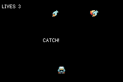

# MICROGAME

> *A WarioWare-shaped bag of four-second games — and the acceptance test for the engine's entity pool.*



Four microgames, three lives, a speed ramp. The point of this example is not the four games in it —
it is that **the fifth one is an `else if` and a function**, and costs nothing until it is written.

## What it proves

A microgame cartridge is the harshest pooling workload there is: the whole cast is thrown away and a
different one set up every four seconds, hundreds of times a session. Done with spawn/despawn that
is ~1,400 ticks per prop on the frame a round starts ([perf-rules §6]) plus a sprite-VRAM
alloc/free cycle per prop per round — the exact churn that fragments EWRAM into an allocation
failure a few hundred transitions later, long after the code that caused it.

Here, **eight props and one player are created once at boot and re-armed forever**:

```
ok   entity count constant (ENT 9 ) across every round — nothing spawns per round
ok   pool high-water 4 <= size 8 ...with headroom
ok   heap bounded across the soak (span 1024 B, 226304 -> 225280)
```

19 rounds, 13 won, 6 lost, through GAME OVER and a restart — with no entity created or destroyed
after boot.

## The inversion: the harness does not call the games

[`packages/microgame.tish`](../../packages/microgame.tish) owns time, lives, the speed ramp and the
verdict. It does **not** dispatch to a microgame. The cartridge does, with a plain branch in its own
module:

```tish
mgStep()
if (mgPhase() === MG_PLAY) {
  if (g === G_CATCH)      { catchTick() }
  else if (g === G_DODGE) { dodgeTick() }
}
```

The obvious alternative — a registry of `{start, tick}` closures — is wrong twice on this target. A
tish closure costs ~151 bytes of heap whether it is ever called or not, so twenty registered
microgames cost ~9 KB before one runs; and [`bench-behav`](../bench-behav/README.md) prices a boxed
per-frame callback at **~1,000 of a frame's 4,389 ticks**, so the dispatch alone would be a quarter
of the budget every frame. The branch above costs neither. Same inversion
[`packages/search.tish`](../../packages/search.tish) uses, for the same measured reason.

## Adding a microgame

1. A `setup()` that arms props from the shared bag, and a `tick()` that calls `mgWin()`/`mgLose()`.
2. One `else if` in `beginRound` and one in the dispatch.
3. A prompt string in `promptFor`.

No new art, no new entities, no new sheet — which is deliberate. The props are chosen by **role**
(`PROP_FOOD`, `PROP_HAZARD`, `PROP_TREASURE`), so a microgame asks for a kind of thing rather than a
specific picture.

⚠️ **Two sprite sheets, not seven.** The GBA has sixteen sprite palette banks for the whole machine
and each imported sheet claims one, so "a sheet per microgame" is how a twenty-microgame cartridge
crashes inside agb the moment two are warm at once. `scripts/gen_microgame.py` packs every prop into
one 16-frame strip and quantises it **across the whole sheet** — quantising per frame gives frames
that each look right alone and clash the moment two are on screen.

## The attract driver throws every third round, on purpose

The first version played perfectly, won every round, and never spent a life — so GAME OVER, the
restart and the whole lose path were dead code that a green verifier would have reported as passing.
An attract mode that cannot lose does not exercise a game that can. `verify.sh` asserts **both**
outcomes occur, which is the negative control that makes the rest mean anything.

## Controls

D-pad moves; A is the button the games that want a button ask for. Any real input turns attract mode
off for good.

```bash
npm run verify
```

`npm run assets` rebuilds both sheets from the vendored [Ninja Adventure][na] pack (CC0).

[perf-rules §6]: ../../docs/perf-rules.md
[na]: ../../assets/ninja-adventure/README.md
