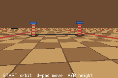

# mode7-demo

> *A Mode 7 ground plane: per-scanline affine transforms driven by a 3D camera.*



A real 3D ground plane on the GBA — the smallest thing that proves it.

```bash
npm run build && npm start
```

Left/Right turn · Up/Down move · A/B raise and lower the camera. With no input the camera orbits, so
a headless screenshot still shows a moving 3D scene.

## What this is

The floor is not a drawing of perspective; it is a plane being projected. Every scanline gets its own
affine transform, so scale changes with distance — which is what perspective *is*.

That distinction is the whole point. The repo previously had affine background support and deleted it
(`7f6f969`) with the note that it "just skews, doesn't read as isometric". That was true of what it
did: it set **one matrix for the whole screen**, which is an orthographic tilt — parallel lines stay
parallel and there is no vanishing point. Per-scanline is a different thing entirely.

agb supports it directly, and cheaply:

- `AffineBackgroundId::transform_dma()` is a public `DmaControllable` pointing at `0x0400_0020`.
- `HBlankDma<Item>` is generic and transfers `size_of::<Item>() / 2` halfwords per line, and
  `AffineMatrixBackground` is `repr(C, packed(4))` — exactly the sixteen bytes of `BG2PA..BG2Y`.

So one DMA channel and a 160-entry table rewrite the entire matrix every scanline: the same budget
`bg_bands` spends on stripes.

## The projection

For a camera at `(cam_x, cam_z)` looking along `yaw`, `height` above the plane, focal length `focal`,
with the ground converging to scanline `horizon` — a scanline `dy` below the horizon sees ground at
depth `focal * height / dy`, so with `k = height / dy`:

```
PA = cos(yaw)*k      PC = -sin(yaw)*k      PB = PD = 0
X  = cam_x + k*(sin(yaw)*focal - cos(yaw)*120)
Y  = cam_z + k*(cos(yaw)*focal + sin(yaw)*120)
```

`PB`/`PD` are zero because reloading `X`/`Y` every HBlank makes the hardware's own per-line
accumulation irrelevant — each line is positioned outright rather than accumulated. `k` is clamped
because the first line under the horizon is at infinite distance and an 8.8 `PA` cannot hold it.

## Two traps

**Scanline 0 is not covered by the DMA.** `HBlankDma` sources from `values[1..]`, so its first
transfer applies to line 1. Line 0 draws with whatever `show()` latched — the layer's own transform,
identity by default, which samples the texture 1:1 and paints a bar of raw floor across the top of
the screen. `set_transform(rows[0])` fixes it.

**The DMA is armed LAST, so heavy commit work corrupts the floor rather than merely dropping a
frame.** agb's `GraphicsFrame::commit` runs, in order: wait for vblank → `oam_frame.commit()` →
`bg_frame.commit()` → blend → windows → **`dma.commit()`**. Anything that makes those earlier steps
expensive pushes the DMA arm past the moment the screen starts drawing, and the top scanlines then
render with the latched matrix instead of their own.

A `hud_text` whose string changes re-lays-out and re-uploads glyphs inside that window. This demo
originally drew a live `YAW n H n` readout: every frame it changed, the floor glitched — first every
frame, then, once the readout was gated to every 32nd frame, exactly on the frames it updated. The
HUD here is now drawn **once** and never rebuilt, and twenty consecutive frames measure zero
above-horizon artifact pixels with floor coverage varying by 0.1%.

A game that needs a live counter has to budget for this: keep the changing text small, or accept the
glitch on the frames it changes. It is a property of the commit order, not of this code.

## API

`affine_bg_new(asset, wTiles, hTiles)` · `mode7_camera(handle, camX, camZ, yaw256, height, horizon,
focal)` · `mode7_visible(handle, on)` · `mode7_screen_x/y/scale(handle, worldX, worldZ)`.

The last three project a ground point to screen space and give a scale — which is how a flat sprite
becomes a billboard standing in the scene. agb also has `AffineMatrixObject` if you want to scale
those sprites continuously rather than picking between baked sizes.

A Mode 7 floor and `bg_bands` cannot coexist: `add_dma` holds one slot, last writer wins.
