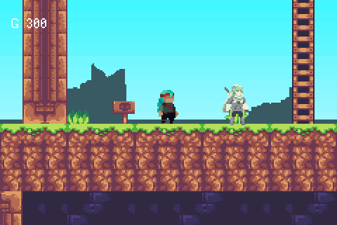

# OAKHOLLOW

> *A farming/life-sim template (Stardew Valley style).*



A town built downwards. There are cellars, a forge and a dock under the street; the street itself,
with eight buildings and the people who live in them; and a plank walk laid along the rooftops that
you reach by ladder, running jump and ledge grab. Eight townsfolk to talk to, two shops to buy from,
three interiors to step into, and a parallax sky behind all of it.

It is the first example that is a **place** rather than a level — and the first side-scroller in this
repo that doesn't write its own character controller.

## Controls

| Input | Action |
|-------|--------|
| **D-pad** | **run** — there is no walk button, you always run; **Up** grabs a ladder, **Down** crouches (and drops through a plank with A) |
| **A** | jump · **A** again in mid-air off a wall to wall-jump · on a ladder, jump off |
| **A** | talk to whoever is in front of you, read a sign, open a door (the HUD says `A: use`) |
| **B + Down** | slide, while moving on the ground (B's only job — it no longer gates speed) |
| **Down** | crouch-walk is the slow, precise move, since running is the default |

> ⚠️ **Four moves have no art.** The player is the "DARK - Hero" sheet shared with
> [`examples/dark-hero`](../dark-hero/), whose free version ships ten states — no crouch, no slide,
> no wall slide, and no ladder climb. Those moves all still *work*; they just play a stand-in (the
> fallback chain in `packages/platformer`: `idle` for the three crouch states, `fall` for a wall
> slide, and the ledge-climb cycle for a ladder). They are left unmapped on purpose rather than
> pointed at a clip that would read as wrong. See the note on `CLIPS` in `src/components.tish`.
| — | fall past a ledge on the side you're facing to **grab** it; **A** or **Up** pulls up, **Down** lets go |

## What it demonstrates

Almost none of the interesting code is in this example. That is the point of it.

- **`packages/platformer`** — the shared side-scroll controller, new with this example and extracted
  from the four platformers that each had their own. Walk/run, coyote time, jump buffering, variable
  jump height, one-way drop-through, crouch, slide, **ladder climbing**, **ledge grab and pull-up**,
  **wall slide and wall jump**, hit and death states, and a clip table that drives all of it.
  `src/components.tish` is 100 lines and mostly says which frames are which.
- **Tiled parallax layers** — the sky and the treeline are layers of `town.tmj` with Tiled's own
  parallax factors, scrolling at their own fractions of the camera. Applied natively, so they cost
  nothing per frame and can never lag the world by a frame.
- **`packages/dialog`** — every conversation, with portraits, multiple pages, and a choice menu at
  the inn.
- **`packages/dialog` again, as the shop counters** — the general store and the forge sell and buy
  back through a choice menu, over an economy that is 40 lines of `src/town.tish`. Not
  `packages/shop`: see the note below.
- **Engine primitives added for this** — a sticky `face` on the platformer body, a side-scrolling
  `interactPF` (there was a grid one and a top-down one, but nothing for a platformer), a
  **ladder plane** in the collision grid alongside solid and one-way, `setVy`, and camera getters.

## Layout

- [`src/main.tish`](src/main.tish) — the wiring: layers, scenes, who stands where, what A means
- [`src/components.tish`](src/components.tish) — the player, and the sprite clip table
- [`src/town.tish`](src/town.tish) — the cast, what they say, the shop stock, the purse
- `assets/town.tmj` + `inn/store/forge.tmj` — **the levels. Open them in Tiled.**
- `assets/tiles.tsj` + `tiles.png` — the tileset, and which tiles are solid / one-way / climbable

## Four things worth knowing before you edit it

**The tileset is a set of PIECES, not a bag of blocks.** Three of its families only read correctly in
the position they were drawn for, and `to_gids` picks each cell's piece from its neighbours rather
than stamping one tile everywhere:

| family | pieces | used for |
|---|---|---|
| masonry `=` | a 3×3 **nine-slice** at (15,7)–(19,11) | the undertown, the interiors, the belfry |
| beam `-` / `+` | left, middle, right | the rooftop walk; `+` is the indoor version |
| ledge `~` | left, middle, right | grass-topped platforms |
| earth `#` | grass caps, five dirt fills | the street and the cellar floor |

Two traps in there. The masonry's *interior* piece is a dark void, because the set is drawn for walls
**around** a space — so it's right for rooms and wrong for solid columns; the rooftop supports are the
tileset's turned wooden post instead. And a one-tile-thick wall can't tell its inside from its
outside (neither neighbour is masonry), so every room shell is **two** tiles thick.


**The levels are Tiled maps, and collision lives in the tileset.** Open `assets/town.tmj`. A tile is
a wall because `tiles.tsj` marks it `walkable = false`, a plank is a platform you jump up through
because it is `oneway = true`, and a ladder is climbable because it is `ladder = true` — the three
are independent, and a ladder cap is one-way *and* climbable. Behaviour belongs to the tile, so
moving a walkway in the editor moves its collision with it. `scene:` bakes the .tmj into ROM at
build time and the streaming layer reads tiles straight out of flash; the same town as a tish array
literal is one boxed value per cell on a ~140 KB heap, and 3,600 of them died in the allocator
before the first frame. The generated `*.atlas.png` / `*.map.bin` beside the .tmj are build
artifacts — not checked in, and not to be edited.

**Four background layers, and every one is spoken for.** World sprites draw at priority 2 and an
object beats a background of equal priority, so the World layer is priority 2 (behind the
characters) and both backdrops are priority 3. Priority 0 is the UI canvas. Each layer carries its
priority as an int `priority` property in Tiled, because the default back-to-front ladder (3, 2,
1, …) would put the town at 1 and draw it over the player. Two layers at the same priority are
ordered by Tiled's own stacking — the higher one in the editor draws in front, which is why Hills
sits above Sky. **Add a fifth layer and the sky silently stops being drawn.**

**The shops are `packages/shop`, and this example is what found four bugs in it.** All four only
show up in a game that has a *world* behind the menu, which is why `examples/shop-demo` never hit
them:

| symptom | cause |
|---|---|
| no ► cursor after entering a building, and a townsperson silently teleporting | `makePointer` took its sprite once at boot, but `loadScene`'s `sprite_clear` drops every sprite **and restarts handle numbering** — so the cursor's handle got reissued to the next scene's first spawn and the menu drove that entity instead |
| the room visible straight through the shop's panels | `ui_rect`'s filled path kept ONE shared solid tile, so the second panel's fill freed the VRAM slot the first panel's cells still pointed at |
| the quantity picker's body see-through | `makeStepper` built its panel with no `fill`, and `uiRelayoutInner` clears a fill-less node's interior to transparent instead of painting over it |
| the hint line's whole strip a window onto the game | `repaintFooter` called `ui_text_box` without a background colour, which clears blank glyph cells to transparent |

The shopkeepers are still **indoors**, which is worth keeping for its own sake: it is how a town
works, and it keeps the heap clear while a menu is up.

**Known limit — the third shop visit of a session can't open the quantity picker.** Measured with
`ui_mem_report()` / `heap_free()`: a tab open costs ~63 KB (5.7 KB selector, 20 KB node tree, 31 KB
canvas paint, 5.6 KB detail), and the picker on top of it another ~8.4 KB. The first conversation
takes a permanent 8.4 KB and the first shop open a permanent 15.2 KB — both are `packages/ui` pool
capacity, which is deliberately never handed back — so free heap settles at ~58.7 KB, the tab lands
at ~7.3 KB, and the picker misses by about a kilobyte. Releasing the list's row graphs under the
picker does not help: rebuilding them on close costs more than they free. The real fix is the one
`packages/ui-roadmap.md` already names — bake the tab into a display list, which drops the ~20 KB
node tree on every open after the first.

## Build / run

```bash
cd examples/oakhollow && npm run build
```

```bash
cd examples/oakhollow && npm start
```

```bash
cd examples/oakhollow && npm run shot
```

Screenshots need **≥500 frames**: a streamed map pages in over the first few hundred, and a capture
before it has finished is pure white — indistinguishable from a crash.

To drive it headlessly, pass a key schedule — `scripts/screenshot.sh oakhollow.gba out.png 900
"200:right,315:,335:up"` walks east and climbs the first ladder.

## Editing the levels

Open `assets/town.tmj` in [Tiled](https://www.mapeditor.org/). The .tmj and .tsj files are the
source of truth — edit, save, `npm run build`.

## Regenerating the art

```bash
python3 scripts/gen_oakhollow.py
```

This bakes the sprite sheets and the tileset from the raw art packs (see
[`assets/ATTRIBUTION.md`](assets/ATTRIBUTION.md) for what they are and where they come from).

**It also rewrites the four .tmj files**, from the procedural `build_town()` that first generated
them. That was a one-shot conversion; re-running it will discard anything you have done in Tiled.
Regenerate the art only if you are changing the art, and expect to redo level edits if you do.

Art sources are listed in [`assets/ATTRIBUTION.md`](assets/ATTRIBUTION.md).
