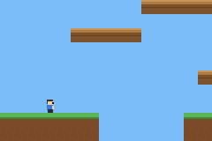

# PLATFORMER SCROLL

> *Demonstrates a platformer with a smoothly scrolling camera.*



A side-scrolling platformer with a **smooth follow camera** — the side-scroll
counterpart of `ninja-adventure` (top-down). Foundation for the metroidvania.

The level (`src/maps.tish`, generated by `scripts/gen_platformer.py`) is 49×13
tiles — far wider than the 240×160 screen — rendered by a streamed tilemap
(`loadStreamMap`). The player has the engine's platformer physics: gravity,
walk, jump, and AABB-vs-tile collision against the map's solid tiles.

- **d-pad**: walk left/right
- **A**: jump

The camera call is `hero.follow()` — it smoothly tracks the player and streams
tiles in as the level scrolls. (Contrast `platformer-rooms`, which uses
`hero.roomFollow(15, 10)` for classic room-by-room panning.)

Build (from the tish compiler workspace or with its source-built binary):

```bash
npm run build      # build the ROM
npm start          # build + open in mGBA
```

Regenerate art + level: `python3 scripts/gen_platformer.py` (repo root).

Note: streamed backgrounds page in over the first few hundred frames, so a
headless screenshot needs ~300+ frames to show the filled scene.
