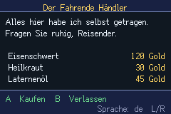

# polyglot

> *One merchant screen, four languages, and a layout that survives all of them.*


An **internationalisation** demo, and the acceptance test for the `strings:` import scheme. This
screen holds none of its own text: every word comes from `assets/ui.strings`. **L / R** switch
language, and the choice is written to the cartridge.

| | |
|---|---|
|  | German — a longer footer and `Laternenöl`, same layout |

## Why a shop screen and not a list of strings

A list proves the table loads. It does not prove a game is internationalised, because the hard part
of i18n is never the lookup — it is that **the same screen must hold text of wildly different length
and shape**, and a layout tuned to English quietly breaks on everything else:

- **`Gold` is `Or` in French and `所持金` in Japanese.** A price column placed by eyeballing the
  English is wrong in three languages out of four, so prices are right-aligned by *measuring*
  (`text_width`) against a fixed right margin. Switch language and watch the column move.
- **`B  Leave` is `B  Verlassen` in German** — half again as wide. The second prompt is placed from
  the measured width of the first, not from a constant.
- **The title is centred by measurement**, not by a guessed x.
- **Japanese has no spaces to break on**, so line breaks belong to the translator: the merchant's
  line is two ids, not one wrapped string (see below).

## Language is a preference, so it lives on the cartridge

Nobody should pick their language twice. The choice writes through `prefs.tish` to SRAM immediately
— a language you have to confirm is a language you lose on the next boot — and is verified by running
the ROM twice:

```
RUN 1  POLYGLOT lang=fr → lang=de
RUN 2  (power cycle, no input)   restored=de
```

## Four things that were wrong, and none of them were the font

**A `while` loop with no increment.** The item loop redrew item 0 for ever, exhausted tile VRAM
("Ran out of video RAM for tiles"), and `paint` never returned — a blank screen with no error. This
cost more time than all the i18n put together and it looked exactly like a font problem. It was found
by logging between draws, not by reading the code.

**`ui_text`'s wrap argument kills the canvas.** Passing a `maxw` aborted `paint` on that call, so
every later draw silently never ran — the agb `Layout` trap recorded in `docs/MEMORY.md` as *"the 5
ways agb 0.25's Layout panics naming no caller"*. The merchant's line is now **two strings**, which
is better i18n anyway.

**`/ 2` is float division.** Centring with `(240 - tw) / 2` handed `ui_text` an x of `52.5`, and a
fractional coordinate takes the canvas down silently. Use `>> 1`.

**The glyph roster must be generated, never written.** `font:` bakes a *selective* glyph set from the
program's string literals; a `.strings` table is data, so its characters are invisible to that pass
and render as blank gaps. `src/generated/glyphs.tish` is derived from the table by
`scripts/gen_strings_glyphs.py` (47 glyphs here) and referenced once. A hand-kept list is a second
copy of the content that drifts the moment a translation is added — and fails silently, in the
language nobody reviewing can read.

## ⚠️ Blank gap and tofu are different bugs

They look identical on screen and have opposite fixes:

| symptom | cause | fix |
|---|---|---|
| blank gap | never baked — the charset pass never saw it | regenerate the roster |
| tofu box | baked, but the **font** has no such glyph | change the font, or the word |

```bash
python3 scripts/check_strings_font.py examples/polyglot/assets/ui.strings assets/fonts/ark-pixel-cjk.ttf
```

That check found that **every vendored `ark-pixel` face lacks 旅 and 薬**, which is why the Japanese
here writes those two words in kana — as retro Japanese games did, for exactly the same reason.
`ark-pixel-10px-cjk.ttf` is missing considerably more (`分所持油鉄`), so this example uses
`ark-pixel-cjk.ttf@12`; at `@10` the kanji strokes merge.

## The format

```
[en]
The Wandering Merchant
Iron Sword

[ja]
たびの商人
鉄の剣
```

Ids are **line positions**, so they cannot drift between languages, and the device-side lookup is an
array index rather than a string compare. A translation with a missing line is a **compile error**:

```
[de] has 4 strings but [en] has 5 — every language must define the same ids, or every
string after the missing one shifts and the game shows the wrong sentence
```

```
str_get(handle, lang, id)   str_count(handle)   str_langs(handle)
str_lang_name(handle, lang)   str_find_lang(handle, "de")   // -> index, or -1
```

## Build

```bash
npm run build && npm start
python3 scripts/gen_strings_glyphs.py examples/polyglot     # after editing the table
```
