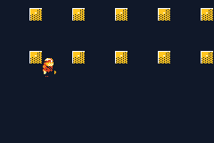

# PRISMFALL

> *A metroidvania-shaped game whose abilities are colours.*

One connected facility. What opens each zone is not a key but a **lens** — and what is not in your
lens is not there: not drawn, not solid, not under your feet. You start able to see only the DAWN
band. The DUSK and VOID lenses are somewhere in the building, and the last gate opens only under
**WHITE**, with all three lit at once.



Built on `examples/spectra`'s chroma mechanic, rebuilt for exploration: one streamed 112×40 map
instead of a room gauntlet, ability gates instead of a fixed order, and 60fps.

## Controls

- **d-pad / A** — move and jump
- **L / R** — turn the lantern. The **DUSK lens is eight tiles along the opening floor**, so the
  mechanic is yours within seconds; L/R *skip* the lenses you have not found yet.
- **L + R held** — WHITE. All three bands real at once. Drains the lantern; prisms refill it.

## ⚠️ A mechanic you cannot see is a mechanic you do not have

Two things had to change before this played like the game it is, and both are worth stealing:

- **The second lens is the FIRST pickup.** It used to sit at the top of zone 1 — several minutes in
  — so the signature verb did nothing at all for the whole opening.
- **The world had to be built out of bands, not decorated with them.** Measured: a lens switch
  changed **0.3% of the screen**, because the zones were grey stone shelves with the odd coloured
  ledge. `band_field` now fills the air between shelves with band structure, placed mid-gap so it
  never seals a route, and a switch changes **5.4%** — orange blocks in DAWN, different blue ones in
  DUSK. Spectra's single-screen rooms read instantly because they are dense; a big exploration map
  has to work *harder* for that, not less.

## The gating is machine-checked, not eyeballed

`scripts/gen_prismfall.py` builds the world and then **proves** the gating with a reachability model
that understands gravity, jump arcs and lens switching:

```
DAWN    reaches lens_dusk    ok
+DUSK   reaches lens_void    ok
+VOID   reaches lens_white   ok
+WHITE  reaches goal         ok
```

⚠️ **This is the check nobody writes, and it caught four real bugs that were invisible in the ASCII.**
A metroidvania map's whole claim is "you cannot get there yet, and later you can", and both halves fail
silently — a leaky gate is a sequence break nobody reports, a sealed one is a softlock found an hour
in. What it found:

1. **Gates built from phase blocks instead of chroma doors.** A block is solid only while its band is
   *lit*, so a wall of band-B blocks is *passable* to a player with no DUSK lens — exactly backwards.
   A door is the inverse: shut in every lens but its own.
2. **Jump arcs that only checked the landing cell**, teleporting the model straight through a
   two-tile door. A wall thinner than the jump is not a wall to a checker that only looks at where
   you land.
3. **Spikes treated as solid ground**, letting the model walk the floor of a lethal chasm — and, one
   row up, letting it *stand inside an unlit block* and stroll the length of the WHITE span in any
   lens. Solid and lethal are different things.
4. **The WHITE span crossable with a single lens, twice.** `ABCABC` leaves same-band steps 3 apart —
   jumpable. `AABBCC` leaves them 5 apart — still jumpable. Only `AAABBBCCC` puts the gap at 6.

The model is deliberately generous (a 4-tile rise, a 5-tile leap — more than the real controller),
because over-estimating what the player can do is the safe direction: if it says a lens is
unreachable, it truly is.

## WHITE cannot be a tile

The engine ORs the lit bands — a cell is solid if *any* lit band has a block there — so no single
tile can mean "solid only when all three are lit". The final gate is a **sequence** instead: a
walkway running `AAABBBCCC`, where one lens gives you three steps and then a six-column hole. Light
all three and it is continuous.

## Story

Told by the place. Six data-logs from the last crew, found rather than delivered; no cutscene stops
the game and nobody talks at you. Each one also points somewhere, which is how a map with no quest
marker teaches direction.

## Engine work

- **`packages/chroma-world.tish`** — a fork of `packages/chroma.tish` with **lens ownership** (L/R
  skip what you have not found — that *is* the gate system) and **chunked collision**: the map is
  diced into 16×16 chunks and a switch refreshes only the player's chunk plus one neighbour per
  frame. Pushing all 548 band cells on every press would freeze the game on its main verb.
  ⚠️ It is a fork on purpose — see the header for why merging it into `chroma.tish` is a separate job.
- **`stream_visible`** (in `crates/tish-agb`, added for spectra) is what makes a lens one call:
  each band is its own tile layer, and showing one is a layer toggle, not a palette or tile rewrite.

## The art

The hero is the **DARK-Hero** 64x64 sheet, the same one `examples/dark-hero` ships — hand-drawn,
already vendored, and reused here with that example's own measured anchor (-24, -47 against a 16x16
box) rather than a re-derived one.

⚠️ It **replaced AI-generated art, and the reason is the useful part.** The generated sprites were
consistent across poses and looked good at 1024px; they baked to **mush at 32x32**, which is a size
GBA sprites are *drawn* at, not downscaled to. Prompting for *"extremely low resolution, very large
chunky pixels"* got noticeably closer and still lost the silhouette. The pipeline is kept in
`~/.claude/skills/ai-image/` and is genuinely useful for concept art, backdrops and mockups — just
not for a 32px sprite that has to read at a glance.

Two things worth keeping from that attempt if you ever revisit it:

- **Bake frames together, never one at a time** (`bake_sheet.py`). Per-frame baking gives each frame
  its own scale and anchor, and the animation swims.
- **`bytedance/seedream-5.0-pro` burns a visible "AI generated" watermark into its output.** Check
  generated art before shipping it.

A four-model bake-off (gpt-image-1-mini, seedream-5.0-pro, imagen-4.0-fast, recraft-v4.1) picked
`openai/gpt-image-1-mini` on evidence — the cheapest model won, because the hard part is obeying
*"flat colours, no anti-aliasing, plain background"* rather than drawing well.

## Build

```bash
npm run assets     # world + story + reachability check
npm run build
npm start
```

## Known gaps

- The zone interiors are a generated staircase — correct and climbable, but plain. Hand-dressing
  them is the obvious next pass.
- The hero sheet is four frames (idle, two-frame run, jump). Falling reuses the jump frame.
- No enemies yet: the facility is a traversal and gating problem at the moment, not a combat one.
