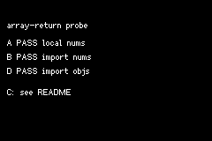

# PROBE ARRAYRET

> *A technical test for array returns over FFI or WASM.*



A regression probe, not a game. It exists to settle one question that decides whether a
**data-driven cutscene / script format is possible at all**.

[`packages/cutscene.tish`](../../packages/cutscene.tish) says a cutscene must be a sequence of
blocking calls rather than a timeline, because *"an array-RETURNING tish function hangs the GBA
codegen (#553), so a timeline-as-array is a trap on device"*. That note has **no regression test
anywhere in the tish tree** — unlike #556 and #558, which are fixed and tested — so its status was
simply unknown, and every cutscene in the repo is written imperatively on the strength of it.

## Cases

| | Where the function lives | Returns | Called from | Result |
|---|---|---|---|---|
| **A** | same module | array of numbers | inside a function | see the ROM |
| **B** | imported module | array of numbers | inside a function | see the ROM |
| **C** | imported module | array of numbers | **module init** | **compile error** |
| **D** | imported module | **array of objects** | inside a function | see the ROM |

**D is the one that matters** — `[{op: 1, …}, {op: 2, …}]` is exactly the shape a cutscene timeline
takes, and the probe walks it the way an interpreter would, reading a field off each element in
order and checksumming.

## Case C is not in the ROM, deliberately

It does not fail at runtime; it fails to **build**, so including it would take the other three cases
down with it and the ROM would report nothing. It was found while wiring the clan bridge into
the isoboard SRPG example (now in the chuggie-tactics repo):

```
error[E0425]: cannot find value `deployList__m18` in this scope
```

The narrow rule — and the loose version is wrong, so it is worth stating carefully — is that an
**imported** function which constructs and returns a new array fails to resolve when called during
**module initialisation**. Called from inside another function it is fine:
`clanJobsForRace` in [`packages/clan/state.tish`](../../packages/clan/state.tish) does exactly this
and ships, because all three of its call sites are inside function bodies.

To reproduce C, add this to `src/main.tish` at top level and build:

```tish
let boom = makeNums(3)   // module-init call into an imported array-returning fn
```

## Run

```bash
cd examples/probe-arrayret
unset CARGO_TARGET_DIR && npm run shot
```

The screenshot is the whole result — each case prints PASS or FAIL with what it actually got. The
same lines also go to the mGBA debug log via `log()`.
