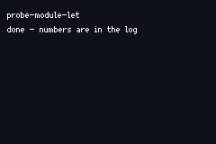

# PROBE MODULE LET

> *Does a bare module-level `let` read back correctly after reassignment on the GBA target?*

A probe ROM: declares a module-level `let X: i32`, reassigns it from inside functions, and prints what reads back.
