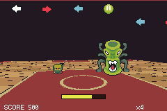

# rap-dojo

> *A call-and-response rhythm game: fake 3D from per-scanline background bands, judged against the deck sequencer's own playhead.*



A call-and-response rhythm game. The master raps a bar; you rap it back.

**Controls** — `A` · `B` · d-pad, in whatever order the master just used. `START` begins, and `START`
on the results screen runs the lesson again.

```bash
npm run build && npm start
```

Regenerate the art, the song and the chart with `npm run assets`.

---

## The Parappa problem

The look being borrowed is flat paper characters standing in a scene that has depth. The characters
are the easy half: they are sprites, and being flat is the style rather than a limitation. The scene
is the interesting half, because the GBA has no 3D and tish-agb has no affine/Mode-7 background —
there was one, and it was removed in `7f6f969`.

What it has is `bg_bands`: a table that rewrites **one** background's horizontal scroll register
between scanlines, by DMA, while the screen is drawing. That buys a different scroll speed per band
of the picture for the cost of a 320-byte table the engine already builds.

So the dojo is one background layer cut into depth bands:

| rows | what | scroll |
|---:|---|---:|
| 0–43 | ceiling void — where the prompt lane lives | 2/256 |
| 44–75 | banner row | 8/256 |
| 76–91 | wall and the DOJO sign | 16/256 |
| 92–159 | the floor, as one surface | 40/256 |

The depth is **drawn**, not transformed. The floor is a perspective checkerboard: for a screen row
`d` of the way from the horizon to the camera, a point sitting `g` pixels off centre at the near edge
appears at `VP_X + g * d`, so the columns converge on a vanishing point as `d → 0`. The rows get
shorter toward the horizon for the same reason, and their joints crowd together. That is what makes
it read as a room.

**The floor gets one scroll rate, not one per depth row** — and this is the mistake worth recording.
Scroll speed really does scale as 1/depth, so the first version gave each of the eleven floor rows
its own multiplier. That is correct for a floor made of independent horizontal strips and wrong for a
floor with a vanishing point: neighbouring rows slide apart a pixel at a time until the vertical
lines break at every row boundary, and on screen that is not depth, it is the picture tearing. A
converging floor is one rigid surface. Panning a camera across it properly needs a real transform,
which is precisely what the deleted affine background would have been.

So the camera **sways** rather than travels — far enough that the wall and floor visibly move against
each other, never far enough to shear the geometry or drag the 256px wrap seam on screen.

[`scripts/gen_rap_dojo.py`](../../scripts/gen_rap_dojo.py) draws the image **and** emits
`src/stage_bands.tish` from the same tables, so the picture and the scroll rates cannot drift apart.

## Where the beat comes from

Nothing here counts frames to find the beat.

The obvious way to build a rhythm game is a frame counter started with the music. It is wrong on
this engine, and wrong in a way that hides: tish-agb advances the deck sequencer once per **elapsed
display frame** (`music_catchup`), not once per `frame()` call, so every frame the game misses moves
the song forward and leaves a hand-rolled counter behind it. The chart slides off the music a frame
at a time — invisible in a screenshot, obvious to a player, and worse the busier the scene gets.

So `packages/rhythm` reads the sequencer's own playhead through `deck_frame()`, added to tish-agb
for this. The chart and the music are then the same clock rather than two clocks that agreed at the
start, and drift stops being a bug to fix and becomes a state that cannot be represented.

Two consequences worth knowing:

- Cue positions are computed with **exactly** deckpack's `beat_to_frames` — `beat * 60 * 59.7275 /
  bpm`, rounded per note. The GBA runs at 59.7275Hz, not 60, and deckpack rounds each note
  individually rather than stepping by a constant; rounding a constant instead agrees at beat 0 and
  is a frame out by the end of a verse.
- deckpack bakes every song with `loop_frame = 0`, so a song does not end, it restarts. The run
  finishes when the **chart** is spent, not when the music is.

## One table, two files

The master's call is a melody in the song and a row of button prompts in the chart. If those
disagree the game is unplayable in a way that looks like a timing bug — the player copies what they
heard and is told they are wrong.

So [`scripts/gen_rap_dojo_music.py`](../../scripts/gen_rap_dojo_music.py) generates
`assets/battle.deck` and `src/chart.tish` from a single `PHRASES` table. Each button is a degree of
C minor pentatonic (Down lowest, Up highest), which means any pattern of buttons is already a
playable lick and phrases can be written for feel. Answer correctly and the pupil plays the notes
back — `chip_borrow` lends channel 2, the harmony, away from the song for a few frames; the lead is
on channel 1 and is never interrupted.

**One shared table is not enough on its own**, and that is worth recording because the bug it was
meant to prevent shipped anyway. The song converted the table's numbers as sixteenth *notes* (÷4 to
beats); the chart converted the same numbers as sixteenths of a *beat* (÷16). The chart therefore ran
at four times the song's tempo. Nothing errored, and every check in `verify.sh` passed — because they
all compared the chart against itself and nothing looked at the music.

A shared table only helps if both consumers agree what its units mean. So there is now exactly one
`step_to_beat`, the unit is spelled out in capitals where it is defined (a **step** is a sixteenth
note, four to the beat), and `verify.sh` parses the notes actually written into `battle.deck` and
asserts every call cue lands on the note the song plays there.

## `packages/rhythm`

The reusable part: beat clock, hit windows, misses, stray presses, combo, score, the "U Rappin'"
meter, and the scrolling prompt bar. It owns the cue table and draws the lane from it — a lane
redraws every visible cue every frame, and reading those back through accessors would cost a boxed
call per cue per field, which is far past the per-frame budget. It takes the layout as arguments, so
it still owns no art.

The judge distinguishes a **stray press** from **freestyle**: off-pattern presses only cost you
inside your own answering window. Mashing along with the master's call is free, which is how the
genre works — you are meant to feel the beat before repeating it.

## Assets

Ninja Adventure pack (CC0, Pixel-boy & AAA) — see [`assets/ATTRIBUTION.md`](assets/ATTRIBUTION.md).
Fonts: Kenney High Square and tinypixel.
