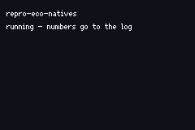

# REPRO ECO NATIVES

> *Proof ROM for the ecosystem/platformer engine natives.*

Headless assertion suite: every check prints `ok <name>` or `FAIL <name>`, so a crash cannot vanish into a traceback while the suite still passes.
