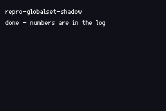

# REPRO: struct-global store shadows a user variable

> *`G.cur = BASE + c` did not compile, because the emitted `with(|c| …)` closure shadowed the author's own `c`.*



**Status: builds today, and is kept as a tripwire.** The lowering that caused this was reverted
upstream (`ad68e6388`, "core tish must stay untouched"), so the emitter no longer exists — this file
compiles because there is nothing left to shadow. If struct-global lowering ever returns, this fails
on the first build, before a real game does.

## What it caught

`examples/solitaire` stopped building when struct-global stores started lowering natively
(`581bb749d`, "lower stores into struct params/globals"). A field write on an all-numeric struct
global lowers to a `thread_local` `Cell` round-trip:

```rust
G_G.with(|c| { let mut __t = c.get(); __t.cur = <RHS>; c.set(__t); })
```

The right-hand side is **user code, interpolated inside that closure**. Solitaire's line 951 is
`G.cur = TAB0 + c`, where `c` is the function's own local — so `c` resolved to the closure's
`&Cell<TishStruct_Game>` and the build failed with:

```
error[E0606]: casting `&Cell<TishStruct_Game>` as `i32` is invalid
```

Nothing about the tish source is unusual. Any program with a variable named `c` and a struct global
would hit it, and the failure names a Rust type the author never wrote.

## The fix, if the lowering returns

The closure should bind `__c`. `__`-prefixed names are already reserved for emitted temporaries (`__t` sits
in the same string), so they cannot collide with anything a program is entitled to name. Three emitters interpolate user expressions inside such a closure and all three would need it:
`struct_global_field_set`, `native_global_set`, and the module-struct-global initialiser.

**Why it was not reapplied after the revert.** Two of those three went away with the lowering. The
survivor, `native_global_set`, could not be reached: a targeted repro leaves the global as a boxed
`VmRef` (and even then computes the value into a `_t` in the OUTER scope, which is safe), and a scan
of **53 generated ROMs across the corpus found zero** occurrences of `with(|c| c.set(`. Patching core
tish for a bug with no reproducer would be speculative, and that repo is deliberately left
untouched.

Renaming the binding was chosen over hoisting the value into a `let` above the closure: a hoisted
binding infers its type from the expression alone rather than from the field it is assigned to, which
would silently change an `f64` field initialised from an integer literal.

## Build

```bash
npm run build && npm start
```
