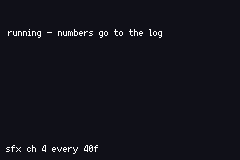

# REPRO: PSG SFX vs MUSIC

> *Does firing a PSG sound effect on a channel the music is using damage the music?*



`rap-dojo` plays a short note on a correct answer via `chip_borrow` + `psg_square`. Whichever
channel it borrows, the music is already using that channel for something, and the reported symptom
was *"it plays another song over the song, so I can't hear it"*.

This is that, isolated: a four-note-per-bar lead on pulse 1, a held pad on pulse 2, a noise backbeat
on 4 — and an SFX fired every 40 frames on a channel chosen by `SFX_CH`. Change `SFX_CH`, rebuild,
and listen to which channel survives.

## Build / run
```bash
npm run build && npm start
```
