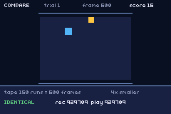
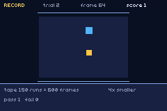

# rerun

> *Record a run, play it back, and check that the game did the same thing twice — on the cartridge, every twelve seconds.*



The acceptance test for **`packages/replay.tish`**, which is new.

| | |
|---|---|
|  | the simulation being recorded: a dot, a pickup, and a tape |

## Why it exists

This repo's hardest testing problem is written down twice and had no tool behind it:

- **"twin ROMs can't prove equality"** — a screenshot at a fixed frame compares two different
  *moments*. Two builds that diverge can still match; two that agree can still look different. The
  recorded advice is "diff a per-frame trace", and nothing produced one.
- **tish builds are nondeterministic in ORDER** (a HashMap in codegen), so "same source, same
  behaviour" is an assumption worth checking rather than believing.

A recording turns both into an artifact. If a game is a pure function of `(seed, inputs)` then
replaying the inputs must reproduce the run — and one number says whether it did.

## What it does, on loop

1. **RECORD** — an attract player drives a small simulation for 600 frames. Every button mask goes on
   the tape; the game's own state is folded into a rolling checksum.
2. **REPLAY** — the simulation resets, the tape rewinds, and the same 600 frames run again with the
   recorded input. The checksum is recomputed from scratch.
3. **COMPARE** — `IDENTICAL` or `DIVERGED`, with both sums on screen.

Then it picks a new seed and does it again, so a soak run is hundreds of determinism checks rather
than one.

```
RERUN trial 1 recorded runs=150 frames=600 sum=929709 ovf=0
RERUN trial 1 rec=929709 play=929709 result=1 score=16 pass=1 fail=0
RERUN trial 2 rec=590035 play=590035 result=1 score=17 pass=2 fail=0
```

## The tape is run-length encoded

Held buttons are the common case, so the tape stores `(mask, frames)`: one entry for a button held
two seconds, nothing at all for an idle stretch. **150 runs cover 600 frames here — 4x** — and that
is with an attract player changing direction constantly; a human holding a direction compresses far
harder. One entry packs into a single `i32` (low 10 bits the keypad, high 22 the run length) so the
tape is a flat `i32[]` that can be written to SRAM verbatim.

## Three things this example had to get right, and got wrong first

**The checksum folds in GAME STATE, not just input.** Inputs alone only prove the *tape* replayed,
which is a property of the package and not interesting. `replayMix` puts position, score and the
pickup id in every frame, so a divergence anywhere in the simulation moves the number.

**The attract player homes on the pickup.** The first version walked at random and scored **zero** in
600 frames — so the branch that consumes RNG and re-places the pickup never ran once. The checksum
was faithfully verifying a simulation that did almost nothing, and a deliberately injected divergence
in that branch went **undetected**. A self-check is worth exactly what it exercises
(`docs/MEMORY.md`, "identity row hides the operator").

**It was tested by breaking it.** With the pickup drawn from RNG stream 1 — which `replayPlay` does
*not* re-seed — the run must diverge, and it does:

```
RERUN trial 1 rec=727940 play=643146 result=0 score=3 pass=0 fail=1
```

A green check that cannot go red is not a check.

## Using the package

```
replayInit({ capacity: 256 })
replayRecord(seed)
let keys = replayTick(keys_held())   // RECORD: stores and returns what you passed
                                     // PLAY:   ignores it and returns the tape
replayMix(score)                     // fold game state in, once a frame
replayStop() ; replayPlay()
```

⚠️ **`replayTick` must be the only place the game reads input.** A stray `key_pressed` anywhere else
is a second, unrecorded input channel and the replay quietly stops reproducing. That is the one way
to misuse this.

⚠️ The screen repaints **per region** — board and panel once per phase, the dot in three `ui_rect`
calls. Clearing 240x160 and redrawing whenever the dot moved did not fit in a frame, and captures
caught it half finished.

## Build

```bash
npm run build && npm start
```
