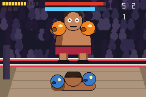

# ringside

> *A Punch-Out-style boxing bout seen over the player's shoulder: an opponent that is a data table of readable tells, and a fight that is pure reaction timing.*

One opponent — BRUNO THE BULL — with seven attacks, three rounds, hearts, stars, knockdowns and a
ten-count.



**L / R** dodge · **DOWN** duck · **UP** guard · **A** right · **B** left · **UP + punch** to the
head, otherwise the body · **START** star uppercut · **A/B** to beat the count · **SELECT** perf
overlay.

---

## The third camera

The corpus is side-view, top-down or isometric. `packages/fpview.tish` and `examples/crawler` were
the first thing in it that rendered **into** the screen. This is the second, and it is the opposite
kind of the same idea:

> A first-person crawler renders into the screen and **moves**. A boxing game renders into the
> screen and **does not move at all**.

There is no locomotion axis, no facing, and no hitbox geometry. Both fighters stand still for the
entire bout. A punch resolves by comparing one table column against the defender's current stance.
The whole game is a timeline.

## Why this is not built on `packages/fighter.tish`

`fighter.tish` is 867 lines of *two actors on a line*. Its state row is mostly position — `S_X`,
`S_Y`, `S_VY`, `S_FACE`, walk speeds in 8.8, gravity, stage bounds, push-apart — and its tick is
integrate, clamp, AABB, push. Reusing it here would mean disabling sixteen of its twenty-four state
fields and five of its twenty-one move fields, and still paying integrate-and-clamp for two fighters
that never translate.

What survives is about ninety lines: startup/active/recovery, damage, hitstun, hit-stop, and a
per-move "what beats this" column. So `packages/boxing.tish` is a new module, and it is a **pure
simulation** — it owns no sprites at all. It returns semantic state and the game maps that to cells,
because the alternative is duplicating pose indices between the package and the art generator, and a
duplicated contract drifts silently.

`motion.tish` is skipped for the same reason: it exists to recognise quarter-circles and dashes
mirrored by facing, and this game has no motions, no dashes and no facing.

## The opponent is data

Seven attacks and three script blocks in [`src/opponent.tish`](src/opponent.tish). No AI, no code
worth the name. A second boxer is a second file exactly like it, and `boxing.tish` never learns it
exists.

| | tell | beaten by | punish |
|---|---|---|---|
| left / right jab | 20f | dodge the other way, or block | 26f |
| body hook | 24f | **duck** — blocking high does not save you | 32f |
| overhand | 28f | dodge either way; **unblockable** | 42f |
| uppercut | 16f | dodge either way | 48f |
| flurry ×3 | 14f | alternating | 20f |
| haymaker (phase 2) | 36f | duck | 72f |

A **flurry needs no special case anywhere in the engine** — a run of zero-gap script steps simply
*is* a flurry.

Three phases: opening (long gaps, teaching), hurt (below half health — chains), and rage (after a
knockdown). Rage shortens every tell **and** adds a taunt after each landed punch, so it is sloppier
as well as stronger. That trade is what keeps a phase 2 winnable rather than merely longer.

Difficulty shortens tells and changes nothing else. It never removes them: `verify.sh` asserts every
tell stays above 150 ms at every difficulty and phase, because an unreadable tell is not difficulty,
it is a broken game — and it is the one balance number that would break silently while every other
check stayed green.

## The economy is stamina, not health

Hearts are what stops this being a mash game. A thrown punch costs one; a punch into a raised guard
costs **three**; a punch taken costs two. At zero the player is gassed — the swings still play, they
just do nothing, because a player whose controller appears to have stopped working will assume a
crash.

Hearts come back from **successful dodges**. The resource you need in order to attack is paid out
for defending well, which is the loop the whole design rests on.

Stars come from **counters** — landing inside the opponent's own windup, after the tell has
committed and before the fist arrives. Triple damage, a stun, and a star. Getting hit costs every
star you have. Every other mechanic exists to make that moment worth reaching for.

## The juice layer is `packages/feel.tish`, and using it found three things

The impact layer — spring shake, hit-stop, call-outs, the flash sweep and every sound — is
[`packages/feel.tish`](../../packages/feel.tish), **unmodified**. That was the point: this repo's own
review argues a genre package is only proven when *someone else's* example builds on it without
touching it, and feel had exactly one consumer before this.

It passes that test. It also produced three findings that only a second consumer could have found.

**1. Presets match by shape, not by name.** feel came out of a card game, so its seven presets are
called PLACE, DESTROY, BUFF, LANE, ILLEGAL, VICTORY, DEFEAT. The *kinds* underneath — callout, burst,
flash, spring, hit-stop, PSG note — are entirely generic, so this game reads the table as effect
shapes: `FP_DESTROY` (freeze + bump + sfx + callout) is a **counter**, `FP_LANE` (flash + callout) is
a **knockdown**, `FP_VICTORY` is the bout won. Nothing was renamed and nothing was added. What is
genuinely missing is a `feelDefPreset` — a consumer cannot author its own rows, only reuse the seven.

**2. `FB_BURST` does not port to a drawn background.** `feelBurstDraw(i, bg)` erases its expanding
ring by repainting every radius in a caller-supplied **solid colour**, which is right for a card
board with a flat panel under it. This game's background is a crowd and a ring floor, and no single
colour erases that — the ring would leave 1px rectangles scattered over the crowd. So the impact
flash stays a pooled sprite. `FB_FLASH` works fine, because feel leaves *its* erase to the caller,
who can use `ui_clear_rect` — transparent rather than a colour. That difference between two
neighbouring kinds is the whole finding.

**3. The player is for composing many effects, not two.** ⚠️ This one cost real frames.
`feelTick()` walks all six slots every call — free in a turn-based card frame, ~1,100 ticks here on
top of a seven-sprite composite and two state machines. Measured: **eleven of twenty-three windows
went over budget in attract mode, with the pad untouched**, which is what proved it was per-frame
rather than per-event. And `feelPlay` on a *two-row* preset cost ~1,000 ticks more than the two calls
it replaced — one dropped frame per opponent punch, forever.

Both fixes follow feel's own argument that the player exists to fire "a whole composed row range":

- Step feel **only while something is playing**, armed by a per-preset lifetime. The spring is safe to
  skip because the engine steps it in Rust, not `feelTick`; hit-stop is safe because it can only
  exist while an effect is live.
- Send the **frequent, two-effect** events (a punch landing, a block, a guard) straight to
  `feelBump` + `feelPlaySfx` — still feel's spring and feel's PSG, just not the composition layer,
  because there is nothing to compose. The **rare, dramatic** ones still go through the player, which
  is where composing six things from one call site is worth its cost.

Result: **0 of 23 windows over budget**, from 11 of 23.

## What this cost, measured

`ticks()` brackets around the whole loop, against a 4,389-tick 60 fps frame:

| | ticks |
|---|---|
| median gameplay frame | ~2,600 |
| worst gameplay frame (exchange + spark + spring + HUD repaint) | **~3,610** (82%) |
| a screen transition where a banner re-shapes its glyphs | ~6,600 — **one dropped frame** |

The banner spike is `text_draw` doing what it does: free while a string is unchanged, expensive the
instant it changes. It happens on four frames of a whole bout, all of them screen transitions, and
buying it back would mean baking the words as sprites and spending sprite VRAM on them.

Three things pay for the rest:

- **`sprite_set_frame` is never called with an unchanged pose.** Each sprite keeps its last cell, so
  an idle frame is seven compares and zero native calls instead of seven ~130-tick ones.
- **One crossing per value per frame.** `boxAtkField` is ~117 ticks; three call sites were asking
  for the same number every frame, and fetching it once in `drawFighters` was worth ~240 ticks — a
  twentieth of the frame budget for a value that cannot change between two statements.
- **A library is stepped only when it has something to do** — see the feel section above.
- **No `%` and no `/` on the hot path.** Every duration is a countdown; every stride is a power of
  two. The two divisions in the game are bar reciprocals, computed once at init. `verify.sh` greps
  for the rest.

## Two things that went wrong, both worth knowing

**Sprite VRAM panicked after two seconds.** `panicked at sprite_allocator.rs: SpriteFull`. The state
machines were provably healthy at the time — logging showed the opponent bobbing and the player idle
with full health on the frame it died. The cause was the *idle animation*: agb frees tile VRAM only
at commit, so a frame that re-points a cell transiently holds **both** the old tiles and the new
ones, and six 64x64 cells flipping together is 12 KB of transient on top of 17.9 KB steady.

Two fixes, and the second is the real one:

1. **Stagger the animation** so no two cells ever change on the same frame — the opponent's upper
   band flips at bobT 0 and 12, the player at 6 and 18, and the lower band does not animate at all.
2. **Stop paying for pixels nobody can see.** The player's band sits at y=118 on a 160-row screen,
   so rows 42–63 of its 64-tall cell were below the bottom of the display. The opponent's lower band
   only ever filled its top half. Halving both took the steady footprint from **17.9 KB to 10 KB**.

**The key codes are ordinals, not a bitmask.** `key_pressed` takes `0=A 1=B 2=Select 3=Start 4=L
5=R 6=Up 7=Down 8=Left 9=Right`. Passing the GBA's actual KEYINPUT bits compiles, runs, and reads
the wrong button or none at all, because `button_of` returns `None` past 9 and `None` reads as "not
pressed". Nothing warns. The symptom is a pad that does nothing, which looks like a broken state
machine and is not.

## Audio, and the one gap it runs into

All of it is feel's inlined PSG — **`chipsfx` is deliberately not imported**, because feel already
carries its own voices and feel's header records that importing chipsfx cost Queen's Blood 10,496
bytes of heap. Taking both would pay twice for the same thing.

There is still **no mixer**. Punches, blocks, whiffs, the bell and the count are one voice at a time
on a priority: the bell and a knockdown always win.

The crowd is **bursts, not a bed**, and that is a workaround rather than a design choice. A
sustained crowd wash needs ch4 permanently, and ch4 is the punch channel — every punch would either
duck the crowd audibly several times a second or be masked by it. A reacting crowd is defensible
game feel, and it is also the only option available. This is the concrete version of the last open
row on the engine roadmap: **no mixer, no positional or panned SFX**, ~220 lines across all three
audio packages.

## Art

All generated by [`scripts/gen_ringside.py`](../../scripts/gen_ringside.py) — no external pack, and
that was checked rather than assumed. The vendored catalog is Ninja Adventure; `~/Downloads/versus-art`
is LuizMelo and ansimuz, all **side profile**, which is the one camera angle this game cannot use;
itch.io's free `boxing` tag is three 3D models, a music pack and a finished game; and the only CC0 2D
boxer anywhere (OpenGameArt's "Boxer Game Character") is side-profile too.

Procedural is also simply better here: a crowd at 240x160 is dithered blobs and a rear-view player
is a silhouette. `npm run assets` regenerates everything, including a **preview composite PNG** — the
generator draws eight game situations at their real screen positions, so "do the tells read, and do
the bands line up" is answerable in two seconds instead of a five-minute ROM build.

## Build

```bash
npm run assets && npm run build && npm run shot
```

`npm run verify` runs the full gate: typed scalars, call arity, the no-divide grep, the reactable-tell
floor, the sprite-VRAM budget, a 9,000-frame input soak, and four live-frame checks.
