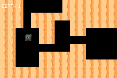

# ROGUELIKE

> *A dungeon generated on the cartridge from a seed — and checkable against a Python oracle, seed for seed.*




## What it proves

`scripts/procgen/` reproduces `packages/dungeon.tish` **draw for draw** — the same LCG constants,
the same 16-bit reduction, the same order and count of `rngBelow` calls. So the ROM reports the shape
of sixteen dungeons at boot and `verify.sh` re-derives all sixteen in Python and diffs them:

```
ok   16 seeds compared against the Python oracle
ok   every generated dungeon matches the Python oracle exactly
ok   the seeds produce different dungeons (15 distinct floor counts)
ok   every dungeon in the sweep is fully connected (no unreachable rooms)
ok   a rendered level matches its swept twin (rendering does not perturb the RNG)
```

**This is the only kind of test a procedural generator can have.** Looking at the output tells you
almost nothing — a broken dungeon and a good one are both "some rooms" — and a generator bug is
often seed-dependent, so it reproduces for one player and not the next. An oracle turns that into a
diff, and a single reordered `rngBelow` fails it immediately.

The negative controls matter as much: the diff would also pass if both sides were degenerate, so the
sweep must **vary** (15 distinct floor counts) and every dungeon must have real area and be fully
connected. A level with an unreachable half looks perfectly fine in a screenshot.


## Three things that were broken (2026-08-14)

**It crashed on the first descent.** Every frame past ~20 was the agb crash card:

```
panicked at tish_core/src/vmref.rs:86: RefCell already borrowed
```

`descend(seed)` passes a module variable to a function whose first statement is `seed = s`, which
holds a read borrow across the `value_call` (tishlang/tish#665). This file had *removed* its
`let sCopy = seed` workaround on the strength of the upstream fix `0158b5c2e` — and that fix is not
on the toolchain's current branch, having gone with the "core tish must stay untouched" revert
(`ad68e6388`). The copy is back, and it is load-bearing: **do not inline it.**

**The auto-walk was a blind square.** Forty frames right, forty down, forty left, forty up,
regardless of the map — in a dungeon of rooms and corridors that grinds into the first wall it meets
and stays there. It never had a pathfinder because there wasn't one when it was written. It now
steers on a flow field (`flow_goal` + `set_seek`), re-aimed at the next room on arrival and rebuilt
on every descent, so a soak walks the whole level instead of one wall.

**And then it wedged, five cells from the goal.** With the field working and reporting a route, the
walker still stopped dead at `px=52.79, py=244` for the rest of the level. Two causes, both about a
box rather than a path:

- `set_seek` steers a topdown body; it does not give it one. Without `topdown_speed` the walker had
  no speed, sat where it spawned, and `seek_arrived` fired on the first frame because it was already
  inside the arrive radius — the objective advanced while nothing walked.
- A **12x12 collider in a 16px lane** leaves 2px of slack a side, and a diagonal step around a corner
  leaves a fractional offset that never washes out. The box then clips the corner of a doorway it is
  entitled to walk through. Half a cell (8x8) gives 4px a side and absorbs the drift.

The engine was right in all three cases. That is worth saying plainly: a flow field that reports
`dist=5` while the unit does not move is not a pathfinding bug, and looking for one there costs a
lot of time.

## Why the map is not a `.tmj`

Every hand-authored map in this repo is a Tiled map, and that rule is not negotiable for maps a
person drew. A roguelike's map is not one — it does not exist until the run starts. Baking N variants
would make it a shuffle with a visible period, which is a different game.

What is still authored is the **vocabulary**: both tiles are cropped from the vendored pack by
`scripts/gen_roguelike.py`. This ROM decides which authored tile goes in which cell, and nothing else.

The map reaches the engine as **one** `tilemap_stream` and **one** `grid_from_gids` call, from inside
the package — a per-cell native loop is what `bench-boot` priced at ~0.175 frames *per tile*, which
for a 40x26 dungeon would be 180 frames of black screen.

## Two compiler bugs found here, both filed

Neither was in this example's logic, and neither was where four rounds of guessing looked.

**[tishlang/tish#665](https://github.com/tishlang/tish/issues/665) — a `RefCell` double-borrow
panic.** The ROM died at frame 200, every run, inside `tish_core/src/vmref.rs`. The cause was one
call:

```tish
descend(seed)        // and descend's first statement is `seed = s`
```

Passing a module variable to a function that assigns *that same variable* emits the argument as
`*g.borrow()`, whose guard lives across the `value_call`, so the callee's write borrow fails. The
compiler already emits a non-holding `vm_read(&g)` for the same variable one statement later, so it
is an inconsistency in argument position rather than a design constraint.

It reads as obviously correct, it fails inside the callee rather than at the call, and the panic
names `vmref.rs` rather than the game. It took a `log()` bisect down to a two-statement window —
after four hypotheses about a boxed array had been tested and disproven. The array had nothing to do
with it. The fix here is a local copy, which is fine once known and invisible until then.

**[tishlang/tish#663](https://github.com/tishlang/tish/issues/663) — a boxing cliff.** Handing
`TILES` to `tilemap_stream` made *every* read of it take the boxed path, everywhere — 5.87 ticks
against 1.55 for an identical array that is never passed, measured in isolation by
[`probe-arrayarg`](../probe-arrayarg/README.md). A full `dungeonGen` overran the 16-bit Timer2
because of it.

`packages/dungeon.tish` works around it with two arrays: a private `TILES` for the generation loops
and an `UPLOAD` copy for the handoff. The copy is O(n) once per level and replaces the separate
paint pass, so it costs nothing.

## Controls

D-pad walks; with no input it walks a slow circuit, which is what proves the collision grid matches
the art — a dungeon whose walls are one cell off looks perfect until you walk into one.

```bash
npm run verify
```
