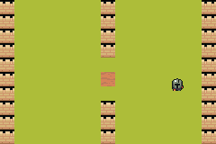

# RTS FLOW



RTS de-risk A1: 24 units following one shared flow field through a three-barrier course, measured
against the 60fps frame budget.

This ROM exists so that the load-bearing assumption of the RTS design gets tested *before* a game is
written on top of it — the same discipline the nine de-risk spikes used for the topdown RPG port. The
assumption: **a screen full of units can move under one player intent without a per-unit tish tick.**

## What it tests

1. **`flow_goal`** — one breadth-first search over the collision grid, shared by every unit and
   rebuilt only when the destination moves. The turn-based alternative (`isob_path` per unit per
   frame) is what this exists to avoid.
2. **`set_seek`** — native movement down that field. The tish loop touches a unit only when the
   *order* changes; a settled army costs it nothing.
3. **That the field is actually followed.** The course has three staggered barriers with a single
   gap each, so a unit that merely steers at the goal jams on the first wall. `A24` in the log means
   all 24 wove through all three gaps.

Move the destination with the d-pad; the army re-paths.

## Result — PASS

```
[frame 141] P4389 E4403 A0      ← all 24 walking
[frame 269] P4389 E4396 A0
[frame 717] P4389 E4382 A24     ← all 24 arrived
[frame 1421] P4389 E4375 A24
```

`P` is the worst frame in the last 64, `E` is `frame_period(2)` (the EMA), `A` is units arrived.
One 60fps frame is **4,389 ticks**.

**The peak sits at exactly 4,389 with all 24 units walking** — that is the display frame itself, not
the game's work, so the game loop never overruns. The EMA settles at 4,375–4,403, i.e. on the
budget line. 24 moving units, pathing included, fit in a frame.

## Two bugs this spike caught, which is the point of building it

Both would have been near-impossible to find inside a finished game, and both were in the *engine*,
not the spike:

1. **The last step of a move order has to be in pixels, not cells.** Inside the goal cell the field
   is flat — every neighbour is farther — so "step to a smaller number" finds no move and the unit
   parks wherever it entered the tile, up to 15px off centre and permanently short of its arrive
   radius. `A` stuck at 0 forever with every unit visibly *at* the destination.
2. **A transform is the collider's top-left, not its centre.** Asking "which cell am I in" about the
   corner puts a 10px unit half a box off, so it walks into the wall *beside* a gap and wedges. The
   fix is `seek_centre`, plus corridor centring: when a step is along one axis only, drift toward
   the centre of the lane on the other.

## And one approach measured and rejected

Physical separation — `set_blocker` on every unit so they push each other apart — was tried, because
"units shouldn't stack" is the obvious next request:

| | EMA | |
|---|---|---|
| staggered arrival (shipped) | **4,375–4,403** | on budget |
| `set_blocker` on all 24 | **6,626** | 51% over — a sustained ~40fps |

It is also *functionally* wrong: units wedge against each other in a one-cell gap and **1 of 24**
ever arrived. `first_blocker_hit` is O(blockers) per mover per axis, so a mutually-blocking army is
O(n²) box tests twice a frame.

What ships instead is a staggered arrive radius per unit (8, 15, 22 … px), so a group settles into a
blob around its destination rather than twenty-four sprites in one 16px cell. Units still overlap
while marching down a corridor. Proper formation placement — giving each unit its own destination
cell — belongs in `packages/rts.tish`, not in the movement system, and this is the measurement that
says so.

## Build

```bash
npm run assets --workspace=rts-flow
npm run build --workspace=rts-flow
```

Measure it:

```bash
GBA_SHOT_LOG=1 ../../scripts/screenshot.sh rts-flow.gba /tmp/f.png 1500
```
