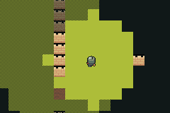

# RTS FOG



RTS de-risk A2: fog of war as a wrapping shroud layer over a scrolling scene map, and whether the
background budget survives it.

A scout patrols four corners. The shroud opens ahead of it and falls back to a dithered "explored"
state behind — explored never returns to black, which is the entire difference between fog of war
and a black screen.

## The two questions

**1. Can a shroud cover a map bigger than one background?** A `tilemap_new` layer is
`Background32x32` — 16×16 of our 16px cells — and it *wraps*. The 30×20 map here does not fit in
one. The answer is to make the wrap the mechanism rather than the obstacle: map cell `(c,r)` paints
at BG cell `(c & 15, r & 15)`, the screen is only 15×10 cells so no two visible cells ever collide,
and `bg_parallax(bg, 256, 256)` points the layer at the camera so the wrap lines up on its own.
`fog_blit` tracks, per BG cell, both the fog state *and* which map cell is currently sitting there,
so a cell is repainted when its fog changes **or** when the camera scrolls a different cell onto it.

**2. Does it fit in four backgrounds?** Yes: the scene takes one, the shroud one, and a game still
has two for terrain detail and a UI canvas.

## Result — PASS

```
[frame 202] P5913 E4377 W18 S10
[frame 586] P5172 E4375 W0  S10
[frame 843] P5190 E4381 W0  S12
```

`E` is the EMA against a 4,389-tick frame, `W` is shroud cells written on the last blit, `S` samples
the fog state at the start corner then the far corner.

- **EMA 4,375–4,395** — fog costs no measurable frame time.
- **`W18` while scrolling, `W0` when settled** — only the column scrolling into view is repainted. A
  settled camera writes nothing at all, so the cost tracks *movement*, not map size.
- **`S10` → `S12`** — the start corner went visible → explored (1) and stayed there, and the far
  corner went unseen (0) → visible (2) as the scout arrived.

## The palette war, which is the real finding

`tilemap_new` uploads its asset's palettes to **all sixteen** background banks. Three arrangements
were built and photographed:

| arrangement | result |
|---|---|
| shroud from its own black PNG, after `scene_stream` | **the entire map renders black** — the shroud's two-colour palette replaced the map's |
| same, but before `scene_stream` | map correct, **shroud paints brown** — its tiles index whatever colour the scene keeps at that slot |
| **shroud cells baked into the map's own tileset, layer built before `scene_stream`** | **correct** |

So the shroud is not a separate image. `scripts/gen_rts_spikes.py` emits one local tileset —
`rts_tiles.png`, five cells: grass, dirt, wall, shroud, half-shroud — and `maze.tmj` is built from
that same file, so the two layers share one palette *by construction*. This is the same local-tileset
shape `scripts/gen_wsg.py` already generates for warsong.

That is why `fog_blit` takes the tileset's column count and the two gids rather than hardcoding
"cell 1 and cell 2": the shroud lives wherever the game's own tileset has room for it.

**The ordering is load-bearing and not obvious**: build the shroud layer *before* `scene_stream`, so
the scene's palettes are the ones left on screen. Reversed, the map goes black.

## Build

```bash
npm run assets --workspace=rts-fog
npm run build --workspace=rts-fog
bash verify.sh
```
