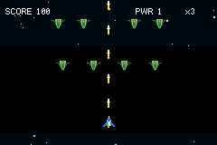
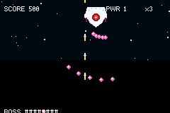

# SHMUP

> *A shoot-em-up (shmup) genre template with bullet patterns and enemies.*

A vertical space shooter: fly the ship, auto-fire upward, clear waves of enemies, grab weapon-ups, and
beat a three-phase battlecruiser boss. Built almost entirely from the reusable
[`packages/shmup`](../../packages/shmup.tish) toolkit — this example is just the **level**.





## Controls

- **D-pad** — move (the ship stays on screen).
- **Fire is automatic** — the shot widens as you collect gold weapon-up orbs (levels 1 → 3).

## What drives it

The genre lives in **`packages/shmup.tish`**, a sibling of `packages/engine.tish` and
`packages/title.tish` in the engine's component library. It gives you:

| piece | what it does |
|---|---|
| `spawnPlayer` | ship: d-pad move + screen clamp, auto-fire by weapon level, power-up pickup, lives/respawn |
| `fireBullet` / `fireAngle` / `fireSpread` / `fireRing` / `aimAngle` | projectiles + bullet-hell patterns (angles in degrees) |
| `spawnGrunt` / `spawnWeaver` / `spawnShooter` | enemy AIs — straight dive, sine-weave, hover-and-aim |
| `spawnBoss` | a boss that enters, sweeps, and rotates attack patterns through three HP phases |
| `spawnPowerup` | drifting weapon / extra-life pickups |
| `explode` | a self-clearing explosion |
| `makeDirector` / `spawnRow` | the scripted level timeline + formations |
| `gameState` | shared score / lives / weapon / boss-HP for the HUD |

## Why it scales (bullet hell without choking the GBA)

The heavy parts are **native**, added to `tish-gba-game-engine` for this genre and reusable by any game:

- **Projectile combat** — `set_hurt(entity, damage, targetTag, despawnOnHit)` makes an entity a
  tag-targeted contact-damage box. The engine resolves every bullet↔target hit in Rust each frame, so
  a bullet is *pure components* (transform + velocity + collider + sprite + hurt + lifetime) with **no
  per-frame tish callback and no wrapper object**. Enemies take 0 i-frames, so a stream chips them.
- **Auto-despawn** — `set_despawn_offscreen` / `set_lifetime` retire spent shots and finished
  explosions. A fixed-screen shooter has no camera to cull against, so this is what keeps the sprite
  count (and the heap) bounded.
- **Free-velocity AI** — the fast `tick` hook gained `vx`/`vy` outputs, so weave/dive/hover patterns
  run wrapper-free at bullet-hell density. Only the player and the boss carry richer per-frame logic.

So the per-frame tish cost is roughly *player + boss + a few shooter/weaver ticks* — everything else
(grunts flying straight, every bullet) is native.

### The budget, concretely

On the dynamic (untyped) tish path each per-frame callback — a player `update` or an enemy `tick` —
costs a few hundred Timer2 ticks (`value_call` + boxed ctx marshalling), so a 59.7fps frame (~4389
ticks) affords roughly **half a dozen live tish callbacks**. That's why the level leans on **straight
grunts (no callback) and bullets (native combat) for density**, and keeps tick-driven enemies
(weavers, shooters, boss) sparse — a screen full of *bullets* is free, a screen full of *AI* is not.
Stacking many tick-enemies at once drops the frame rate (authentic GBA slowdown); typed lowering is
the engine's roadmap for making per-entity AI cheap enough to lift that cap. You can watch the budget
live with the engine's `step_ticks(phase)` profiler (0 = total, 1 = callbacks, 2 = systems,
3 = collisions, 4 = render).

A pair of engine changes landed here to make that budget go further, and help every game:
`collect_behaviours`/`collect_ticks` no longer deep-copy an entity's ctx object when it has no
`update`/`tick` to run (a straight grunt was being cloned twice per frame for nothing), and a `tick`
only marshals the props its entity actually uses (a free-flyer pays for `vx`/`vy`, not the nine
platformer props).

## The level is data

```tish
let level = makeDirector([
  { at: 30,  run: () => { spawnRow(4, 34, (x) => { spawnGrunt(x, {}) }) } },
  { at: 165, run: () => { spawnShooter(120, {}) } },
  { at: 700, run: () => { spawnBoss({ hp: 60 }) } },
])
while (true) { scrollStars(level.time()); level.update(); drawHud(); step() }
```

## Assets

All procedurally generated by [`scripts/gen_shmup.py`](../../scripts/gen_shmup.py) (re-run to tweak):
`ships16.png` (16×16 sheet — ship, bullets, 3 enemy types, power-ups, 4-frame explosion),
`boss32.png` (32×32 boss + hit-flash), `stars_near.png` (256×256 seamless scrolling starfield),
and `title-bg.png` (a nebula backdrop, for pairing with `packages/title`).

## Build

```bash
npm install    # once, at the repo root
npm start      # build + open in mGBA
```
