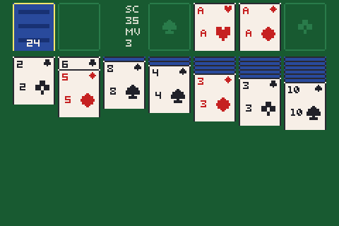
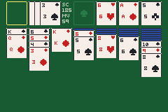
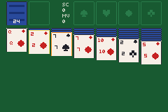

# solitaire

> *Klondike solitaire drawn entirely from ui_rect and ui_text — no art, no sprites, no OAM. A cold screen that repaints only when the table changes.*



> Klondike solitaire drawn entirely from `ui_rect` and `ui_text` — no art, no sprites, no OAM. A
> cold screen that repaints only when the table changes.





The repo had action, puzzle, RPG, SRPG, shmup, kart and rhythm examples and nothing in the
**card** family — a game that is almost entirely static, repaints only on input, and lives on the
background text canvas rather than on OAM. This is that example, and a complete game: deal,
stock/waste, four foundations, seven tableau piles, run moves, undo, auto-finish, scoring and a
win.

One file, 1175 lines, no assets. `src/main.tish`.

## Controls

| Key | Action |
|---|---|
| Left / Right | move the cursor across the piles |
| Up | walk the grab depth up the face-up run; at the top of the run, jump to the pile above |
| Down | walk the grab depth back down; from the top row, drop into the tableau |
| A | on the stock: draw / recycle. Otherwise: pick up, or drop what you are holding |
| B | put the selection back |
| R | send this pile's top card to its foundation — the most-used move in a real game |
| Select | auto-finish: send everything that can go up, until nothing moves |
| L | undo |
| Start | new deal |
| L + R | perf overlay (`frame_stats`) |

Draw-three by default. `let DRAW: i32 = 3` at the top is the whole switch to draw-one.

**Attract.** Touch nothing and it deals and plays itself; touch anything and it never plays itself
again, and reseeds from the frame you pressed on — the only entropy a GBA has with no clock.

## There is no art, and that is the point

The obvious build is a 52-frame sprite sheet. It does not survive contact with the hardware: a
Klondike table shows twenty-odd cards at once, which is twenty-odd OAM entries and their tile VRAM,
laid out down the full height of the screen. And a card at this scale *is* a white rectangle with a
rim and two glyphs — the sheet would be 52 near-identical rectangles that have to be authored,
regenerated and kept in sync.

So every card is `ui_rect` + `ui_text` on the background text canvas. No OAM, no sprite VRAM, no
palette banks, no `sheet32:` import, no `scripts/gen_*.py`. The sibling `card-gba` repo reached the
same conclusion independently and ships three card games with zero card assets.

| Piece | Where it comes from |
|---|---|
| Card body, rim, back, highlight, suit pips, erases | `ui_rect` (`crates/tish-agb`) |
| Rank + suit, HUD, win banner | `ui_text` / `ui_text_box`, one font: `assets/fonts/tinypixel.ttf@7` |
| Canvas reset, tile bookkeeping | `ui_begin`, `ui_clear_rect`, `ui_reserve_tiles` |
| Shuffle | `packages/rng` (`rngSeed`, `rngBelow`) |
| Sounds | `packages/chipsfx` |
| Rules, layout, undo, attract player | this file |

## Cards have pips, and the pips are rectangles

Colour does not name a suit — it splits four into two pairs. The first build used the letters
S/H/D/C, which are worse than pips at every size. A pip is four to seven `ui_rect` bars, widest
where the silhouette is widest, and within a colour exactly one distinction has to survive five
pixels: heart's twin bumps against diamond's single point, and spade's solid triangle against
club's three separated lobes. That is what the bars are cut to preserve. 5px pips in the corner
index, 10px in the middle of a full face and on an empty foundation.

Affording them is a consequence of the section below: at ~5 rects each they would be real money on
a whole-table repaint and are nothing on a two-pile one.

## The repaint is per pile, and that is the interesting part

A full table is ~150 native calls and measures **~20 frames**. Gating it on a signature compare —
the right instinct, and what card screens in this repo normally do — still leaves a third of a
second of lag on every cursor press.

The symptom that led here is worth recording, because it looks like a rendering bug and is not. A
screenshot at frame 60 showed the top row drawn and **the entire tableau missing**. Nothing had
failed: the repaint was still in flight. mGBA renders scanlines continuously, so a capture taken
during a paint that spans twenty frames shows however much of the canvas has been written so far.
The first theory — that `ui_clear_rect` was exhausting the dynamic-tile table — was wrong, and the
source says so out loud: *"Reuse — never allocate here."*

So the damage gate is **per pile**. Each of the thirteen piles carries its own signature over its
cards, their face-up flags, and whether the cursor or the selection is on it, and a repaint redraws
only the piles whose signature moved. `ui_begin`, which throws the whole canvas away, is reserved
for a new deal.

Four things make that work:

1. **A signature, not a dirty flag.** A `dirty = 1` sprinkled at mutation sites gets written in
   seven places and read in none. A signature is derived from the state it summarises and cannot
   disagree with it.
2. **One `ui_text` per card.** Rank and suit come from a 52-entry label table built at boot. Writing
   `"A"` then `"S"` is the obvious way and doubles the cost of the most expensive native on the
   screen: `ui_text` is priced per *call*, not per glyph.
3. **Nothing clears before it draws.** Cards are opaque and a pile is drawn top-down, so redrawing
   a pile covers its own previous state. The only thing that needs erasing is the tail a *shrunken*
   pile leaves behind, and that is one FELT rect below the new content, after it. The first build
   cleared the pile's whole tile column and then drew into the hole — and both halves are visible
   to the player, because the beam passes over the cleared column before the cards land in it.
   **That was the flicker on every selection and cursor move.**
4. **The highlight is the card's own rim**, not an outline in the gutter. An outline has to be
   erased when it moves, and erasing a 1px ring means clearing tiles that belong to the card, which
   is the flicker again. A rim is overdrawn for free, and a selected *run* reads correctly: every
   card that would travel carries the orange edge.

The column pitch is **32**, not the 34 that packs seven columns most tightly, so a pile plus its
gutter is exactly four 8×8 tiles. That was load-bearing for the `ui_clear_rect` design and is only
tidiness now that erases are FELT rects — `ui_clear_rect` snaps *out* to whole tiles, a `ui_rect`
under h=48 is pixel-exact. It still matters for the HUD, which does clear its two tile columns.

| Measured | |
|---|---|
| Cursor move → picture changed | **2 frames** (`GBA_SHOT_TRACE`, press at 120, change at 122) |
| New deal (full repaint, `ui_begin` + 13 piles) | ~11 frames |
| Whole-table repaint on every change (the first design) | ~20 frames |
| Attract, one move per 4 loop iterations | ~12 emulator frames per move (was ~24) |
| Idle frame | zero `ui_*` calls |
| UI palette | 10 of 15 entries, `palovf 0` |
| Dynamic tiles | peak 506 against the 640 table cap, no drift over 30k frames |
| ROM | 814 KB |

## The fan step is computed, not a constant

A worst-case tableau column is 6 face-down plus 13 face-up. At a fixed 9px step that column is
148px tall in 119px of room, and the card that falls off the bottom is the one you need to see.
`upStep` solves the face-up step per column so the last card always lands fully on screen, floored
at 2px. It is the one piece of layout that cannot be a constant.

Only the top 5–9px of a covered card is ever visible, so a covered card is a body, a rim and the
corner index, and nothing else. Full faces are drawn only for the thirteen cards that are the top
of a pile.

## The attract player, and why a King would not move

The generator is the standard greedy line: foundations first, then tableau moves, then the waste,
then turn the stock. It is a test harness, not a solver.

Its moves split in two, and the split is the whole reason it terminates:

- **Productive** — the move turns a face-down card over. The face-down count strictly decreases, so
  no sequence of these can cycle.
- **A shuffle** — a run moved onto another run, exposing nothing. These are *needed*: a King only
  reaches an empty column once the cards above it have somewhere to go. They are also exactly what
  cycles — with a red 7 and two black 8s on the table, a generator that takes any legal move
  ping-pongs the 7 between the 8s for ever. A build that did shows it plainly: 40,000 frames
  produced **one** deal, no stall and no win. So shuffles are rationed, 12 per deal.

Two mistakes on the way, both of which look like a rules bug and are not:

1. The first version moved a column's **entire** face-up run or nothing, so a King sitting under two
   or three cards of its own run — exactly the card you split off to fill an empty column — was not
   in the generator's vocabulary. Empty columns stayed empty.
2. The fix for the cycle was "the move must expose a face-down card", which *silently un-did the
   split*: face-up cards are a contiguous run at the top of a pile, so that condition is only ever
   true for the whole run. Every partial split was rejected and the loop was decoration. It reads
   as working code. `log`ging every move into an empty column returned **zero** in 12,000 frames,
   which is what gave it away.

A shuffle also does **not** refresh the stock-recycle allowance. Letting it made every deal run to
the 400-move backstop: twelve shuffles times three fresh passes through the stock is a long way to
go nowhere. Only a productive move earns the stock again.

## Two bugs worth keeping

**The recycle is a reversal, and undo has to know.** Turning the waste back into the stock flips it
as a block: the top of the waste becomes the bottom of the stock. `applyMove` copies in slot order,
so the reversal is a separate step — and undoing the recycle has to reverse it back, which is what
the journal's `flip` field is overloaded to `2` for. Without it, undoing a recycle silently
reorders the deck and the same deal stops being the same deal.

**A rectangle two tiles too wide reads as a font bug.** The waste's erase box was `DRAW * WFAN`
wide instead of `(DRAW - 1) * WFAN`, which reaches into the HUD's first tile column. Since the HUD
only repaints when the score changes, its left half stayed erased — and half a HUD looks exactly
like a broken font. The same shape of mistake, one row short instead of one column wide, clipped
the bottom of the move counter.

## Verification

The rules engine is asserted by *outcomes*, not by the absence of a panic:

```bash
GBA_SHOT_LOG=1 scripts/screenshot.sh examples/solitaire/solitaire.gba /tmp/s.png 40000 "" 2>&1 | rg "DEAL|WIN|STALL"
```

40,000 frames of attract: **33 deals, 4 wins, no panic, and the 400-move backstop never fires.** A
greedy line winning ~12% of draw-three Klondike is the expected shape.

Two probes were run against the same attract loop and then stripped (`rg -n "probe|log\(" src` to
prove it):

- **Permutation invariant** after every frame: the 52 ids across all thirteen piles are a
  permutation, no duplicate, no out-of-range, `sum(PN) === 52`. Zero violations in 30,000 frames.
- **Undo round-trip** on every tenth move: make the move, undo it, compare the full state signature
  and the score to the values before. Zero violations.
- **The King rule**, every frame there is an empty column: a King is accepted, a Queen is refused,
  and a King of a different suit is accepted. Zero violations.
- **Kings actually move**, which the rule check alone does not prove: logging every move into an
  empty column gives **28** in 30,000 frames, all of rank 12, from both the waste and the tableau.

```bash
cd examples/solitaire
unset CARGO_TARGET_DIR && npm run build
npm start          # mGBA
npm run shot       # rebuild + screenshot.png
```
