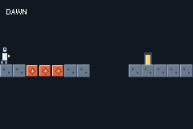

# SPECTRA

> *Four colours at a time. What is not in your lens is not there.*

A puzzle-platformer whose verb is the **palette**. The world is painted in more colours than the
screen shows at once; your lantern holds four. The two bands your lens is not showing are not dimmed
or greyed out — they are **not there**: not visible, not solid, not standing under your feet.



## Controls

- **d-pad / A** — move and jump.
- **L** and **R** — turn the lantern. Three lenses, in a ring: **DAWN** → **DUSK** → **VOID**.
  Exactly one colour band is real at a time.
- **L + R held** — **WHITE**. All three bands real at once. It is the only way past some gaps, and
  the worst possible moment for every hazard in the room, because they all become real together. It
  drains the lantern; the gold prisms refill it.
- **SELECT** — skip a room. A debug affordance, kept in the ROM because it is the only way
  `verify.sh` can prove all twelve rooms still load.

## What makes a puzzle

| | |
|---|---|
| **phase blocks** | Solid under their own lens, absent under the others. The floor is a choice. |
| **the crush rule** | A switch that would materialise a block *inside you* is **refused** — the lantern buzzes and nothing happens. That makes a refused switch **information**: it says you are standing in the answer's way. Several rooms are solved by finding the one tile where the switch is legal. |
| **chroma doors** | The same rule read backwards: a shutter that only *opens* in its own light. |
| **band teeth** | Spikes that only bite while their band is real. Harmless in the wrong lens; all of them lethal under WHITE. |
| **lens-lock fields** | Hatched zones where the lantern will not turn. The lens you enter with is the lens you finish with, so the choice is made before it matters. |
| **the stalker** | An eye that can only see you while you share its band. In another lens you are not hidden from it — *it* cannot reach *you*. Switching is stealth. |
| **repaint pads** | Permanently move a region from one band to another. The first thing in the game you cannot undo. |

## The gauntlet

Twelve rooms in three acts. Each is exactly one screen (15×10 cells), so the whole problem is
visible at once and a solution is a plan rather than an exploration — except the finale, which is a
shaft you climb.

**Act I — the lens.** 1 FIRST LIGHT · 2 THE CRUSH · 3 THE THIRD LENS · 4 THE LOCKED DOOR
**Act II — the dark.** 5 TEETH · 6 THE NARROWS · 7 THE STALKER · 8 CROSSFIRE
**Act III — white.** 9 WHITE · 10 THE PAINTERS · 11 THE LONG DARK · 12 THE SHAFT

## ⚠️ The thing this example is really about

**A lens is not a palette swap, and two days went into learning why.**

On this machine the obvious move is to paint the absent bands the backdrop colour and change the
whole level for twelve palette writes. It *works* — `terrain_pal_bank` really does rewrite a
`scene:` map's live palette bank, ~1,700 ticks for the lot, no tile touched.

It is still unusable: **which palette index holds which colour is nondeterministic across builds.**
Same source, two clean builds, the backdrop moved from entry 5 to entry 9. agb's optimiser pushes the
per-tile colour sets through a hash-ordered bin-packer, and it assigns **per atlas** — and `scene:`
packs one atlas per `.tmj`, so two rooms built from the same tileset disagree with each other too.
Measuring the order and baking a table does not rescue it; the next build invalidates the table.

Rewriting the **tiles** can be aimed, but `scene:` *remaps gids* when it packs, so the number in the
tileset is not the number at runtime — and it costs ~310 ticks a cell.

What works is neither. **Each band is its own tile layer.** Showing a band is
`stream_visible(band, on)`: one call, against a layer the hardware was already compositing, with no
gid and no palette entry in it anywhere. The GBA's four background layers are exactly three bands
plus the world, and a hidden layer hands its slot back, so the usual case (one band lit) runs on two.

That leaves collision as the only per-cell work, and only for the bands that actually changed:
DAWN → DUSK touches band A's cells and band B's, never band C's and never the stone.

The one colour a lens *does* change is `backdrop()` — palette 0, entry 0, by name. It is the only
colour call on this machine that means exactly what it says.

## Engine additions

- **`stream_visible(layer, visible)`** (`crates/tish-agb`) — show/hide a **streamed** map layer.
  `scene_bg_visible` only ever reached a scene's wrapping parallax backdrops; streamed layers simply
  had no switch, which made "a layer of the map that comes and goes" the one thing a `.tmj` could not
  express. Hidden layers are skipped by the frame loop *and* by `prime_stream_layers`, so they cost
  neither a background slot nor a streaming pass.
- **`packages/chroma.tish`** — the reusable lens: band state, the crush probe, the collision delta,
  lock fields, repaint, and the lumen meter.

## Measured

4,389 Timer2 ticks is one 60fps frame. Averaged over 64 frames, in room 1:

| | ticks |
|---|---|
| `step()` (engine world pipeline) | 4,378 |
| game logic (chroma + hazards + HUD) | ~700 |
| **whole loop period** | **8,778** |

**The ROM runs at 30fps, and the lens is not why.** `step()` alone fills the 60fps budget for a room
holding two entities — disabling `platformerAnimate` moved it by nothing, so the cost is engine-side,
not in this game's tish. Everything this example owns fits in ~700 ticks, and a lens switch is three
`stream_visible` calls plus the collision delta for two bands (a couple of dozen `grid_set_solid`
writes at most), comfortably inside one frame.

Three consolidations were made to get the game side down from ~900: one packed `takeSignals()` call
instead of a clear plus three reads, one `chromaHazardSpan(c0, c1, row)` instead of a probe per foot,
and the lock-field lookup folded into `chromaUpdate`, which already had the cell list open. A boxed
call is ~117 ticks and the arithmetic around it is free — see `docs/perf-rules.md` §2.

## Two traps worth stealing

- **tish does not hoist function declarations.** `loadScene(buildRoom)` runs at module init, so a
  helper declared *below* it is a name that does not exist yet when `buildRoom` first runs. It throws,
  the screen stays white, and **nothing is printed** — no error, no traceback, not even the `log()` on
  the next line.
- **`keys_edge()` is empty by the time a game loop reaches it.** The edge comes from agb's
  `ButtonController` and survives exactly one `input.update()`. Measured here: `keys_held()` reported
  R down on the very frame the button appeared while `keys_edge()` reported nothing, then and on every
  frame after. `chroma` latches its own edge from the held mask — one store, and it cannot go stale.

## Build

```bash
npm run assets     # regenerate art + the twelve rooms (scripts/gen_spectra.py)
npm run build
npm start          # mGBA
npm run verify     # headless: all 12 rooms load, the lens turns, the crush rule refuses
```

Everything is generated: the tileset, the hero, the stalker, and the rooms are drawn by
`scripts/gen_spectra.py`, whose rooms are ASCII art you can read and move a tile at a time.

## Known gap

Room 11 was going to be **moving band platforms**. The engine has no rider-carry — `set_mover` and
`set_patrol` move the entity and not what is standing on it — so a lift would have slid out from
under the player. It is a combination room instead, and the gap is recorded here rather than faked.
