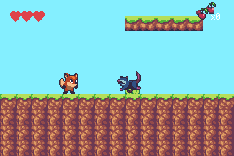

# SUNNY LAND

> *A platformer template using the Sunny Land asset pack.*

A classic side-scrolling platformer built on the reusable engine, using Luis Zuno's (Ansimuz)
CC0 **Sunny Land** pixel art. The camera follows a fox across a 102×15 streamed level of grass,
pits, floating platforms, coins, a powerup, and patrolling opossums.



## Controls
- **d-pad** — move
- **A** — jump. Hold for a higher jump, tap for a short hop (variable height). Buffered on press and
  coyote-timed. **Down + A** drops through a one-way (green) platform. Once you grab the **gem**, A
  in mid-air is a second (double) jump.
- **B** — run (faster than walking)

Land on an opossum to **stomp** it (it bursts in a puff and you bounce); touch its side and you take
a hit (with a brief invincibility flicker). Grab **cherries** for coins (top-right counter) and the
purple **gem** to unlock the double jump. At 0 HP you respawn at the start with full health.

**The chasms want a run.** The first one has a pillar in the middle, so it is two hops you can clear
at walking speed — the level teaches the run there. Every chasm after it is three tiles wide and
needs **B** held. Falling in costs a heart and puts you back at the start; it used to drop you into a
walled-in hole with no floor and no way out, which soft-locked the game until you reset the console.

## What it demonstrates (reusable engine features)
- **Platformer feel** — run/walk, gravity + AABB tile collision, coyote time, jump buffering,
  variable-height jumps, one-way platforms + drop-through, and a mid-air double jump layered on top
  in tish via `bounce`.
- **Health** — HP with post-hit i-frames (sprite flicker) and an `onDeath` hook (here: respawn).
- **HUD** — a hearts readout (`setupHearts`/`updateHearts`) and a coin counter (`hudText`).
- **Enemies** — a **native** patrol (`e.patrol(1)`: walk, turn at walls and ledges, mirror the
  sprite), with contact damage and stomp-to-kill in tish. The patrol used to be a tish `tick` hook;
  see the note at the end of this file for why that halved the frame rate.
- **Collectibles** — trigger-collider pickups that grant score (coin) or a powerup (gem), identified
  by an entity **tag** so an enemy walking over a coin is ignored.
- **Pooled effects** — stomp puffs and pickup sparkles come from a fixed pool of pre-created sprites
  driven by flat `i32[]` arrays, not from spawned entities. This is the difference between a clean
  60fps and a sustained ~45fps whenever anything happens; see the FX block in `src/components.tish`
  and [docs/perf-rules.md](../../docs/perf-rules.md) §6.
- **Bigger-than-hitbox sprites** — the 32×32 fox/opossum draw over a 16×16 hitbox via `spriteOffset`.

All of the above are engine/sugar APIs (see [`packages/engine.tish`](../../packages/engine.tish)),
not example-specific: `run/jump/jumpRelease/drop/moveX/onGround/blocked/bounce`,
`setHealth/hurt/heal/hp/alive`, `setTag/tag`, `spriteOffset`, `setupHearts/updateHearts`, `hudText`,
`tileSolid`, and the `tick`/`onCollide`/`onDeath` component hooks.

## Build / run
```bash
npm run build      # build the ROM
npm start          # build + open in mGBA
npm run shot       # build + headless screenshot (screenshot.png)
```
Regenerate the art + level from the source pack: `python3 scripts/gen_sunnyland.py` (repo root). The
Sunny Land art is CC0 (Ansimuz); see [`assets/ATTRIBUTION.md`](assets/ATTRIBUTION.md).

## Notes
- **Streamed backgrounds page in over the first few hundred frames** — the screen is a plain white
  (forced-blank) for the first several seconds at boot while the tilemap fills, then clears. A
  headless screenshot therefore needs ~450+ frames to show the scene; earlier is a false white.
- **Entity budget** — the tish entity wrapper is relatively heavy on the small GBA heap, so a scene
  tops out around ~25 live wrapped entities. This level stays near 18 (player + 5 enemies + 12
  cherries + 1 gem) and never spawns an entity during play; pickups free their wrapper on despawn.
  Bump these counts up only alongside a lighter-weight entity wrapper.

## Three things this example is now the record of

**It shipped broken for weeks and built cleanly the whole time.** `entityForget` in
`packages/engine.tish` was a back-compat no-op with an empty body and an unannotated parameter, so
tish promoted it to a real Rust fn taking a *number* — and its only callers, the three spawn loops
in `src/main.tish`, pass the wrapper *object* from `create()`. The stub whose entire job was to keep
old games building panicked at frame 47 instead. `verify.sh` exists so that cannot happen quietly
again: a build says nothing about whether a ROM runs.

**It had no frame budget left, which is what "slow when there are enemies about" actually was.**
`world_step` measured 3,057 Timer2 ticks of a 4,389-tick 60fps frame — 1,943 of it tish callback
dispatch — so a single stomp's FX entity was enough to tip it over. Three changes took the step to
**2,590** (callbacks 1,943 → 1,466), roughly 35% more headroom, with no gameplay change:

| | |
|---|---|
| singleton state out of `this.data` | `this.data.face` is two boxed property lookups; there is one player, so a module-level `i32` is ~1.7 ticks. Per-entity data earns its keep when there are *many* of an entity |
| `setFlip` and `play` gated on change | both are idempotent natively, but the *call* is not — four boxed arguments is ~150 ticks a frame to tell the sprite what it is already doing |
| hearts gated on HP change | it was redrawing every frame a row that changes a few times a life |

**And what was actually slow was the enemies after all — the tish `tick` hook.** The opossum patrol
was six lines in a `tick`, under a comment claiming that hook was "one call, plain field access, no
per-op ABI trip". Reading `.tish/gba/sunny-land/src/main.rs` says otherwise — per enemy, per frame:

| written | generated |
|---|---|
| `s.dir`, `s.x`, `s.y`, `s.blocked` | `get_prop(&(s).clone(), "dir")` — clone the boxed object, then a **string-keyed** lookup, ×5 |
| `s.x + 16` | `ops::add(&Value, &Value)` then `to_int32_value(…)` — boxed f64 arithmetic |
| `tileSolid(c, r)` | `value_call(&_callee, &[Value::Number(…), …])` — a boxed cross-module call |
| `s.dir/move/flip = …` | three more boxed writes |

`patrol_system` and the rest of `world_step` **skip entities that are off screen** (`is_active`), so
all of that is paid only for the enemies currently visible. That is the whole symptom: fine with none
on screen, well under half speed with two, and nothing to do with combat, drops or FX.

The engine already had `set_patrol` — the identical wall/ledge patrol in Rust, at zero tish cost. The
only reason this example hand-rolled it was the sprite mirroring, which `set_patrol` did not do; it
now takes a `flipMode`, so `e.patrol(1)` is a complete drop-in and the `tick` hook is gone.

**The FX were a real second cost, just not this one.** A stomp puff and a pickup sparkle were each a
*spawned entity* (`create()` + `sprite_new()` + `behave()`, all on one frame). A/B with identical
instrumentation, one FX every 30 frames (EMA; 4,389 ticks = one 60fps frame):

| | EMA | |
|---|---|---|
| nothing spawning | 4,371 | inside budget |
| **FX as an entity** | **5,750** | **31% over — a sustained ~45fps** |
| FX from a pool | 4,378 | indistinguishable from idle |

Effects fire on *good outcomes*, so that one stuttered when the player was doing well. Both are now
fixed: pooled FX, native patrol. See [docs/perf-rules.md](../../docs/perf-rules.md) §6 and §7.

Two lessons about measuring, both in the perf rules, because the first attempt at this got it wrong:
**only compare builds that log the same thing** (changing nothing but the fields in the debug `log()`
moved the measured callback phase from 1,466 to 2,441 ticks), and **when a report says "slow with two
enemies", read the generated Rust before trying to reproduce a frame rate.** The cost was sitting in
plain text in `.tish/` the whole time.
