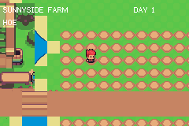

# Sunnyside farm — the farming core

Sunnyside de-risk 4, part of the `sunnyside` example family (see
`examples/sunnyside/SPEC.md`).  The loop the game is named for: till a plot
cell with the hoe, plant seeds, water them, sleep on it, and cut the grown
crop with the scythe — each visual change one `bg_set_tile` patch on the
streamed world layer (the burnt-bush mechanism), the plot state held as
parallel typed arrays (state/stage/watered per cell — the exact payload the
save de-risk round-trips).

Growth is gated on water: at each (fast, 10-second) day tick every watered
planted cell advances one of six stages and dries off; unwatered cells hold.
The farmer plays the pack's dig / watering / doing / attack animation while
the tool lands.

- D-pad walks; the faced neighbour cell is the target
- L/R cycle hoe → can → seeds → scythe (HUD label)
- A uses the tool; DAY and CROPS count on the HUD

`./verify.sh` drives the whole cycle headlessly with a key schedule and
asserts five watered growth days, a `HARVEST OK`, and — as the negative
control — that an unwatered day grows nothing.
