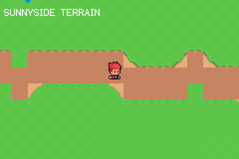

# Sunnyside terrain — runtime autotiling of a generated island

Sunnyside de-risk 2, part of the `sunnyside` example family (see
`examples/sunnyside/SPEC.md`).  Proves the terrain pipeline the farming game
sits on: a 48x32 island (grass, pond, wavy dirt road) generated on-cartridge
from a seed through `packages/rng`, autotiled in typed tish with the baked
lip tables, and handed to the hardware in ONE `tilemap_stream` call plus one
`grid_from_gids` for collision — the `packages/dungeon` discipline (working
array separate from the UPLOAD copy, tishlang/tish#663; no per-cell native
crossings).

Transitions use Sunnyside's own model, learned from the pack's GameMaker
room by `scripts/gen_sunnyside_pack.py`: a material cell is plain fill and
the *neighbouring* cell carries a mostly-transparent lip overlay (grass
fringe over water, path edge over grass), pre-composited opaque into the
atlas under a 20-entry neighbour mask table.  Two hard-won notes live in the
source: helper calls in the paint loop are boxed and cost ~250 frames until
inlined, and `world_step()` commits the frame itself — pairing it with
`frame()` double-pumps input and eats every `key_pressed` edge.

- D-pad walks the farmer around the island (sea is solid, engine camera
  streams the map)
- A regenerates the world with the next seed

`./verify.sh` builds fresh, drives two reseeds headlessly, checks the ROM's
per-seed land-cell counts against a Python replica of the generator (the
only kind of test a procedural generator can have), and asserts the heap is
flat across rebuilds.
