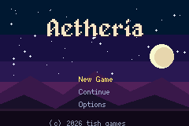

# TITLE DEMO

> *Demonstrates a main menu and title screen flow.*


The screen every RPG opens with: a full-screen **background**, a big **title** in a fancy font, a
**menu** with a moving cursor, and a **copyright** line — all from one reusable component
([`packages/title.tish`](../../packages/title.tish)).



## Usage

```tish
import { titleScreen } from '../../../packages/title'
import { sky }         from 'background:../assets/title-bg.png'
import { frame }       from 'cargo:tish_agb'

titleScreen({
  background: sky,
  title: "Aetheria",                 // drawn in Alagard by default
  menu: [
    { label: "New Game", onSelect: () => { newGame() } },
    { label: "Continue", onSelect: () => { loadSave() } },
    { label: "Options",  onSelect: () => { options() } },
  ],
  copyright: "(c) 2026 tish games",
}).run()                             // owns vsync until a choice, then fires that item's onSelect
```

Each menu item carries its own `onSelect`; the component owns the input and selection.

**Own loop vs main loop** — a title screen is a self-contained mode, so `run()` (the usual way) drives
`frame()` itself until the player confirms with **A**/**Start**, blanks the title, and fires the chosen
item's `onSelect`. If your game runs ONE state-machine loop instead, call `title.update()` each frame
(it moves the cursor, fires `onSelect` on confirm, returns the picked index or `-1`) and own `frame()`
yourself. Menu items may also be plain strings when you don't need a handler.

## Configuration

Every field is optional except `title` and `menu`:

| field | default |
|---|---|
| `background` | none (bg handle from a `background:` import) |
| `title`, `titleFont`, `titleColor`, `titleShadow`, `titleX`, `titleY` | **Alagard**, cream on a dark shadow, centred at the top |
| `menu`, `menuFont`, `menuColor`, `menuSelColor`, `menuX`, `menuY`, `menuGap` | built-in font, grey / gold-selected |
| `copyright`, `copyrightFont`, `copyrightColor`, `copyrightY` | built-in font, centred at the bottom |
| `slot` | `0` — base of the `hud_text` slot block it reserves |

The **title font defaults to Alagard** (a medieval pixel face, bundled with the component and baked at
build time — only the glyphs your title uses reach the ROM). Override it with any `font:…@N` handle.

## The background

`assets/title-bg.png` is a 240×160, ≤15-colour night sky (moon, stars, mountain silhouettes) so it fits
a 4bpp GBA background. Swap in your own full-screen image and pass its `background:` handle.

## Build

```bash
npm install    # once, at the repo root
npm start      # build + open in mGBA
```
