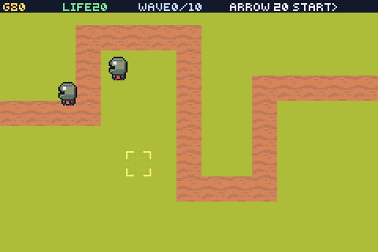
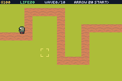

# tower-def

> *A fixed-track tower defence: every creep shares one flow field, and a tower is a soldier that cannot move.*



Ten waves come down one road. You get gold for kills and spend it on towers beside the route; they
acquire and fire on their own. Twenty lives. Leave it alone and it plays itself.

| | |
|---|---|
|  | the build phase — move the bracket, **B** switches tower, **START** sends the wave |

## Controls

- **d-pad** — move the build cursor · **A** — build · **B** — switch tower kind
- **START** — send the next wave

## What it proves

**`flow_goal` + `set_seek` as a crowd.** `examples/rts-fog` walks one scout around a maze; this runs
a dozen creeps at once. They all share ONE field, computed outward from the goal, so the twelfth
creep costs nothing more to route than the first and none of them runs a tish tick — which is the
property a tower defence needs and a path-per-unit cannot give.

**`set_soldier` as a turret.** A tower has no `set_topdown` and no `set_seek`, so it stands where it
is built, acquires the nearest creep of the other team in range, and fires on its own cooldown. The
whole combat loop is four native calls at build time and nothing per frame.

**The map is one screen.** 15x10 cells of 16px is exactly 240x160 — no camera, no scrolling, no wrap
arithmetic. A tower defence is a game you read at a glance, because the decision is *where to build
against a route you can see all of*.

## Four things that were wrong

**Sprites cycled through the whole sheet.** Every unit shares one sheet, so each needs a different
cell — and a one-off `sprite_set_frame` does not survive on anything that moves: the engine drives
the frame for a topdown body, so creeps spent part of every second drawn as the build cursor.
`set_dir_anim(e, art, 0, 1, 0)` — a one-frame animation — is the supported way to pin it.

**...but that does nothing for a tower.** `diranim_system` only runs for entities with `C_TOPDOWN`,
so a tower set the same way stayed on frame 0 and the board filled up with slimes. A stationary
entity's frame is never overwritten, so it takes `sprite_set_frame` instead. The asymmetry is the
engine's, and it is worth knowing before debugging it twice.

**Nothing ever died, and the towers were fine.** The first tuning was 3 damage every 26 frames, which
is two hits on a creep crossing the tower's radius. A 6,000-frame soak reported `killed=0` — so no
bounty came in, no further tower could be afforded, and the run death-spiralled. The numbers are now
derived from time-in-range: a creep at speed 1 spends ~80 frames inside a 40px radius, so one shot
per 18 frames is four shots, and four times five damage is exactly a slime. **A tower defence
balance bug does not look like a bug.**

**The ROM went quiet after ~5,000 frames.** Ten waves is over 140 creeps and each was calling
`sprite_new`, which never gives the handle back. Sprites are pooled per slot now — creeps *and*
towers, because the game restarts when it ends. `sprite_new` also returns a sprite that is visible
at a default position, so the pool has to be hidden at boot or it sits in a heap in the middle of
the board.

## Verification

A 24,000-frame headless run clears all ten waves, restarts, and clears them again identically:

```
STAT t=3000 wave=7 kill=79 tw=10 lives=20
TD CLEARED gold=843 lives=20 killed=150
TD restart
STAT t=9000 wave=7 kill=79 tw=10 lives=20
TD CLEARED gold=885 lives=20 killed=150
```

The attract player builds from a fixed list of cells beside the six corners rather than searching
randomly — the random version cleared ten waves on its first run and lost on its second, which makes
any screenshot of it unrepresentative.

## Build

```bash
npm run build && npm start
```

```bash
python3 scripts/gen_towerdef.py
```
