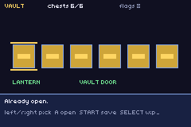
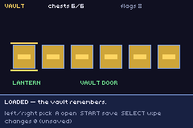

# vault

> *Six chests, two triggers, and a cartridge that still knows what you did after the power goes off.*



The acceptance test for **`packages/flags.tish`**, which is new.

| | |
|---|---|
|  | a second boot against the same cartridge — the flags came back, and nothing re-fired |

## Controls

- **left/right** — pick a chest · **A** — open it
- **START** — write to the cartridge · **SELECT** — wipe it
- Touch nothing and it opens all six and saves on its own.

## Why the package exists

`save.tish` and `prefs.tish` handle **bytes**. Neither owns the question a progression game actually
asks — not "what is in slot 7" but *"has this specific thing happened yet"*. Every game here that
needs one grew its own: `metroidvania` gates abilities by hand, the two topdown RPG ports each
carried a private bitfield, and `save.tish` offers exactly **one 32-bit int per slot** for a game to
pack its whole story into. That is a reasonable NES-era budget and a poor 2026 one — one of those
ports alone tracks OPENED and TAKEN per room.

`flags.tish` is a named bitset over `prefs.tish`'s versioned, checksummed SRAM: **up to 1,024 flags**,
with a wrong-version cartridge reading as blank rather than as somebody else's story.

## Three claims, each visible on screen

**1. Flags survive a power cycle.** Not a screenshot trick — the `.sav` is real cartridge SRAM and the
proof runs the ROM twice:

```
RUN A (fresh)      VAULT boot FRESH
                   VAULT save wrote=1 chests=6 set=8
RUN B (power-cycle) VAULT boot LOADED chests=6 lantern=1 door=1 set=8/64
```

**2. Triggers fire from a change, not a poll.** The lantern is granted on the third chest and the door
opens on the sixth, and neither is checked anywhere in the frame loop. `flagSet` queues the flip;
`flagsPump` drains it. A frame in which nothing happens costs one compare — the alternative, scanning
a watch table every frame forever to observe something that happens a few dozen times in a
playthrough, also pays ~117 ticks per tish callback that fires.

**3. Re-asserting a flag is not an event.** Opening an already-open chest still calls `flagSet`, and
fires nothing, because it compares before it queues. Run B proves the same thing at load: the rewards
are re-derived from the chest flags, and the triggers stay silent (`changes 0` on screen). **A room
that re-asserts its state on entry would otherwise re-trigger every time you walked in** — which is
the bug a hand-rolled bitfield ships with.

A fourth falls out of `prefs.tish`: saving twice logs `wrote=0` the second time, because the commit
is a no-op when nothing is dirty.

## Notes for anyone building on it

- **The slot math is shifts, not division** — `id >> 5`, `id & 31`. The GBA has no divide
  instruction, and a flag read is exactly what a room-load loop does in bulk.
- **The change ring is a power of two with a mask.** A `% RING` on this path measured 1,400 of a
  4,389-tick frame elsewhere in this repo.
- **Bump `version` whenever a flag id changes meaning.** Every existing cartridge then reads as fresh,
  which is what you want — a returning player inheriting a re-numbered story is worse than a reset.
- The screen is **all `ui_rect`/`ui_text`, no background image and no sprites**, the way `solitaire`
  draws a card table. `visual-novel` records what a changing background does to a repainting canvas.

## Build

```bash
npm run build && npm start
```

Proving persistence headlessly (this is what the two runs above do):

```bash
rm -f vault.sav && ../../scripts/screenshot.sh vault.gba /tmp/a.png 900 && ../../scripts/screenshot.sh vault.gba /tmp/b.png 120
```

`GBA_SHOT_NOSAVE=1` forces a guaranteed-fresh cartridge for tests that want one.
